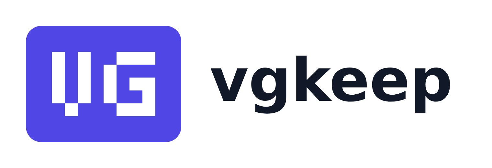

# vgkeep

<picture>
  <source media="(prefers-color-scheme: dark)" srcset="docs/brand/lockup-dark.png">
  
</picture>

Video-game collection tracker with granular per-item detail: OIDC login,
IGDB metadata enrichment, PriceCharting market pricing, per-service
Postgres/MongoDB/Valkey datastores, full observability.

## Prerequisites

- go >=1.26
- docker
- kubectl
- helm >=3.14
- tilt >=0.33
- task >=3.38
- golangci-lint >=2.1
- node 22+ (with npm); for the browser smoke, `npx playwright install chromium`

## Quickstart

```bash
task bootstrap          # tool checks + .env scaffold (edit .env if you have real keys)
task bootstrap:cluster  # once per cluster: cert-manager, external-secrets, the APISIX gateway, the observability stack, CA issuers
task run                # tilt up: builds images, deploys charts, port-forwards
```

Works against any local Kubernetes context (docker-desktop, kind, k3d, minikube);
add yours to `allow_k8s_contexts` in the Tiltfile if it's not listed.

If you need to test admin only features, you can grant admin to the dev fixture to a running cluster by running:
```bash
task grant-fixture-admin
```

Note: the fixture's handle is literally `admin` on dev databases created before the handle-backfill reserved-word fix (migrations do not re-run); fresh databases suffix it instead (e.g. `admin2`).

## Dev commands

| Command                  | What                                                                                                                                                                                              |
| ------------------------ | ------------------------------------------------------------------------------------------------------------------------------------------------------------------------------------------------- |
| `task lint`              | golangci-lint every Go module + helm lint every chart + eslint the frontend + obsgen dashboard and alert lint                                                                                     |
| `task test`              | go test every module (testcontainers need Docker) + frontend vitest                                                                                                                               |
| `task test:cover`        | tests + the 80% coverage gate (generated code and cmd/ wiring excluded)                                                                                                                           |
| `task gen`               | regenerate region/platform tables from `api/domain.yaml` + OpenAPI server stubs/types + the frontend's typed API client + Grafana alert rules and golden dashboards from `deploy/observability/`  |
| `task tidy`              | go mod tidy every module                                                                                                                                                                          |
| `task migrate`           | run db:migrate for every migrate-capable service (auth, collection, enrichment, social, user)                                                                                                     |
| `task build`             | compile every module + the frontend bundle                                                                                                                                                        |
| `task e2e`               | Playwright smoke suite against the running stack (login, collection journey, currency, account, admin, social, submissions)                                                                       |
| `task run` / `task down` | tilt up / down                                                                                                                                                                                    |
| `task nuke`              | full app-stack reset: tilt down + the vgkeep namespace (see Teardown)                                                                                                                             |

## Teardown

```bash
task down                    # stop the dev stack; namespace, datastore PVCs, issued TLS secrets survive
task nuke                    # app layer: tilt down + delete the vgkeep namespace (drops PVCs + TLS secrets)
task bootstrap:cluster:down  # remove the platform: helm uninstalls + the vg-platform namespace
```

Reinstalling the platform mints a fresh dev CA, and cert-manager does not
reissue previously issued certificates (they still match their Certificate
specs), so TLS secrets from before a platform-only teardown keep chaining
to the dead CA until their renewal window. For platform down/up cycles
prefer `task nuke && task bootstrap:cluster:down`, which drops those secrets
(and the datastore PVCs) with the vgkeep namespace; 
`task bootstrap:cluster && task run` then brings everything back from scratch.

Platform teardown removes the monitoring stack's owning helm release, but
the kps CRDs applied by hand in `task bootstrap:cluster` are not
helm-managed and remain until deleted by hand; this is harmless, and the
next `task bootstrap:cluster` re-adopts them.

## Edge and ports

The bff is the only public service. It is published through the APISIX
gateway, which applies per-IP rate limits: tight on `/api/auth/*` (the
credential-adjacent surface), looser on the rest of `/api/*`, none on
static assets. Everything the browser touches goes through that gateway;
the other services are reachable in dev only via Tilt port-forwards.

| Port  | What                                                                              |
| ----- | --------------------------------------------------------------------------------- |
| 8090  | APISIX gateway: the app's entrypoint (browser and Bruno `bff/`)                   |
| 8083  | bff, direct (bypasses the gateway; for debugging)                                 |
| 8082  | auth, direct (Bruno `auth/` Bearer flows)                                         |
| 8081  | user, direct (Bruno `user/` Bearer flows)                                         |
| 8084  | enrichment, direct (Bruno `enrichment/` Bearer flows)                             |
| 8085  | collection, direct (Bruno `collection/` Bearer flows)                             |
| 8086  | social, direct (no Bruno flows yet)                                               |
| 5173  | Vite dev server (the manual `frontend-dev` Tilt resource; proxies `/api` to 8090) |
| 3000  | Grafana (anonymous admin in dev)                                                  |
| 9090  | Prometheus                                                                        |
| 16686 | Jaeger                                                                            |

## Frontend

In-cluster, the bff serves the built SPA bundle at the same origin as
the API, so there is no separate frontend deployment. For SPA iteration,
trigger the `frontend-dev` Tilt resource (or run `npm run dev` in
`frontend/`) and open http://localhost:5173; its `/api` requests proxy
to the gateway on 8090, so login and cookie flows run against the real
edge. See `frontend/README.md` for the frontend task list.

Site identity (instance name, operator and legal slots, provider
credit lists) bakes into the bundle at build time from `VITE_SITE_*`
variables; see the frontend section of `.env.example`. In dev, Tilt
derives the credit lists from the same `.env` credentials that enable
the backend providers.

## Observability

Every service pushes OTLP straight to a node-local otel-agent collector;
it forwards to a central otel-gateway, which fans out to Prometheus
(metrics, with exemplars linking histogram buckets to trace IDs), Loki
(logs), and Jaeger (traces). Browser telemetry rides the same pipe
through a session-gated relay on the bff, so one trace stitches the
browser through the bff and into whichever service and database
answered the call.

Twelve dashboards are provisioned into the `vgkeep` Grafana folder
(localhost:3000, anonymous admin in dev). The six service dashboards
generate from `deploy/observability/` manifests, with panels shared
across services drawn from named golden blocks; `task lint:obs` checks
panel geometry and every query expression across all twelve, generated
and hand-authored alike:

- `vg-overview` - the application overview pane: edge, services, and
  datastores on one screen, with per-service rate/errors/duration
- `vg-apisix-edge` - gateway traffic and status codes
- `vg-datastores` - Postgres/MongoDB/Valkey health
- `vg-pod-details` - per-pod CPU/memory/restarts
- `vg-node-details` - node-level pressure and capacity
- `vg-frontend` - browser telemetry: locale, prose fallback, errors,
  network failures, web vitals
- `vg-auth`, `vg-bff`, `vg-collection`, `vg-enrichment`, `vg-social`,
  `vg-user` - one per service: RED, domain metrics, datastore health
  from that service's seat, pods, and error logs

Thirty-two alert rules are provisioned alongside them in the same
`vgkeep` folder; each links a runbook under `docs/runbooks/` via
its `runbook_url` annotation. The same directory holds an operating
runbook per service and `docs/runbooks/stack.md` for the application
as a whole; `docs/runbooks/README.md` indexes them.

See one stitched trace:

1. Log in at localhost:8090 and click around the app for a minute.
2. Open Jaeger at localhost:16686.
3. Look up service `frontend` and open its most recent trace.

## Secrets (dev)

`.env` (gitignored) -> Tilt renders an external-secrets `fake` ClusterSecretStore ->
per-service `ExternalSecret`s materialize k8s Secrets. The same ExternalSecrets run
against AWS Secrets Manager in the documented production path.

## Repo layout

- `api/` OpenAPI contracts
- `libs/go/` shared modules (one concern each)
- `services/` one Go module per service
- `frontend/` React SPA (typed against `api/bff.yaml`, served by the bff)
- `deploy/charts/` Helm (per-service + platform + `vg-lib`, the shared
  library chart)
- `docs/` diagrams, runbooks, production paths, brand assets (`docs/brand/`).

Helm: `deploy/charts/vg-lib` holds the templates common to every
service chart (datastore certificate/pdb/service/servicemonitor/
statefulset for postgres, valkey, and mongo; the datastore owner-only
network policies; the per-service pdb, service, and serviceaccount).
Each service chart keeps its own thin caller file per template, under
the same file names as before. `task helm:deps` vendors `vg-lib` into
every service chart and runs automatically from `task lint`,
`task bootstrap:cluster`, and the Tiltfile, so a fresh clone needs no
manual step.

Translations: see `docs/translations.md` to contribute a language.
Regions: `docs/adding-a-region.md` is the graduation checklist for a
new entry region.

## Status

All services and features to date are complete and verified end to end
by Playwright journeys, per-service test suites, and bruno flows: auth
and user, the APISIX/bff edge, enrichment (catalog, matching, pricing,
per-region release dates and localized titles), the role-gated admin
page, catalog submissions (user-submitted custom entries reviewed into
a shared community catalog, with in-place promotion when providers
gain the item), with submission-approval banners, user cover images,
unified search results, and alias-aware platform canonicalization,
collection, the full SPA, and observability with runbooks. Stub
provider mode remains the credential-less default; real IGDB and
PriceCharting keys have been exercised live in dev. Frontend still
needs style work and cleaner user flows.

## License

Licensed under the [GNU Affero General Public License v3.0](LICENSE)
(SPDX `AGPL-3.0-only`). You may use, modify, and distribute this code, including
commercially, provided derivative works and any network-hosted modified versions
are released under the same license with complete corresponding source. As the
copyright holder you may also grant separate commercial licenses.
