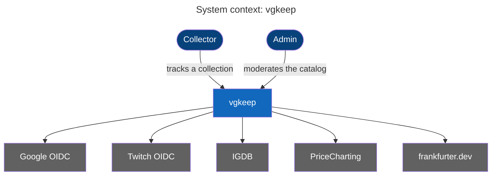
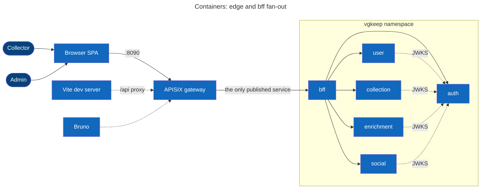
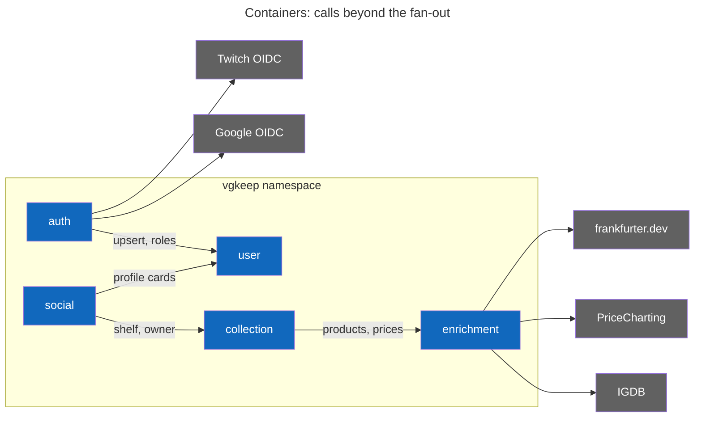
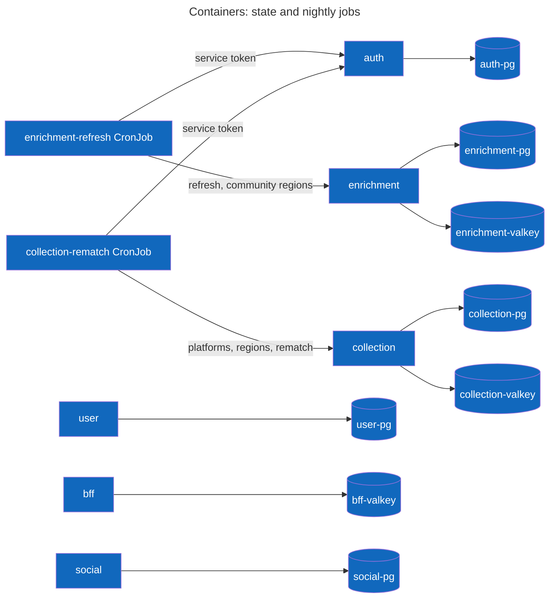
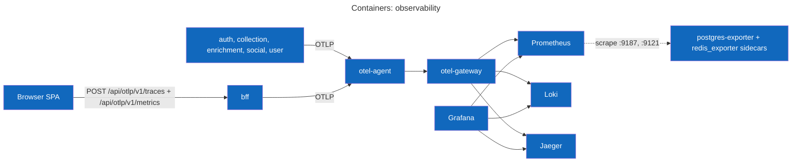
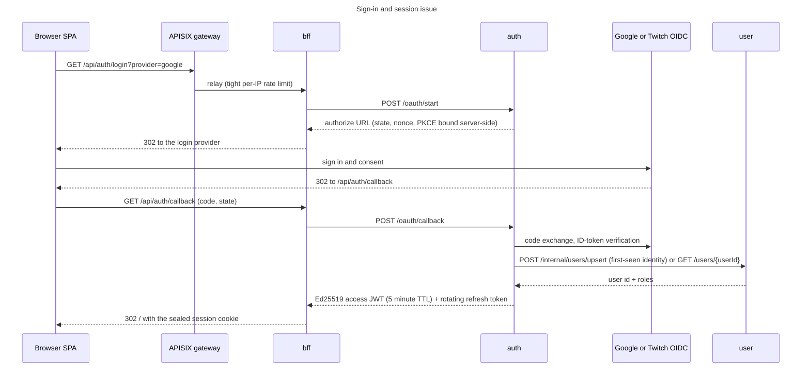
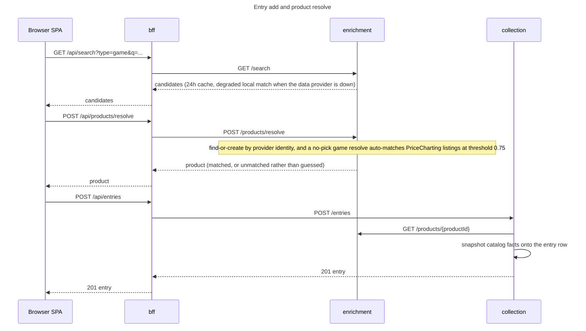
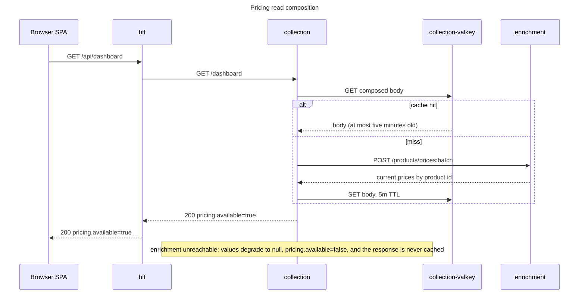
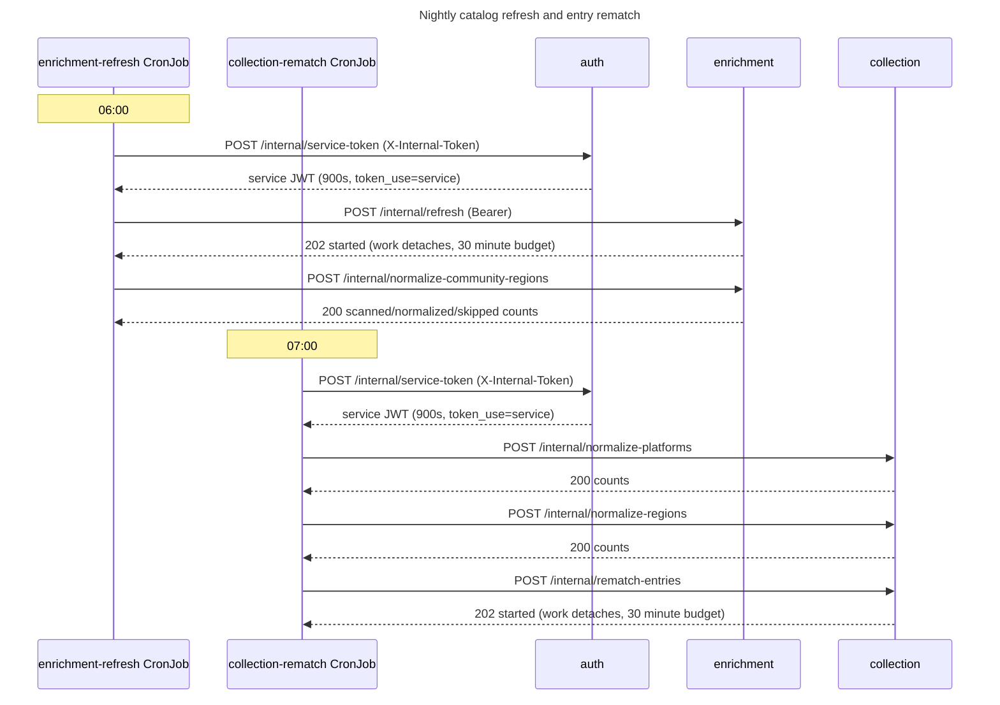
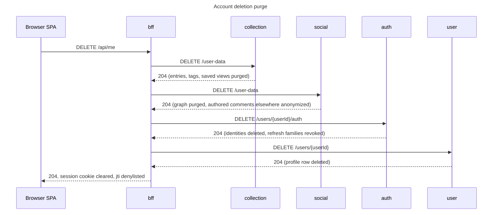

# vgkeep architecture

vgkeep is a video-game collection tracker: Go services behind an APISIX gateway that publishes only the bff, a
React SPA, a Postgres or Valkey instance per service that owns it, nightly CronJobs, and all third-party data
quarantined in the enrichment service. This page is the system view: context, containers, the end-to-end flows,
the datastore boundaries, and how the stack deploys. Per-service internals live in each
service's README under `services/<name>/`; operator material lives in [the runbooks](runbooks/README.md).

## System context

A Collector is a signed-in person tracking their collection; an Admin is a collector whose JWT carries role `admin`
and who moderates the catalog and runs the admin levers. The external systems, by kind:

- Login providers: Google OIDC and Twitch OIDC. Each enables only when `.env` carries both halves of its credential
  pair; the dev provider that mints the `alice`, `bob`, and `admin` fixtures (and the `e2e-*` test pattern) is auth's
  own code, not an external system.
- Data providers: IGDB (`api.igdb.com/v4`) for game metadata, PriceCharting (`www.pricecharting.com`) for market
  prices, frankfurter.dev (`api.frankfurter.dev`) for exchange rates. IGDB calls authenticate with an app token
  minted at `id.twitch.tv/oauth2/token`.

Every data-provider call has a stub mode serving embedded fixtures (`IGDB_MODE`, `PRICECHARTING_MODE`, `FX_MODE`),
and the dev login provider needs no credentials, so a credential-less checkout runs the whole feature set.

## Containers

The application plane, split by concern (edge and bff fan-out, calls beyond the fan-out, state and nightly
jobs), then the observability plane.

The browser reaches the APISIX gateway on `:8090` in dev, and the gateway publishes only the bff
(its `ApisixRoute` applies per-IP rate limits, tight on `/api/auth/*`, looser on the rest of `/api/*`, none on
static assets). The bff seals the session into an AES-GCM cookie and fans out to the other services through
typed clients under `services/bff/internal/`; with `SERVE_STATIC` on (the chart default in this stack) it also
serves the SPA bundle from its own binary, and the CDN split is
[production-paths.md#spa-delivery](production-paths.md#spa-delivery). It never verifies JWT
signatures itself: anything that opens under its cookie key is something it sealed, and the services behind it
(user, collection, enrichment, social) each validate the forwarded bearer against auth's
`/.well-known/jwks.json` (the dotted JWKS edges). The other dotted edges are the dev side doors: the Vite dev
server on `:5173` proxies `/api` to the gateway, and the Bruno flows in `bruno/` hit the gateway (`bff/` folder)
or the per-service Tilt port-forwards directly.

Service-to-service call paths exist beyond the bff fan-out. Auth resolves every login against the user
service (a first-seen identity upserts the profile, a returning login re-reads the user and its roles) and re-reads
roles again at every token refresh. The collection service reads products and batch prices from
enrichment (`POST /products/prices:batch`, `POST /products/price-history:batch`) and mints community products there
when a submission is approved. The social service validates its targets before writing: shelves and their owners
against collection (`/shared/shelves/{shelfId}`), profile cards and followees against the user service
(`/shared/profiles/by-ids`). The outbound edges are the external providers, quarantined where they enter:
auth's login providers (Google, Twitch) and enrichment's data providers (IGDB, PriceCharting, frankfurter.dev).

Each service talks to its own datastores and nobody else's; ingress-only NetworkPolicies enforce every hop drawn
in these views (the gateway namespace to the bff, the bff to the services it fans out to, the service-to-service
calls with their JWKS fetches, each service to its own Postgres and Valkey, CronJob pods to auth and their own
service). The CronJobs authenticate by exchanging a shared internal secret at auth's `POST /internal/service-token`
before their first call; their chains are drawn in the nightly flow below.

Every service pushes OTLP to the node-local otel-agent, which forwards to the central otel-gateway, which fans out
to Prometheus (metrics, with exemplars), Loki (logs), and Jaeger (traces); the SPA rides the same pipe through the
bff's session-gated relay, so one trace stitches the browser through the bff into whichever service and database
answered. Prometheus also scrapes the datastore exporter sidecars (postgres-exporter on `:9187`, redis_exporter on
`:9121`). Operations, the dashboard catalog, and alerting live in [runbooks/stack.md](runbooks/stack.md).

## Actor flows

The flows here are drawn end to end, at actor and endpoint altitude; the owning service README carries the wire
detail for each. Every browser hop below rides the gateway; it is drawn in the first flow's opening leg and elided
everywhere else.

### Sign-in and session issue

The token pair never reaches the browser: the bff seals it into the cookie, and later refreshes it transparently
through auth's `/token/refresh` behind a Valkey singleflight. The dev fixture leg short-circuits the provider dance
entirely: `GET /api/auth/login?provider=dev&user=alice` mints the fixture pair at auth's `/oauth/dev/token` and
seals the same cookie. Wire detail: the [auth README](../services/auth/README.md) owns this flow; refresh, reuse
revocation, and logout live in the [bff README](../services/bff/README.md).

### Entry add and product resolve

An entry is one tracked copy; the product it points at is the catalog identity in enrichment. At entry creation the
collection service copies the product's catalog facts onto the entry row, so entry reads never join across
services; prices are the deliberate exception, composed at read time in the next flow. End to end this flow belongs
to the [collection README](../services/collection/README.md); the resolve and auto-match internals belong to the
[enrichment README](../services/enrichment/README.md).

### Pricing read composition

Dashboard, value history, and entry-list values all compose the same way: current prices come from enrichment at
read time and are never stored on the entry. Enrichment being down therefore costs pricing, not the page; the
degraded response carries `pricing.available=false` and RED metrics alone would miss it. The
[collection README](../services/collection/README.md) owns this flow.

### Nightly catalog refresh and entry rematch

The nightlies sit an hour apart so the catalog settles before entries re-match against it. The catalog refresh
(06:00) re-prices every mapped product, appends snapshots, rebuilds IGDB projections, and sweeps promote
candidates; the entry rematch chain (07:00) normalizes platforms, then regions, then repoints entries whose match
no longer fits. Both jobs authenticate the same way: the shared internal secret buys a 900-second JWT with claim
`token_use=service`, which the internal routes require and a plain user token cannot satisfy. The refresh side is
the [enrichment README](../services/enrichment/README.md)'s flow; the rematch chain is the
[collection README](../services/collection/README.md)'s.

### Account deletion purge

Order is the design: data first (collection, then social), the login identity next, and last the user row that
login resolution anchors on. An interrupted run leaves a login-able account, every leg answers 204 on a repeat, so
the fix for a half-finished deletion is to run it again. The [bff README](../services/bff/README.md) owns the
orchestration; each purge leg is documented by its own service.

### Admin levers

Every lever rides the Admin page through the bff's `/api/admin/*` relays. The bff forwards the caller's JWT and
holds no role logic; the executing service enforces role `admin` (or accepts a service token where noted above).

| Lever | Executing service | Endpoint |
| --- | --- | --- |
| Catalog refresh trigger | enrichment | `POST /admin/refresh` |
| Entry rematch | collection | `POST /internal/rematch-entries` |
| Resnapshot catalog facts | collection | `POST /internal/resnapshot` |
| Normalize platforms | collection | `POST /internal/normalize-platforms` |
| Normalize regions | collection | `POST /internal/normalize-regions` |
| Normalize community regions | enrichment | `POST /internal/normalize-community-regions` |
| Product moderation (mint, remap, promote, dismiss) | enrichment | the `/admin/products` family |
| Guarded product delete | enrichment | `DELETE /admin/products/{productId}`, after the bff checks collection's `GET /admin/products/{productId}/references` |
| Submission verdicts | collection | `POST /admin/submissions/{submissionId}/verdict` (an approval mints the product at enrichment) |

## Datastore map

| Instance | Engine | Owning service | Holds | Why the boundary sits there |
| --- | --- | --- | --- | --- |
| auth-pg | Postgres | auth | `identities`, `signing_keys`, `auth_states`, `refresh_tokens` | token material and login state never leave auth; everyone else sees only JWTs and JWKS |
| user-pg | Postgres | user | `users`, `user_roles` | the profile and roles anchor; auth writes it through `/internal/users/upsert`, never SQL |
| collection-pg | Postgres | collection | `entries`, `tags`, `entry_tags`, `saved_views`, `catalog_submissions` | entries snapshot catalog facts at creation, so collection reads stand alone |
| social-pg | Postgres | social | `follows`, `likes`, `comments`, `activity`, `cap_events` | the graph holds ids only; targets are validated over HTTP at write time |
| enrichment-pg | Postgres | enrichment | `products`, `igdb_raw`, `platforms`, `price_snapshots` (yearly partitions plus a default) | all third-party data lands here and nowhere else |
| bff-valkey | Valkey | bff | session jti denylist; `/api/me` composition cache (45s); recommendations cache (1h per user); refresh singleflight lock and result | the bff owns no database: the session itself lives in the sealed cookie |
| collection-valkey | Valkey | collection | dashboard and value-history composition cache (`DASHBOARD_CACHE_TTL`, default 5m, invalidated on owner mutations) | prices are composed at read time; the cache only shortens the enrichment round trip |
| enrichment-valkey | Valkey | enrichment | search cache (24h), product read cache (5m), platform catalog (24h) | data-provider rate limits make cold reads expensive; a restart rebuilds from providers and Postgres |

One Postgres per service and no cross-service SQL, ever: reads that need another service's facts ride the HTTP
contracts (social validates against collection and user, collection composes prices from enrichment). Catalog facts
snapshot onto an entry at creation, while prices are composed at read time and never stored. All third-party data
enters at enrichment and nowhere else. The Valkeys are pure caches: total loss of any of them degrades latency or
revocation speed, and breaks nothing.

## Deployment topology

- Namespaces: the application runs in `vgkeep`, the platform in `vg-platform`.
- The platform installs once per cluster with `task bootstrap:cluster` (idempotent): the platform chart pins its
  dependencies (cert-manager, external-secrets, apisix, kube-prometheus-stack, loki, jaeger, grafana, and
  opentelemetry-collector twice, aliased `otel-agent` and `otel-gateway`); the pins live in its `Chart.yaml`.
  The platform-config chart mints the dev CA: a selfsigned issuer signs a CA certificate that
  backs the `vg-ca` ClusterIssuer. kube-prometheus-stack CRDs are applied server-side by hand, because helm only
  installs a chart's `crds/` on first install.
- The application deploys through Tilt: one image per service built from `services/<name>/Dockerfile` with only
  `libs/go` and that service in the build context (the bff's context adds `frontend/`, whose Vite build the image
  bakes into the binary), one helm chart per service under `deploy/charts/`, and the
  CronJobs from the enrichment and collection charts. Datastores are templated by `vg-lib`, the shared library
  chart every service chart vendors via `task helm:deps` (run automatically by `task lint`,
  `task bootstrap:cluster`, and the Tiltfile). Port-forwards are listed in the [root README](../README.md); the
  full set including per-service Postgres is in [runbooks/stack.md](runbooks/stack.md).
- Secrets flow `.env` -> Tilt renders the `vg-fake` ClusterSecretStore -> per-service ExternalSecrets -> Kubernetes
  Secrets -> pod env. Zero real credentials are required; stub modes serve fixtures.
- NetworkPolicies are ingress-only allowlists per hop: the gateway namespace to the bff, the bff to the services
  it fans out to, the service-to-service call paths (auth to user, collection to enrichment, social to collection
  and user, and the JWKS fetchers to auth), each service to its own datastores, and CronJob pods to auth and their
  own service.
- Every dev-to-production swap (managed datastores, real secret stores, edge, TLS, CI) is documented in
  [production-paths.md](production-paths.md).

## Documentation map

Where the rest of the documentation lives:

- Per-service READMEs, `services/<name>/README.md`: the developer's view (API surface, components, data model,
  configuration, development).
- [runbooks/](runbooks/README.md): the operator's view, one runbook per service plus
  [runbooks/stack.md](runbooks/stack.md); every provisioned alert deep-links a runbook section.
- [api/README.md](../api/README.md): contract layout and editing flow. [frontend/README.md](../frontend/README.md):
  the SPA, its typed client, and translations. [bruno/README.md](../bruno/README.md): API flows against the dev
  stack.
- [production-paths.md](production-paths.md), [adding-a-region.md](adding-a-region.md),
  [translations.md](translations.md): production swaps, the region graduation checklist, and contributing a
  language.
- Codegen (contracts, domain tables, dashboards, typed clients, locale catalogs) is documented across
  `api/README.md`, `frontend/README.md`, and the generation section of `runbooks/stack.md`.

The shared Go modules under `libs/go/`, one concern each:

| Module | Concern |
| --- | --- |
| catalogval | catalog input-normalization rules shared by collection and enrichment: domain logic, not HTTP plumbing |
| config | service configuration from environment variables via struct tags (`env`, `envDefault`, `required`) |
| contract | generated typed clients and models for the service contracts (oapi-codegen), one package per contract plus shared `common` models |
| ctrtest | the boot-once-and-cache container singleton shared by pgtest and valkeytest, plus per-test-binary database naming |
| httpkit | HTTP server lifecycle, middleware, and RFC 9457 problem+json responses shared by all services |
| jwtauth | validates access JWTs (Ed25519, kid-aware JWKS) and provides auth and role middleware; never mints tokens |
| jwtauthtest | mints real, validator-accepted access tokens for tests from an in-process Ed25519 key and JWKS server |
| metrictest | installs an OpenTelemetry ManualReader over the global MeterProvider for a test, with typed read helpers |
| otel | bootstraps OpenTelemetry traces, metrics, and logs for services (imported aliased as `vgotel`) |
| pgkit | constructs instrumented pgx pools and runs embedded golang-migrate migrations; health checks included |
| pgtest | hands each test binary its own freshly created Postgres database and URL (shared container via `PGTEST_URL`, else a per-binary testcontainer) |
| regionkit | the region tables for resolving free-text region strings against the reviewed known set, plus the canonical fold map |
| reqtest | shared HTTP test mechanics: request building, problem+json assertions, JSON decoding, condition polling |
| specval | validates incoming requests against a service's embedded OpenAPI spec, answering house problem+json on schema failures |
| valkeykit | constructs OTel-instrumented go-redis clients for per-service Valkey caches, plus the shared GetBytes/PutBytes and FailOpen idioms |
| valkeytest | hands each test binary a live Valkey URL with its own logical database index (shared container via `VALKEYTEST_URL`, else a per-binary testcontainer) |
