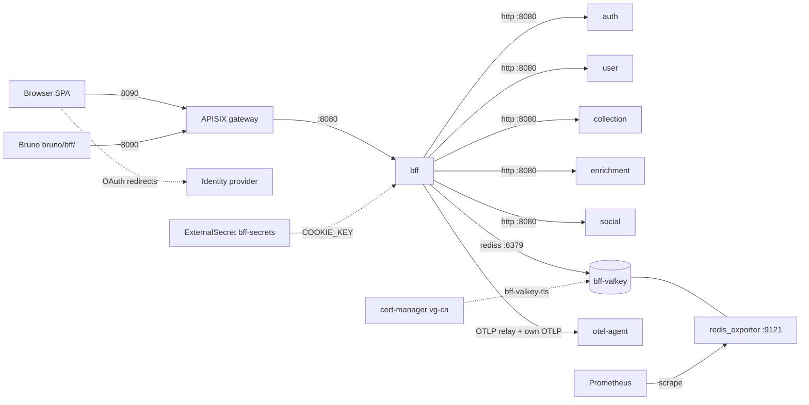
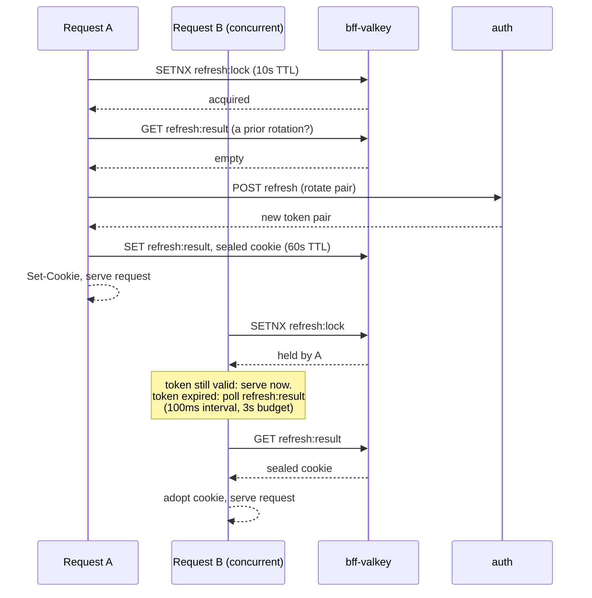

# bff service

The bff is the only public vgkeep service: APISIX (port 8090) publishes it and
nothing else. It owns the browser session end to end (AES-GCM sealed cookie,
transparent token refresh, jti denylist, CSRF origin checks, security headers),
serves the built SPA bundle from the binary, and fronts every other service
through typed clients that relay upstream answers verbatim. It holds no
database: its only datastore is `bff-valkey`, a TLS-only, non-persistent cache
whose total loss degrades latency and revocation speed but breaks nothing.

What it does, as an operator sees it:

- Sessions: dev and OAuth login, logout, transparent refresh with a
  Valkey-coordinated singleflight, account linking and unlinking, full account
  deletion (purge orchestration across collection, social, auth, and user).
- Profile: `/api/me` composed from the user service and cached 45s; profile
  edits invalidate the cache immediately.
- Collection relays: entries CRUD, reorder, and bulk-update, tags, views, dashboard, value
  history, catalog submissions (file, read, cancel, ack).
- Catalog relays: search, product resolve and read, platforms, FX rates.
- Recommendations: the one cross-service composition (collection library
  summary + enrichment scoring), cached 1h per user; the user's own entry
  mutations invalidate it.
- Social relays: follows and unfollows, shelf likes, shelf comments (list,
  create, delete), the activity feed, Explore browsing (recent and top
  shelves), and the shared profile and shelf pages composed from collection,
  user, and social together.
- Admin relays: unmatched and community product worklists, mapping corrections,
  guarded product delete (reference check against collection before the
  enrichment delete), community mint, promote flows, submissions queue and
  verdicts, catalog refresh trigger, entry rematch trigger, entry resnapshot,
  and the three normalization sweeps (platforms, regions, community regions).
  Role enforcement lives downstream; the bff holds no role logic.
- Request validation: every relay's body and query parameters are checked
  against the bff's own copy of the OpenAPI contract before any upstream
  call; a schema violation 400s right here (`invalid_param` or
  `invalid_body`) and the downstream service is never dialed. Once past that
  check, a semantically invalid request still gets whatever problem body the
  downstream service answers with, relayed unchanged.
- Browser telemetry relay: `POST /api/otlp/v1/traces`, session-gated, capped at
  1 MiB, forwarded to the otel-agent so one trace stitches browser to backend.
- SPA serving: embedded Vite bundle; content-hashed assets are immutable,
  `index.html` never caches, extensionless paths fall back to the app shell.

## Architecture



Ingress is locked down twice: the `bff-from-gateway-only` NetworkPolicy admits
port 8080 traffic only from the gateway namespace (`vg-platform`), and
`bff-valkey-owner-only` admits 6379 only from bff pods (plus Prometheus on the
9121 exporter port). There are no cron workloads and no migrations.

### Session refresh hot path

Refresh is the one subtle path in the service. Exactly one rotation may happen
per session: a second rotation of the same refresh token trips the auth
service's reuse detection and revokes the whole session family. Concurrent
requests (multiple tabs) coordinate through Valkey:



When Valkey is down the lock is skipped and rotation proceeds uncoordinated: a
concurrent tab can then trip reuse detection and cost that user a re-login.
Availability wins over that edge while the cache is out.

## Running it

| Port | What                                                               |
| ---- | ------------------------------------------------------------------ |
| 8090 | APISIX gateway, the app's entrypoint (browser and Bruno)           |
| 8083 | bff direct via Tilt port-forward (bypasses the gateway; debugging) |
| 8080 | container port inside the cluster (`HTTP_ADDR` default)            |
| 5173 | Vite dev server (`frontend-dev` Tilt resource, manual trigger)     |

Under Tilt the image rebuilds on edits to `libs/go`, `services/bff`, or
`frontend` (the Dockerfile bakes the Vite output into the binary), and the
`bff` resource starts after `secret-store`, `bff-valkey`, `auth`, and
`collection`. Startup requires Valkey to answer (the process exits if the dial
fails, then crash-loops until `bff-valkey` is up); every later Valkey failure
is handled per-request instead.

Health endpoints answer unconditionally: `GET /healthz` and `GET /readyz` both
return 200 with no dependency checks. That is deliberate: the bff has no hard
runtime dependencies (denylist and caches fail open, downstream calls degrade
per-request with 502s), and the only public service must not unpublish itself
while Valkey is unreachable. There is no migrate mode, no init
container, and no database. The probes are a pod-only surface: kubelet hits
them directly, and the gateway answers 404 on both paths instead of proxying
them (the `internal-probes` rule in the bff ApisixRoute), so probing the
deployed bff means `kubectl`, not `curl :8090/healthz`.

Task targets: `task run` / `task down` for the stack, `task bff:gen` (or root
`task gen`) to regenerate server stubs from `api/bff.yaml` (the typed
upstream clients regenerate once, covering every service, via the shared
`libs/go/contract` module inside the same root `task gen`), `task lint`,
`task build`, `task test:short`, `task test:cover`, `task check` as the
pre-commit gate, and `task e2e` for the parallel Playwright browser suite
against the running stack. Bruno flows live in `bruno/bff/` (user
journeys) and `bruno/bff/admin/` (admin journeys), both pointed at the
gateway origin.

## Configuration

All env comes from `deploy/charts/bff/values.yaml` except the cookie key,
which arrives through the `bff-secrets` ExternalSecret. Dev values for local
runs are in `.env.example`.

| Var                           | Value in dev                                           | Source                                                                                                                    | Notes                                                                         |
| ----------------------------- | ------------------------------------------------------ | ------------------------------------------------------------------------------------------------------------------------- | ----------------------------------------------------------------------------- |
| `HTTP_ADDR`                   | `:8080`                                                | code default                                                                                                              |                                                                               |
| `COOKIE_KEY`                  | base64 32-byte AES key                                 | ExternalSecret `bff-secrets` key `cookie-key`, store key `bff/cookie-key`, filled from `BFF_COOKIE_KEY` in `.env` by Tilt | required; rotating it kills every live session                                |
| `COOKIE_SECURE`               | `true`                                                 | `env.cookieSecure`                                                                                                        | stays on in dev; browsers trust `http://localhost`                            |
| `PUBLIC_ORIGINS`              | `http://localhost:8090,http://localhost:5173`          | `env.publicOrigins`                                                                                                       | origins allowed to send mutating requests (CSRF check)                        |
| `AUTH_SERVICE_URL`            | `http://auth:8080`                                     | `env.authServiceUrl`                                                                                                      | required                                                                      |
| `USER_SERVICE_URL`            | `http://user:8080`                                     | `env.userServiceUrl`                                                                                                      | required                                                                      |
| `ENRICHMENT_SERVICE_URL`      | `http://enrichment:8080`                               | `env.enrichmentServiceUrl`                                                                                                | required                                                                      |
| `COLLECTION_SERVICE_URL`      | `http://collection:8080`                               | `env.collectionServiceUrl`                                                                                                | required                                                                      |
| `SOCIAL_SERVICE_URL`          | `http://social:8080`                                   | `env.socialServiceUrl`                                                                                                    | required                                                                      |
| `VALKEY_URL`                  | `rediss://bff-valkey:6379/0`                           | `env.valkeyUrl`                                                                                                           | required; `rediss://` demands `VALKEY_CA_FILE`                                |
| `VALKEY_CA_FILE`              | `/etc/vg/valkey-ca/ca.crt`                             | set by the chart when `valkey.enabled`                                                                                    | CA from the `bff-valkey-tls` secret                                           |
| `ACCESS_TOKEN_TTL`            | `5m`                                                   | `env.accessTokenTtl`                                                                                                      | must match the auth chart's `accessTokenTtl`; bounds denylist entry TTLs      |
| `REFRESH_WINDOW`              | `30s`                                                  | `env.refreshWindow`                                                                                                       | refresh starts when less than this remains on the access token                |
| `ME_CACHE_TTL`                | `45s`                                                  | `env.meCacheTtl`                                                                                                          | `/api/me` cache                                                               |
| `RECS_CACHE_TTL`              | `1h`                                                   | `env.recsCacheTtl`                                                                                                        | recommendations cache                                                         |
| `SERVE_STATIC`                | `true` in-cluster                                      | `env.serveStatic`                                                                                                         | `false` means the Vite dev server owns the frontend and `/` answers 404       |
| `OTLP_PROXY_URL`              | `http://otel-agent.vg-platform.svc.cluster.local:4318` | `otel.proxyUrl`                                                                                                           | empty disables the browser telemetry relay: payloads are accepted and dropped |
| `OTEL_EXPORTER_OTLP_ENDPOINT` | `http://otel-agent.vg-platform.svc.cluster.local:4317` | `otel.exporterEndpoint`                                                                                                   | empty disables the service's own OTLP export (JSON stdout logs only)          |
| `SERVICE_VERSION`             | image tag                                              | deployment                                                                                                                | stamped on telemetry as `service.version`                                     |

The two optional pieces degrade cleanly: with `OTLP_PROXY_URL` empty the relay
returns 200 and drops payloads; with `OTEL_EXPORTER_OTLP_ENDPOINT` empty the
service still logs JSON to stdout but exports no traces or metrics.

## Datastore: bff-valkey

A single-replica StatefulSet running `valkey/valkey:8-alpine`, TLS-only
listener on 6379 (cert-manager `vg-ca` issues `bff-valkey-tls`, 2160h
duration; client cert auth off, the NetworkPolicy gates callers), no AUTH
user, and no persistence (`--save "" --appendonly no`). A restart empties it
by design. A `redis_exporter` sidecar serves Prometheus metrics on 9121,
scraped through the `bff-valkey` ServiceMonitor; those series carry
`service="bff-valkey"`.

Key families, all written by the bff:

| Pattern                            | Holds                                             | TTL                              |
| ---------------------------------- | ------------------------------------------------- | -------------------------------- |
| `denylist:<jti>`                   | revoked access-token ids                          | access-token life + 1 min leeway |
| `refresh:lock:<sha256(refresh)>`   | rotation singleflight lock                        | 10s                              |
| `refresh:result:<sha256(refresh)>` | published rotation result (AES-GCM sealed cookie) | 60s                              |
| `me:v4:<sub>`                      | composed `/api/me` body                           | `ME_CACHE_TTL` (45s)             |
| `recs:v1:<sub>`                    | composed recommendations body                     | `RECS_CACHE_TTL` (1h)            |

Nothing secret rests in Valkey in the clear: the published rotation result is
the same ciphertext the browser holds. Every key carries a TTL, so memory
growth beyond steady state means traffic growth, not a leak.

Client-side pool health comes from the valkeykit instruments registered at
connect time (no pgkit metrics exist for this service; it has no Postgres):

| Prometheus name                      | What it answers                                                                                  |
| ------------------------------------ | ------------------------------------------------------------------------------------------------ |
| `vg_valkeykit_pool_hits_total`       | acquires served by a free connection; with misses, the reuse ratio                               |
| `vg_valkeykit_pool_misses_total`     | acquires that dialed a new connection (rising rate: pool too small or connections being dropped) |
| `vg_valkeykit_pool_timeouts_total`   | callers that gave up waiting; hard saturation, investigate any nonzero value                     |
| `vg_valkeykit_pool_connections`      | connections currently open to Valkey                                                             |
| `vg_valkeykit_pool_connections_idle` | idle connections available for reuse; zero under load means the pool is exhausted                |

All five are scoped by `service_name="bff"` (resource attribute), no other
labels.

Triage access (read-only; `--scan`, never `KEYS`):

```bash
kubectl -n vgkeep exec statefulset/bff-valkey -c valkey -- \
  valkey-cli --tls --cacert /tls/ca.crt -p 6379 --scan --pattern 'denylist:*'
```

## Telemetry

### Metrics

Everything the bff emits, with Prometheus-side names. HTTP and runtime series
come from the shared router stack (`httpkit.Recover` > otelhttp >
`httpkit.RouteLabel` > `httpkit.RequestLogger`) and the otel runtime
instrumentation; domain counters are registered on the meter
`github.com/levonn-dev/vgkeep/services/bff`. `http_route` values are the
mux patterns, method-prefixed (`GET /api/me`, `POST /api/otlp/v1/traces`).

| Prometheus name                                                                  | Instrument                           | Unit        | Labels (bounded values)                                                                                                                                                                                                                                    | Answers                                                                                                                                                                                                         |
| -------------------------------------------------------------------------------- | ------------------------------------ | ----------- | ---------------------------------------------------------------------------------------------------------------------------------------------------------------------------------------------------------------------------------------------------------- | --------------------------------------------------------------------------------------------------------------------------------------------------------------------------------------------------------------- |
| `http_server_request_duration_seconds_{count,sum,bucket}`                        | histogram                            | s           | `http_route`, `http_response_status_code`                                                                                                                                                                                                                  | RED for every route; 502s are upstream faults                                                                                                                                                                   |
| `go_goroutine_count`                                                             | gauge                                | goroutines  | none                                                                                                                                                                                                                                                       | leak or stall detection                                                                                                                                                                                         |
| `go_memory_used_bytes`                                                           | gauge                                | bytes       | none                                                                                                                                                                                                                                                       | heap pressure against the 128Mi limit                                                                                                                                                                           |
| `vg_valkeykit_pool_*` (five series above)                                        | counters + gauges                    | mixed       | none                                                                                                                                                                                                                                                       | client pool sizing and saturation                                                                                                                                                                               |
| `redis_memory_used_bytes`, `redis_evicted_keys_total`, `redis_connected_clients` | exporter                             | mixed       | `service="bff-valkey"`                                                                                                                                                                                                                                     | server-side cache health                                                                                                                                                                                        |
| `vg_bff_cache_fail_open_total`                                                   | counter (`vg.bff.cache.fail_open`)   | `{event}`   | `op`: `denylist_add`, `denylist_check`, `me_get`, `me_put`, `me_invalidate`, `recs_get`, `recs_put`, `recs_invalidate`, `refresh_lock`, `refresh_unlock`, `refresh_publish`, `refresh_result`, `social_summary`, `social_publish_event`, `comment_authors` | Valkey operations skipped by failing open, plus non-Valkey composition calls that degrade the same way (social counts, the publish event, and batched comment-author cards); the denylist ops feed a page alert |
| `vg_bff_auth_logins_total`                                                       | counter (`vg.bff.auth.logins`)       | `{login}`   | `flow`: `login`, `link`; `outcome`: `success`, `failed`, `email_unverified`, `provider_error`, `conflict`                                                                                                                                                  | did logins or account links regress, and how are they failing                                                                                                                                                   |
| `vg_bff_session_refreshes_total`                                                 | counter (`vg.bff.session.refreshes`) | `{refresh}` | `outcome`: `rotated`, `adopted`, `deferred`, `rejected`, `reuse_revoked`, `failed`, `adopt_timeout`                                                                                                                                                        | are sessions staying alive; a `rejected`/`reuse_revoked`/`failed` climb is users being logged out                                                                                                               |
| `vg_bff_cache_lookups_total`                                                     | counter (`vg.bff.cache.lookups`)     | `{lookup}`  | `cache`: `me`, `recs`; `outcome`: `hit`, `miss`                                                                                                                                                                                                            | are the two composition caches absorbing load; a hit-ratio drop after a deploy means a key-version bump or TTL misconfig                                                                                        |

Emission sites for the three domain counters beyond `fail_open`:

- `vg.bff.auth.logins`: one increment per completed login or link attempt, at
  the `Login`, `Callback`, and `LinkLogin` outcome points (success on the
  cookie-set redirect; failures mapped from the authclient error taxonomy:
  `ErrEmailUnverified` > `email_unverified`, `ErrProviderError` >
  `provider_error`, `ErrLinkConflict`/`ErrLinkEmailUnverified` on the link
  flow, everything else `failed`). No `provider` label on purpose: the bff
  does not know the provider on the OAuth callback leg; provider-level login
  health belongs to the auth service.
- `vg.bff.session.refreshes`: one increment per refresh attempt at the
  terminal points of `refreshSession` and `adoptRefreshResult`. `rotated` is
  a successful rotation, `adopted` covers both adoption paths (post-lock
  result read and the poll), `deferred` means auth or its role source was
  unavailable but the current token still had life (request served, refresh
  postponed), `rejected` is a non-reuse 401 from auth, `reuse_revoked` is
  reuse detection killing the family, `failed` is a refresh error with an
  expired token (user saw 502/503) or a rotation whose successor could not
  be parsed or sealed (user saw 401/500), `adopt_timeout` is the adoption
  poll giving up: budget expiry, a Valkey read error or unreadable result
  mid-poll, or the caller disconnecting while waiting (user saw 401; the
  browser retry adopts the late result). A request that finds the rotation
  lock held while its token still has life serves immediately and counts
  nothing: the holder's rotation is the one event.
- `vg.bff.cache.lookups`: in `GetMe` and `GetRecommendations`, `hit` when the
  cached body is served, `miss` otherwise. A Valkey read error counts as
  `miss` (the composition ran) and fires the fail-open counter separately.
  Denylist checks are excluded: their hit means "revoked", not "cache warm".

### Logs

Lines worth knowing: `http request` (INFO, one per request: `method`,
`path`, `status`, `duration_ms`), `dependency unavailable; failing open` (ERROR,
`op`, `err`), `login failed` (WARN, `err`), `token refresh failed` (WARN,
`err`), `refresh chain revocation failed` (ERROR, `err`), `cookie seal failed`
(ERROR, `err`), `bff listening` (INFO, `addr`, `serve_static`). All are JSON
on stdout and shipped to Loki with `trace_id` attached.

Three lines cover paths that would otherwise fail silently:

- `refresh token reuse detected; session family revoked` - WARN, fields `sub`
  and `revoked_jtis` (count), at the reuse-detection arm of `refreshSession`.
- `refresh result adoption timed out` - WARN, field `sub`, when the
  `adoptRefreshResult` poll gives up (budget expiry, or a read error or
  unreadable result mid-poll). Each occurrence is a browser that got a
  spurious 401.
- `browser telemetry relay failed` - WARN, field `err`, when the collector
  call in `ProxyTraces` errors. The 502 shows in RED metrics; this line
  carries the cause (DNS, refused, timeout).

## Dashboard: vg-bff

Provisioned from `deploy/charts/platform/files/dashboards/bff.json` into the
vgkeep folder, uid `vg-bff`, title `BFF Service`. Open it at
http://localhost:3000/d/vg-bff while `task run` holds the Grafana
port-forward. It follows the structural conventions shared by every
vgkeep dashboard (schemaVersion 39, tag `vgkeep`, browser timezone,
30s refresh, explicit `{"type": "prometheus", "uid": "prometheus"}`
datasource per target; the logs panel uses uid `loki`). No in-flight panel:
the pipeline exports no active-requests series.

Overview:

1. "Availability" - timeseries, unit `short`, legend `{{pod}}`:

   ```promql
   up{namespace="vgkeep", pod=~"bff-.*"}
   ```

2. "Request rate" - stat, unit `reqps`:

   ```promql
   sum(rate(http_server_request_duration_seconds_count{service_name="bff"}[5m]))
   ```

3. "5xx ratio" - stat, unit `percentunit`, state thresholds green under
   0.05 / red at 0.05 (the vg-service-5xx page objective):

   ```promql
   sum(rate(http_server_request_duration_seconds_count{service_name="bff",http_response_status_code=~"5.."}[5m])) / sum(rate(http_server_request_duration_seconds_count{service_name="bff"}[5m]))
   ```

4. "p99 latency" - stat, unit `s`, state thresholds green under 0.5 /
   yellow at 0.5 (the vg-service-p99 warn objective):

   ```promql
   histogram_quantile(0.99, sum by (le) (rate(http_server_request_duration_seconds_bucket{service_name="bff"}[5m])))
   ```

HTTP:

5. "Request rate by route" - timeseries, `reqps`, legend `{{http_route}}`:

   ```promql
   sum by (http_route) (rate(http_server_request_duration_seconds_count{service_name="bff"}[$__rate_interval]))
   ```

6. "5xx ratio (5m)" - timeseries, `percentunit`, legend `5xx ratio`:

   ```promql
   sum(rate(http_server_request_duration_seconds_count{service_name="bff",http_response_status_code=~"5.."}[5m])) / sum(rate(http_server_request_duration_seconds_count{service_name="bff"}[5m]))
   ```

7. "Latency by route (p95/p99)" - timeseries, `s`, `"exemplar": true` on both
   targets, legends `p95 {{http_route}}` / `p99 {{http_route}}`:

   ```promql
   histogram_quantile(0.95, sum by (le, http_route) (rate(http_server_request_duration_seconds_bucket{service_name="bff"}[$__rate_interval])))
   histogram_quantile(0.99, sum by (le, http_route) (rate(http_server_request_duration_seconds_bucket{service_name="bff"}[$__rate_interval])))
   ```

8. "4xx and 5xx by route and status" - timeseries, `reqps`, legend
   `{{http_route}} {{http_response_status_code}}`:

   ```promql
   sum by (http_route, http_response_status_code) (rate(http_server_request_duration_seconds_count{service_name="bff",http_response_status_code=~"4..|5.."}[$__rate_interval]))
   ```

Sessions and composition:

9. "Login and link outcomes" - timeseries, `short`, legend
   `{{flow}} {{outcome}}`:

   ```promql
   sum by (flow, outcome) (increase(vg_bff_auth_logins_total[5m]))
   ```

10. "Session refresh outcomes" - timeseries, `short`, legend `{{outcome}}`:

    ```promql
    sum by (outcome) (increase(vg_bff_session_refreshes_total[5m]))
    ```

11. "Composition cache hit ratio (me, recs)" - timeseries, `percentunit`,
    legend `{{cache}}`:

    ```promql
    sum by (cache) (rate(vg_bff_cache_lookups_total{outcome="hit"}[5m])) / sum by (cache) (rate(vg_bff_cache_lookups_total[5m]))
    ```

12. "Browser telemetry relay responses by route" - timeseries, `reqps`,
    legend `{{http_route}} {{http_response_status_code}}`:

    ```promql
    sum by (http_route, http_response_status_code) (rate(http_server_request_duration_seconds_count{service_name="bff",http_route=~"POST /api/otlp/v1/(traces|metrics)"}[$__rate_interval]))
    ```

Valkey:

13. "Valkey pool connections" - timeseries, `short`, legends `open` /
    `idle`:

    ```promql
    vg_valkeykit_pool_connections{service_name="bff"}
    vg_valkeykit_pool_connections_idle{service_name="bff"}
    ```

14. "Valkey pool acquire outcomes" - timeseries, `ops`, legends `hits` /
    `misses` / `timeouts`:

    ```promql
    rate(vg_valkeykit_pool_hits_total{service_name="bff"}[$__rate_interval])
    rate(vg_valkeykit_pool_misses_total{service_name="bff"}[$__rate_interval])
    rate(vg_valkeykit_pool_timeouts_total{service_name="bff"}[$__rate_interval])
    ```

15. "Valkey pool reuse ratio" - timeseries, `percentunit`, legend `reuse ratio`:

    ```promql
    rate(vg_valkeykit_pool_hits_total{service_name="bff"}[5m]) / (rate(vg_valkeykit_pool_hits_total{service_name="bff"}[5m]) + rate(vg_valkeykit_pool_misses_total{service_name="bff"}[5m]))
    ```

16. "Valkey server memory" - timeseries, `bytes`, legend `used`:

    ```promql
    redis_memory_used_bytes{service="bff-valkey"}
    ```

17. "Valkey evictions and clients" - timeseries, `short`, legends
    `evictions` / `clients`:

    ```promql
    rate(redis_evicted_keys_total{service="bff-valkey"}[$__rate_interval])
    redis_connected_clients{service="bff-valkey"}
    ```

18. "Valkey keyspace hit ratio" - timeseries, `percentunit`, legend `hit ratio`:

    ```promql
    rate(redis_keyspace_hits_total{service="bff-valkey"}[5m]) / (rate(redis_keyspace_hits_total{service="bff-valkey"}[5m]) + rate(redis_keyspace_misses_total{service="bff-valkey"}[5m]))
    ```

19. "Valkey fail-open events by op" - timeseries, `short`, legend `{{op}}`:

    ```promql
    sum by (op) (increase(vg_bff_cache_fail_open_total[5m]))
    ```

Runtime:

20. "Goroutines" - timeseries, `short`, legend `goroutines`:

    ```promql
    go_goroutine_count{service_name="bff"}
    ```

21. "Heap used" - timeseries, `bytes`, legend `heap`:

    ```promql
    go_memory_used_bytes{service_name="bff"}
    ```

Pods:

22. "CPU by pod" - timeseries, `short`, legend `{{pod}}`:

    ```promql
    sum by (pod) (rate(container_cpu_usage_seconds_total{namespace="vgkeep", container="bff"}[$__rate_interval]))
    ```

23. "Working-set memory by pod" - timeseries, `bytes`, legend `{{pod}}`:

    ```promql
    sum by (pod) (container_memory_working_set_bytes{namespace="vgkeep", container="bff"})
    ```

24. "Restarts and OOM kills by pod (15m)" - timeseries, `short`, legends
    `restarts {{pod}}` / `oom {{pod}}`:

    ```promql
    sum by (pod) (increase(kube_pod_container_status_restarts_total{namespace="vgkeep", container="bff"}[15m]))
    sum by (pod) (kube_pod_container_status_last_terminated_reason{reason="OOMKilled", namespace="vgkeep", container="bff"})
    ```

Logs:

25. "Recent error and warn logs" - logs panel against Loki:

    ```logql
    {service_name="bff"} | severity_text=~"ERROR|WARN"
    ```

## Failure modes and triage

### 1. Valkey unreachable

Requests keep succeeding; the service fails open. Confirm on the "Valkey
fail-open events by op" panel, or:

```promql
sum by (op) (increase(vg_bff_cache_fail_open_total[5m]))
```

plus the ERROR line `dependency unavailable; failing open`. Many ops firing at
once means Valkey itself is down (check the `bff-valkey` pod); a single op
firing points at one code path.

The `vg-denylist-failopen` rule (severity page) covers the denylist slice
of the same counter over a 10 minute window, with no for delay: it fires
on the first revoked-token check skipped because Valkey was unreachable:

```promql
sum(increase(vg_bff_cache_fail_open_total{op=~"denylist_.*"}[10m]))
```

Revoked-token checks are skipped by design (requests proceed rather than
blocking), so this is a degraded-availability signal, not a functional
bug. While it fires, a session that was just logged out or revoked keeps
its access token usable for the remainder of its TTL (5 minutes max): a
bounded, known exposure window, not an open-ended one. Use the by-op
panel to see whether the spike is isolated to denylist checks or every
bff cache operation is failing open.

### 2. A downstream service is down

The bff answers 502 `upstream_error` with the failing dependency named in the
problem detail. Confirm which routes on the "4xx and 5xx by route and status"
panel, or:

```promql
sum by (http_route) (rate(http_server_request_duration_seconds_count{service_name="bff",http_response_status_code="502"}[5m]))
```

Route-to-dependency map: `/api/auth/*` and `/api/me/identities*` > auth;
`/api/me` > user; `/api/entries*`, `/api/tags*`, `/api/views*`,
`/api/dashboard*`, `/api/admin/submissions*`, `/api/admin/rematch`,
`/api/admin/resnapshot`, `/api/admin/normalize-platforms`,
`/api/admin/normalize-regions` > collection; `/api/search`,
`/api/products*`, `/api/fx`, `/api/platforms`, `/api/admin/products*`,
`/api/admin/refresh`, `/api/admin/normalize-community-regions` > enrichment;
`/api/social/follows/*`, `/api/social/likes/*`, `/api/shelves/*`,
`/api/shelves/*/comments`, `/api/comments/*`, `/api/feed`, `/api/explore`,
`/api/profiles/*` > social; `/api/otlp/v1/traces` > otel-agent.
`/api/recommendations`, `DELETE /api/me`, and the composed profile pages
(`/api/profiles/{handle}` and `/api/profiles/{handle}/shelves/{slug}`
read user and collection before social) touch several services; read the
problem detail or the trace. Then triage the named service, not the bff
([stack.md](stack.md#1-service-5xx-ratio-above-5-percent) says the same
from the other direction).

### 3. Refresh failure storm (mass logout)

Users report being logged out; 401s climb. Confirm on the "Session refresh
outcomes" panel:

```promql
sum by (outcome) (increase(vg_bff_session_refreshes_total[10m]))
```

The vg-bff-refresh-failures rule fires when the failing outcomes
together exceed 10 in 10 minutes:

```promql
sum(increase(vg_bff_session_refreshes_total{outcome=~"rejected|reuse_revoked|failed"}[10m]))
```

- `rejected` or `reuse_revoked` climbing: auth is refusing rotations. If it
  started at a deploy, suspect an auth signing-key or TTL change.
- `failed` or `deferred` climbing: auth (or its role source) is unavailable;
  sessions survive until their access tokens expire, then requests fail.
- `adopt_timeout` climbing: rotation results are not being published or read;
  check Valkey (scenario 1) first.
- No refresh outcomes at all, but a 401 wave plus a spike on "Login and link
  outcomes": cookies stopped opening. That is a `COOKIE_KEY` change (see the
  rotation lever below); expected after a deliberate rotation, an incident
  otherwise.

Correlate with the WARN lines `token refresh failed` and
`refresh token reuse detected; session family revoked`.

### 4. Login failures at the edge

Confirm on the "Login and link outcomes" panel:

```promql
sum by (flow, outcome) (increase(vg_bff_auth_logins_total[15m]))
```

`provider_error` means the identity provider or the auth service's OAuth
exchange is failing (retryable, IdP-side); `email_unverified` is policy
refusing unverified emails, not an outage; `failed` with no pattern means read
the `login failed` WARN lines and the auth service's own logs, which carry the
exchange detail the bff never sees.

### 5. Valkey client pool exhaustion

Requests slow down or error while Valkey itself looks healthy. A nonzero
`timeouts` series on the "Valkey pool acquire outcomes" panel is the
confirmation, or:

```promql
sum(increase(vg_valkeykit_pool_timeouts_total{service_name="bff"}[10m]))
```

The vg-bff-valkey-pool-timeouts rule fires on any nonzero value of the
same expression. A rising miss rate on "Valkey pool acquire outcomes" without timeouts means
the pool is churning connections (too small, or connections being dropped
mid-life); check "Valkey pool connections" for zero idle under load.

### 6. Valkey memory growth or evictions

Every bff key carries a TTL, so sustained growth tracks live sessions and
traffic. Evictions are the dangerous case: an evicted `denylist:` key
un-revokes a token until its natural expiry. Confirm on the "Valkey
server memory" and "Valkey evictions and clients" panels, or with:

```promql
rate(redis_evicted_keys_total{service="bff-valkey"}[5m]) > 0 or redis_memory_used_bytes{service="bff-valkey"} > 209715200
```

Shared triage in
[stack.md](stack.md#7-valkey-evicting-keys-or-memory-unusually-high).

### 7. Browser telemetry relay failing

Browser traces stop appearing in Jaeger; the app itself is unaffected.
Confirm on the "Browser telemetry relay responses by route" panel (502s on
`POST /api/otlp/v1/traces`) and the WARN line
`browser telemetry relay failed`. A 200-yet-no-traces state means
`OTLP_PROXY_URL` is empty (accept-and-drop mode) or the collector is dropping
queue items downstream:
[stack.md](stack.md#telemetry-pipeline-operations).

The relay carries a second OTLP signal the same way: `POST
/api/otlp/v1/metrics` shares the identical session gate, 1 MiB cap, and
verbatim passthrough to the otel-agent (`proxyOTLP` in the bff serves both
routes), and a relay failure on that leg logs the same WARN line. Empty
panels on the Frontend Telemetry dashboard (vg-frontend) with the rest of
the pipeline healthy point here first: [frontend.md](frontend.md).

### 8. Rate limiting at the gateway

A 429 at the gateway has two distinct origins, and the access log's
upstream_status field tells them apart. Edge rejections come from the
limit-count plugin and never reach the bff (no upstream address on the
log line). Application 429s are proxied straight through with
upstream_status 429 - today that is exactly one endpoint, the handle
cooldown on `PATCH /api/me` (contract code `handle_cooldown`, relayed
from the user service) - and both kinds land in the same
`apisix_http_status` counter below.

Edge budgets are per client IP per minute: 1800 on `/api/*` and 240 on
`/api/auth/*` on this dev stack, unlimited static. Both are sized
against the busiest legitimate client the stack has - the parallel
browser-test suite, whose full run measures about 900 API requests and
85 auth requests in under a minute from one address, with consecutive
runs sharing one fixed window when a developer iterates - so a green
`task e2e` produces zero edge rejections (its one expected 429 is the
application's own cooldown answer, asserted by a test) while hot
client request loops (thousands per minute) and credential stuffing
(hundreds) still trip the limits. Production traffic is human-shaped: keep the
tighter 300/min API and 20/min auth budgets there. Once real users
share NAT'd addresses, key the API budget per authenticated user
rather than per IP (per-IP stays as the coarse outer guard on the
anonymous auth surface, where credential stuffing arrives before any
user identity exists).
Confirm on the "Rate-limited (429)" panel of the APISIX Edge dashboard
(vg-apisix-edge):

```promql
sum(rate(apisix_http_status{code="429"}[$__rate_interval]))
```

A 429 wave from one IP is a hot loop or an abuser; from many IPs it means the
budgets no longer fit the app's request fan-out.

## Admin levers

The bff owns no data, so it has no backfills of its own; its levers are
relays and key material.

- Catalog refresh trigger (relayed to enrichment, which enforces the admin
  role). One-off from a shell against the dev stack:

  ```bash
  curl -sc /tmp/vg-admin.jar -o /dev/null "http://localhost:8090/api/auth/login?provider=dev&user=admin"
  curl -sb /tmp/vg-admin.jar -X POST "http://localhost:8090/api/admin/refresh"
  ```

  The same journey exists as a Bruno flow under `bruno/bff/admin/`. All other
  `/api/admin/*` endpoints (worklists, verdicts, promotes, mapping
  corrections) work the same way: session cookie plus downstream role check.

- Entry rematch trigger (relayed to collection, which enforces admin-or-service).
  Same shape as the catalog refresh trigger above, one route later:

  ```bash
  curl -sc /tmp/vg-admin.jar -o /dev/null "http://localhost:8090/api/auth/login?provider=dev&user=admin"
  curl -sb /tmp/vg-admin.jar -X POST "http://localhost:8090/api/admin/rematch"
  ```

  Also a Bruno flow under `bruno/bff/admin/`, and the Admin page's own
  "Trigger entry rematch" button.

- Entry resnapshot (relayed to collection, which enforces admin-or-service).
  Synchronous, unlike the two triggers above - the sweep counts ride the
  response:

  ```bash
  curl -sc /tmp/vg-admin.jar -o /dev/null "http://localhost:8090/api/auth/login?provider=dev&user=admin"
  curl -sb /tmp/vg-admin.jar -X POST "http://localhost:8090/api/admin/resnapshot"
  ```

  Also a Bruno flow under `bruno/bff/admin/`, and the Admin page's own
  "Run entry resnapshot" card.

- Admin role grant (dev fixture only): `task grant-fixture-admin`. Logs the
  `admin` dev fixture in (upserting its user row), then inserts the role in
  user-pg. Idempotent.

- Cookie key rotation, the sessions kill switch: rotate the secret-store key
  `bff/cookie-key` (dev: change `BFF_COOKIE_KEY` in `.env`; Tilt re-applies
  the store). ESO refreshes the `bff-secrets` Secret within 1m, but the
  deployment's checksum annotation tracks the ExternalSecret manifest, not
  the value, so force the roll:

  ```bash
  kubectl -n vgkeep rollout restart deployment/bff
  ```

  Every live cookie stops opening; every user re-logs-in. Expect the "Login
  and link outcomes" spike and a 401 wave (scenario 3's last bullet) as
  confirmation.

- Cache reset: restart the cache, since it holds nothing persistent:

  ```bash
  kubectl -n vgkeep rollout restart statefulset/bff-valkey
  ```

  Consequences are scenario 1's for the restart window plus a cold-cache
  latency bump on `/api/me` and `/api/recommendations`, and denylist entries
  lost until their tokens expire (5 minutes max).

## Capacity and rollout

One replica (`replicas: 1`), stateless by construction: session state lives in
the cookie, so scale-out needs no session affinity, and the refresh
singleflight already coordinates across replicas through Valkey. Requests are
`cpu: 50m, memory: 64Mi` with a 128Mi memory limit and no CPU limit;
bff-valkey runs the same shape. Watch "Working-set memory by pod" (what the OOM
killer acts on) against the 128Mi limit before raising replicas for memory
reasons.

PodDisruptionBudgets set `minAvailable: 1` on both bff and bff-valkey. At one
replica that refuses voluntary evictions: a node drain blocks until the
workload is moved by other means (for the Deployment, a rolling update
surging onto another node; the StatefulSet has to be deleted and rescheduled).
Inert on the single-node dev cluster, correct shape on many.

A rollout is a default RollingUpdate: the new pod surges up, its probes
(liveness `/healthz`, readiness `/readyz`, default kubelet timings) pass as
soon as the HTTP server answers because readiness is unconditional, then the
old pod terminates. In-flight sessions carry over untouched (cookies, not
server state). The SPA ships inside the binary, so a frontend deploy is the
same rollout: `index.html` is `no-cache`, browsers pick up the new bundle on
the next navigation, and a pre-rollout tab can 404 on a lazily loaded
content-hashed chunk until it reloads. A secret-shape change re-rolls pods via
the ExternalSecret checksum annotation; value-only rotations need the manual
restart above.

A bff-valkey restart never takes the bff down (scenario 1 is the worst case);
a full bff-valkey outage at bff startup does, because the initial connect is
required: Tilt orders `bff` after `bff-valkey` for exactly that reason.
