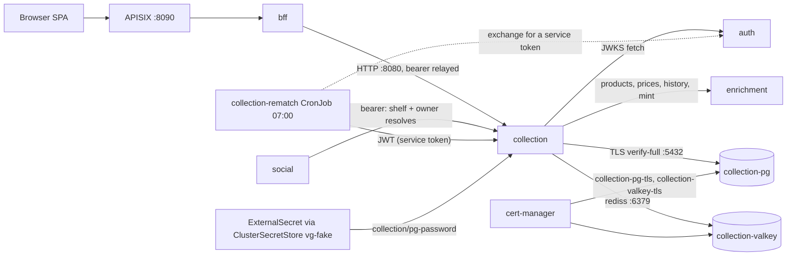
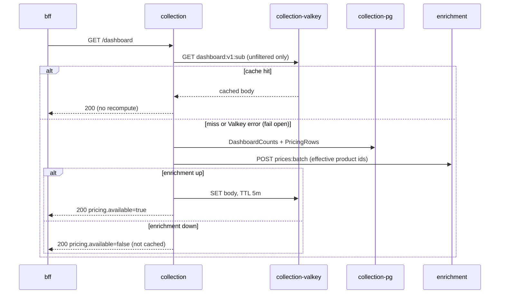

# Collection service

The collection service owns the user-collections domain: granular
physical entries (one row per copy) recorded against the enrichment
catalog or as custom off-catalog items, user-scoped tags and saved
views, fractional-index backlog ordering, and read-time value
composition that joins entries to enrichment prices. Catalog facts are
snapshotted onto an entry at creation; prices are composed on every
read and never stored. Every route requires a Bearer access JWT from
the auth service and is scoped to the token subject, except the admin
reads and verdicts, which additionally require role admin.

Feature inventory, as an operator sees it:

- Entries: create (product-backed or custom), get, full-replace
  update, delete, transactional bulk-update (tags add/remove, status,
  storage location across a batch of the caller's own entries; 400
  `tag_cap_exceeded` rolls back the whole call), and the list matrix
  (filter x sort x group, paged).
- Backlog ordering: single-row fractional-index reorder between two
  neighbor entries (409 `conflicting_order` on stale drags).
- Tags and saved views: per-user CRUD, case-insensitive unique names;
  tags are capped at 200 distinct per user (429 `cap_exceeded`).
- Shelf sharing: saved views carry a visibility (private, unlisted,
  listed; default private) with `published_at` stamped on transitions
  into listed, and the `/shared/shelves` family (list, by-slug, by-ids,
  by-id, entries) serves whitelisted cross-user reads to the bff and
  social - profile pages, Explore, and social's shelf resolves all ride
  it.
- Dashboard and value history: SQL aggregates plus one batched
  enrichment price call, cached about five minutes in Valkey and
  invalidated by the owner's own mutations.
- Library summary: deduplicated game list shaped for enrichment's
  recommendation scoring input.
- Catalog submissions: users file custom entries for review; admins
  page the pending queue and resolve with approve_new (mints a
  community product in enrichment), approve_existing, or reject.
- Purge: the collection leg of account deletion (idempotent).
- Admin product-references count: the safety read behind the
  catalog's guarded product delete.

## Architecture

The bff, social, and the rematch CronJob are the callers; NetworkPolicy
`collection-from-callers-only` admits port 8080 ingress from bff,
social, and collection-rematch pods, and the datastore policies admit
only collection pods plus the Prometheus exporter ports (9187, 9121)
from vg-platform. The one cron workload, collection-rematch
(`0 7 * * *`, an hour after enrichment's catalog refresh), exchanges
the shared internal secret for a service JWT at auth and presents a
normal bearer to a nightly chain in dependency order:
`/internal/normalize-platforms`, then `/internal/normalize-regions`,
then `/internal/rematch-entries` (`&&`-joined, so a failed step stops
the chain); every other endpoint is request-driven. Enrichment hops
always relay the calling user's own bearer; there is no service
credential.

The dashboard read is the hot path with the most moving parts:

## Running it

Dev stack facts (Tilt resource `collection`, labels `services`):

| Surface                  | Address                                                                                                            |
| ------------------------ | ------------------------------------------------------------------------------------------------------------------ |
| collection HTTP (direct) | localhost:8085 -> pod 8080                                                                                         |
| via gateway              | none: APISIX (8090) publishes only the bff                                                                         |
| collection-pg            | localhost:5435 -> pod 5432                                                                                         |
| collection-valkey        | no port-forward (in-cluster only, TLS)                                                                             |
| health                   | GET /healthz (liveness, always 200 when the process is up)                                                         |
| readiness                | GET /readyz (Postgres ping via pgkit.Health; Valkey is deliberately NOT checked: the cache fails open per request) |

Both health endpoints sit outside JWT auth; everything else is inside
it. Tilt rebuilds the image from `services/collection/Dockerfile` on
changes under `libs/go` or `services/collection` and re-applies the
chart; the resource depends on secret-store, collection-pg,
collection-valkey, auth, and enrichment, so a fresh `task run` brings
those up first.

Task targets:

- Root: `task lint`, `task build`, `task test`, `task test:short`,
  `task test:cover`, `task tidy`, `task gen` (regenerates collection's
  server stubs and enrichment client), `task run` / `task down`,
  `task grant-fixture-admin` (grants the dev admin fixture the admin
  role; needed before admin routes answer 200 in dev).
- Module (`services/collection/Taskfile.yml`): `task collection:gen`,
  `task collection:db:migrate` (runs `go run ./cmd/collection migrate`
  against `DATABASE_URL`).

Bruno flows live in `bruno/collection/` (environment variable
`collection_url` = http://localhost:8085): entry CRUD, bulk-update,
tags, views, dashboard, value history, library summary, reorder,
purge, and the resnapshot lever.

Migrate mode: `collection migrate` loads the full config, runs the
embedded migrations via pgkit.Migrate, and exits. The deployment runs
it as an init container with the same env anchor as the app container,
so a schema change rolls out as migrate-then-serve; a failed migration
blocks the rollout while the old pod keeps serving.

## Configuration

| Env var                     | Default                  | Source                                                                                                                                                                                                                | Notes                                                                     |
| --------------------------- | ------------------------ | --------------------------------------------------------------------------------------------------------------------------------------------------------------------------------------------------------------------- | ------------------------------------------------------------------------- |
| HTTP_ADDR                   | :8080                    | code default                                                                                                                                                                                                          | not set by the chart                                                      |
| DATABASE_URL                | required                 | composed in deployment.yaml: user `collection`, db `collection`, host `collection-pg`, `sslmode=verify-full`, `sslrootcert=/etc/vg/pg-ca/ca.crt`                                                                      | password expands from env `PG_PASSWORD`                                   |
| PG_PASSWORD                 | required                 | Secret `collection-pg-credentials` key `password`, filled by the ExternalSecret from ClusterSecretStore `vg-fake` key `collection/pg-password`; dev value comes from `.env` `PG_COLLECTION_PASSWORD` via the Tiltfile | refreshInterval 1m                                                        |
| VALKEY_URL                  | required                 | chart `env.valkeyUrl` = rediss://collection-valkey:6379/0                                                                                                                                                             |                                                                           |
| VALKEY_CA_FILE              | /etc/vg/valkey-ca/ca.crt | set when `valkey.enabled`                                                                                                                                                                                             | config.Load rejects a rediss:// URL without it                            |
| JWKS_URL                    | required                 | chart `env.jwksUrl` = http://auth:8080/.well-known/jwks.json                                                                                                                                                          |                                                                           |
| JWT_ISSUER                  | vgkeep-auth              | chart `env.jwtIssuer`                                                                                                                                                                                                 |                                                                           |
| JWT_AUDIENCE                | vgkeep                   | chart `env.jwtAudience`                                                                                                                                                                                               |                                                                           |
| ENRICHMENT_SERVICE_URL      | required                 | chart `env.enrichmentServiceUrl` = http://enrichment:8080                                                                                                                                                             | 10s client timeout                                                        |
| DASHBOARD_CACHE_TTL         | 5m                       | chart `env.dashboardCacheTtl`                                                                                                                                                                                         | also the value-history TTL                                                |
| SERVICE_VERSION             | dev                      | chart sets it to the image tag                                                                                                                                                                                        | stamped as service.version on telemetry                                   |
| OTEL_EXPORTER_OTLP_ENDPOINT | unset                    | chart `otel.exporterEndpoint` = http://otel-agent.vg-platform.svc.cluster.local:4317                                                                                                                                  | empty disables export entirely; the service then logs JSON to stdout only |

There are no provider or mode flags. Absence behavior worth knowing:
Valkey must be reachable at startup (Connect fails the boot; a Valkey
outage during boot crashloops the pod) but is soft at runtime (every
cache call fails open to a recompute). Enrichment absent degrades
pricing on reads and 502s the operations that need the catalog
(product-backed create, proxy validation, verdicts).

## Datastores

Postgres (`collection-pg`, StatefulSet, postgres:17-alpine, 1Gi PVC).
Five tables: `entries` (one row per physical copy; CHECK constraints
encode the domain invariants - pricing modes, backlog rank existing
exactly while status is backlog, condition grades requiring the part,
platform id never without a name; `backlog_rank` is COLLATE "C" so
byte order matches the Go rank generator; partial index on `(user_id,
backlog_rank) WHERE status = 'backlog'`), `tags` (citext name, unique
per user), `entry_tags` (cascade join), `saved_views` (jsonb params,
8192-byte cap enforced in the handler; `visibility` checked
private/unlisted/listed with default private, `published_at` stamped on
transitions into listed, and a generated `slug_key` fold backing the
per-user unique slug index), and `catalog_submissions`
(lifecycle rows kept as history; partial unique index enforces one
pending submission per entry; `(user_id, created_at)` serves the abuse
caps and `(status, created_at)` the admin queue). Ten embedded
migrations under `services/collection/migrations/`, applied by the
init container (see migrate mode above). Connections use TLS
verify-full against the in-cluster CA (secret `collection-pg-tls`);
the pod-local postgres-exporter sidecar serves :9187.

Valkey (`collection-valkey`, StatefulSet, valkey/valkey:8-alpine).
Two keys per user: `dashboard:v1:` and
`dashboard:value_history:v1:`,
both marshaled response bodies with the configured TTL, both deleted
together on any of the owner's entry mutations. TLS-only listener,
client cert auth off, and no persistence (`--save "" --appendonly
no`): a restart empties the cache and the next reads recompute from
Postgres and enrichment. The redis-exporter sidecar serves :9121.

Client-side pool telemetry now comes from the shared libs on every
pool, scoped by the resource attribute `service_name="collection"`:

| Instrument                                   | Prometheus name                                                                                |
| -------------------------------------------- | ---------------------------------------------------------------------------------------------- |
| vg.pgkit.pool.connections / .idle / .max     | vg_pgkit_pool_connections, vg_pgkit_pool_connections_idle, vg_pgkit_pool_connections_max       |
| vg.pgkit.pool.acquires / .empty_acquires     | vg_pgkit_pool_acquires_total, vg_pgkit_pool_empty_acquires_total                               |
| vg.pgkit.pool.acquire_wait                   | vg_pgkit_pool_acquire_wait_seconds_total                                                       |
| vg.valkeykit.pool.hits / .misses / .timeouts | vg_valkeykit_pool_hits_total, vg_valkeykit_pool_misses_total, vg_valkeykit_pool_timeouts_total |
| vg.valkeykit.pool.connections / .idle        | vg_valkeykit_pool_connections, vg_valkeykit_pool_connections_idle                              |

## Telemetry

Everything flows through libs/go/otel Setup(): OTLP traces, metrics,
and logs to otel-agent -> otel-gateway -> Jaeger / Prometheus / Loki,
plus JSON slog to stdout with trace ids attached. Domain instruments
hang off `otel.Meter("github.com/levonn-dev/vgkeep/services/collection")`
and follow the `vg.collection.<area>.<name>` convention.

### Metrics

From shared instrumentation (otelhttp, the runtime metrics, the pool
libs, the exporter sidecars):

| Metric (Prometheus name)                                                 | Instrument                   | Unit                                   | Labels                                                           | Question it answers                                            |
| ------------------------------------------------------------------------ | ---------------------------- | -------------------------------------- | ---------------------------------------------------------------- | -------------------------------------------------------------- |
| http_server_request_duration_seconds_{count,sum,bucket}                  | histogram (otelhttp)         | s                                      | service_name="collection", http_route, http_response_status_code | RED per route; the 502/429/409 codes carry the domain outcomes |
| go_goroutine_count, go_memory_used_bytes (and the other runtime metrics) | runtime instrumentation      | short / bytes                          | service_name                                                     | goroutine leaks, heap growth                                   |
| vg_pgkit_pool_* (table above)                                            | observable gauges + counters | {connection}, {acquire}, s             | service_name                                                     | pg pool saturation, contention share, mean acquire wait        |
| vg_valkeykit_pool_* (table above)                                        | observable counters + gauges | {hit}, {miss}, {timeout}, {connection} | service_name                                                     | valkey pool reuse ratio, hard saturation (timeouts)            |
| pg_stat_activity_count, pg_settings_max_connections, ...                 | postgres-exporter            | short                                  | service="collection-pg"                                          | server-side connection load (exporter view)                    |
| redis_memory_used_bytes, redis_evicted_keys_total, ...                   | redis-exporter               | bytes / short                          | service="collection-valkey"                                      | cache instance memory and evictions                            |

Domain instruments (created in server.New, stored on the Handlers
struct, logged and skipped on registration error so telemetry never
stops the service):

| Metric                            | Instrument           | Unit         | Labels (bounded values)                                                                       | Prometheus name                                           | Question it answers                                                                                                                                                                                                                                   |
| --------------------------------- | -------------------- | ------------ | --------------------------------------------------------------------------------------------- | --------------------------------------------------------- | ----------------------------------------------------------------------------------------------------------------------------------------------------------------------------------------------------------------------------------------------------- |
| vg.collection.pricing.compose     | Int64Counter         | {request}    | op = entry, list, dashboard, value_history; outcome = ok, degraded                            | vg_collection_pricing_compose_total                       | Is read-time value composition healthy? Enrichment being down never produces a 5xx on these paths (responses degrade to null values / available=false), so RED is blind to it; degraded/(ok+degraded) is the feature's failure rate, split by surface |
| vg.collection.cache.lookups       | Int64Counter         | {lookup}     | cache = dashboard, value_history; outcome = hit, miss                                         | vg_collection_cache_lookups_total                         | Is the cache saving recompute? A collapsed hit ratio explains a dashboard latency regression and extra enrichment load. The surface key is cache (matching the bff's lookups counter) so hit ratios group cross-service on one key                    |
| vg.collection.cache.fail_open     | Int64Counter         | {event}      | op = dashboard_get, dashboard_put, dashboard_invalidate, value_history_get, value_history_put | vg_collection_cache_fail_open_total                       | Is Valkey failing from this service's seat? (mirror of the bff's fail-open counter)                                                                                                                                                                   |
| vg.collection.submissions.events  | Int64Counter         | {event}      | event = created, cancelled, approved, rejected                                                | vg_collection_submissions_events_total                    | Is the community catalog lane alive: are submissions arriving, and how do verdicts split?                                                                                                                                                             |
| vg.collection.submissions.pending | Int64ObservableGauge | {submission} | none                                                                                          | vg_collection_submissions_pending                         | Is the admin review queue draining or backing up?                                                                                                                                                                                                     |
| vg.collection.rematch.duration    | Float64Histogram     | s            | none                                                                                          | vg_collection_rematch_duration_seconds_{count,sum,bucket} | How long one entry-rematch run takes; a 409-refused overlap never records                                                                                                                                                                             |
| vg.collection.rematch.triples     | Int64Counter         | {triple}     | outcome = ok, failed                                                                          | vg_collection_rematch_triples_total                       | Is the entry rematch's per-triple resolve succeeding: ok covers nothing-pending or a successful resolve (a per-entry repoint failure logs and continues rather than counting here - see the audit log), failed covers a member-fetch or resolve error |
| vg.collection.rematch.repoints    | Int64Counter         | {entry}      | none                                                                                          | vg_collection_rematch_repoints_total                      | How many entries the entry rematch actually moved onto a region-correct sibling this run                                                                                                                                                              |
| vg.collection.normalize.platforms | Int64Counter         | {row}        | outcome = normalized, skipped, failed                                                         | vg_collection_normalize_platforms_total                   | Is the nightly platform-canonicalization sweep landing: how many free-text platform rows get stamped vs left alone (no catalog alias) vs fail on the store write, each run                                                                            |
| vg.collection.normalize.regions   | Int64Counter         | {row}        | outcome = normalized, skipped, failed                                                         | vg_collection_normalize_regions_total                     | Is the nightly region-promotion sweep landing: how many free-text region rows get promoted vs left as typed (no known value or synonym match) vs fail (the enrichment product fetch or the store write), each run                                     |

Emission sites:

- pricing.compose: incremented once per request that actually calls
  enrichment for prices - respondEntry (op entry), the ListEntries
  batch call (op list), the GetDashboard batch call (op dashboard),
  the GetValueHistory history call (op value_history). ok on success,
  degraded on error. Requests that price nothing (custom-only,
  disabled, empty id set) do not increment, keeping the ratio a clean
  enrichment-hop failure rate.
- cache.lookups: at the two cache GET sites; hit when a body comes
  back, miss otherwise (a Valkey error counts as miss here AND as a
  fail_open event).
- cache.fail_open: inside the failOpen helper, attribute op from its
  argument.
- submissions.events: on the success path of CreateSubmission
  (created), CancelSubmission (cancelled), RejectSubmission
  (rejected), and adoptAndApprove (approved).
- submissions.pending: registered at server construction; the
  callback counts pending rows across all users via the store's
  CountAllPendingSubmissions (the `(status, created_at)` index makes
  it an index scan).
- rematch.duration: recorded once per CAS-won InternalRematchEntries
  run (deferred, so it fires however the run ends); a 409-refused
  concurrent trigger never reaches the CAS win and so never records.
- rematch.triples: once per (game, platform, region) triple - ok when
  nothing was pending or the triple's resolve succeeded (a per-entry
  repoint failure logs and continues rather than flipping this to
  failed - the audit log is the honest signal for a partial repoint),
  failed on a member-fetch or resolve error.
- rematch.repoints: once per entry RepointEntry actually persists.
- normalize.platforms: once per name-only-platform entry scanned -
  skipped when the folded name matches no catalog name or alias,
  failed when the store write (SetEntryPlatformIdentity) itself
  errors, normalized on a successful stamp.
- normalize.regions: once per open-region entry scanned - skipped
  when the folded region matches neither a known value nor a listed
  synonym, failed when the enrichment product fetch (game-backed rows
  only) or the store write errors, normalized on a successful promote
  (a plain region write for a custom entry, or a promote plus a
  release-date/localization re-pick for a game-backed one).

### Logs

Events (JSON stdout + OTLP; Loki label
`service_name="collection"`, level in `severity_text`):

| Event                                                  | Level | Fields                            | Site                                 |
| ------------------------------------------------------ | ----- | --------------------------------- | ------------------------------------ |
| http request                                           | INFO  | method, path, status, duration_ms | httpkit.RequestLogger, every request |
| valkey unavailable; failing open                       | WARN  | op, err                           | failOpen helper                      |
| value composition unavailable                          | WARN  | err                               | respondEntry                         |
| list value composition unavailable                     | WARN  | err                               | ListEntries                          |
| dashboard pricing unavailable                          | WARN  | err                               | GetDashboard                         |
| value history unavailable                              | WARN  | err                               | GetValueHistory                      |
| resnapshot: product fetch failed / entry update failed | WARN  | product or entry, err             | InternalResnapshot                   |
| normalize: entry update failed                         | WARN  | entry, err                        | InternalNormalizePlatforms           |
| panic recovered                                        | ERROR | panic, path                       | httpkit.Recover                      |

Domain lifecycle and outcome events (same pipeline and labels):

| Event                        | Level | Fields                                                      | Site                                                                                                                                                                                                                                                           |
| ---------------------------- | ----- | ----------------------------------------------------------- | -------------------------------------------------------------------------------------------------------------------------------------------------------------------------------------------------------------------------------------------------------------- |
| internal error               | ERROR | detail, err                                                 | a shared helper in server.go used by every branch that answers 500 (detail is the problem body's generic detail; err is the cause, which the response never carries); without this line the error-logs panel and the vg-loki-errors rule see nothing for a 500 |
| submission created           | INFO  | submission_id, entry_id                                     | CreateSubmission success path                                                                                                                                                                                                                                  |
| submission cap hit           | WARN  | user_id, cap (pending or rate)                              | CreateSubmission cap branches; identifies who is hitting the abuse caps                                                                                                                                                                                        |
| submission verdict           | INFO  | submission_id, entry_id, action, product_id (when resolved) | SubmitVerdict reject arm and adoptAndApprove; the admin audit trail                                                                                                                                                                                            |
| resnapshot complete          | INFO  | products_seen, products_failed, entries_updated             | InternalResnapshot, before writing the response; makes the lever's outcome durable in Loki                                                                                                                                                                     |
| normalize-platforms complete | INFO  | scanned, normalized, skipped                                | InternalNormalizePlatforms, same reason                                                                                                                                                                                                                        |
| normalize-regions complete   | INFO  | scanned, normalized, skipped                                | InternalNormalizeRegions, same reason                                                                                                                                                                                                                          |
| entry rematch started        | INFO  | none                                                        | InternalRematchEntries, immediately after winning the in-flight guard, before detaching (mirrors the catalog refresh's started line, enrichment.md)                                                                                                            |
| rematch-entries complete     | INFO  | triples_seen, triples_failed, entries_repointed             | runRematch, at the end of the detached sweep - no longer "before the response": the trigger already answered 202 by the time this fires                                                                                                                        |

"entry rematch started" pairs with "rematch-entries complete": a
started line with no completion inside the run's budget is the
signature of a hung sweep, the same read as the catalog refresh's own
started/finished pair.

## Dashboard: vg-collection

File `deploy/charts/platform/files/dashboards/collection.json`, uid
`vg-collection`, title `Collection Service`, globbed into the
vg-dashboards ConfigMap and provisioned into Grafana's "vgkeep"
folder. Open it at http://localhost:3000/d/vg-collection while
`task run` holds the Grafana port-forward. Structural conventions
are the ones shared by every vgkeep dashboard: schemaVersion 39,
tags ["vgkeep"],
timezone browser, refresh 30s, an explicit datasource object per
target (uid `prometheus`, and uid `loki` for the logs panel). Every
panel sets fieldConfig.defaults.unit; legends come from labels;
latency targets set `"exemplar": true`.

Row 1 - HTTP (RED, this service only):

1. "Request rate by route" - timeseries, reqps, legend {{http_route}}

       sum by (http_route) (rate(http_server_request_duration_seconds_count{service_name="collection"}[$__rate_interval]))

2. "5xx ratio" - timeseries, percentunit

       sum(rate(http_server_request_duration_seconds_count{service_name="collection",http_response_status_code=~"5.."}[5m])) / sum(rate(http_server_request_duration_seconds_count{service_name="collection"}[5m]))

3. "Latency by route (p95/p99)" - timeseries, s, exemplar true on
   both targets, legends `p95 {{http_route}}` / `p99 {{http_route}}`

       histogram_quantile(0.95, sum by (le, http_route) (rate(http_server_request_duration_seconds_bucket{service_name="collection"}[$__rate_interval])))
       histogram_quantile(0.99, sum by (le, http_route) (rate(http_server_request_duration_seconds_bucket{service_name="collection"}[$__rate_interval])))

4. "Errors by route and status" - timeseries, reqps, legend
   `{{http_route}} {{http_response_status_code}}`

       sum by (http_route, http_response_status_code) (rate(http_server_request_duration_seconds_count{service_name="collection",http_response_status_code=~"4..|5.."}[$__rate_interval]))

Row 2 - feature health:

5. "Pricing composition outcomes" - timeseries, short, legend
   `{{op}} {{outcome}}`

       sum by (op, outcome) (increase(vg_collection_pricing_compose_total[5m]))

6. "Cache hit ratio by surface" - timeseries, percentunit, legend
   {{cache}}

       sum by (cache) (rate(vg_collection_cache_lookups_total{outcome="hit"}[5m])) / sum by (cache) (rate(vg_collection_cache_lookups_total[5m]))

7. "Valkey fail-open events" - timeseries, short, legend {{op}}

       sum by (op) (increase(vg_collection_cache_fail_open_total[5m]))

8. "Submission lifecycle events" - timeseries, short, legend
   {{event}}

       sum by (event) (increase(vg_collection_submissions_events_total[5m]))

9. "Pending submissions" - stat, short, thresholds green to 25,
   yellow 25, red 100 (queue state, not series identity)

       max(vg_collection_submissions_pending)

Row 3 - datastores from this service's seat:

10. "PG pool connections" - timeseries, short, legends `in pool` /
    `idle` / `max` (the pool gauge counts constructing, acquired,
    and idle together)

        vg_pgkit_pool_connections{service_name="collection"}
        vg_pgkit_pool_connections_idle{service_name="collection"}
        vg_pgkit_pool_connections_max{service_name="collection"}

11. "PG pool mean acquire wait" - timeseries, s

        rate(vg_pgkit_pool_acquire_wait_seconds_total{service_name="collection"}[5m]) / rate(vg_pgkit_pool_acquires_total{service_name="collection"}[5m])

12. "PG server connections vs max" - timeseries, short, legends
    `connections` / `max`

        sum(pg_stat_activity_count{service="collection-pg"})
        max(pg_settings_max_connections{service="collection-pg"})

13. "Valkey pool reuse ratio" - timeseries, percentunit

        rate(vg_valkeykit_pool_hits_total{service_name="collection"}[5m]) / (rate(vg_valkeykit_pool_hits_total{service_name="collection"}[5m]) + rate(vg_valkeykit_pool_misses_total{service_name="collection"}[5m]))

14. "Valkey pool timeouts" - timeseries, short

        increase(vg_valkeykit_pool_timeouts_total{service_name="collection"}[5m])

15. "Valkey memory (collection-valkey)" - timeseries, bytes

        redis_memory_used_bytes{service="collection-valkey"}

Row 4 - workload health and logs (pod regex `collection.*`
deliberately catches the app plus collection-pg and collection-valkey;
those statefulset pods are part of this service's blast radius):

16. "CPU by pod" - timeseries, short, legend {{pod}}

        sum by (pod) (rate(container_cpu_usage_seconds_total{namespace="vgkeep", pod=~"collection.*", container!=""}[$__rate_interval]))

17. "Working-set memory by pod" - timeseries, bytes, legend {{pod}}
    (limits to read against: app 128Mi, pg 256Mi, valkey 128Mi)

        sum by (pod) (container_memory_working_set_bytes{namespace="vgkeep", pod=~"collection.*", container!=""})

18. "Restarts last 15m" - timeseries, short, legend {{pod}}

        sum by (pod) (increase(kube_pod_container_status_restarts_total{namespace="vgkeep", pod=~"collection.*"}[15m]))

19. "Goroutines" - timeseries, short

        go_goroutine_count{service_name="collection"}

20. "Heap used" - timeseries, bytes

        go_memory_used_bytes{service_name="collection"}

21. "Recent error and warn logs" - logs panel, Loki datasource. WARN
    is included on purpose: this service's characteristic failures
    (fail-open, degraded pricing) log at WARN, not ERROR.

        {service_name="collection"} | severity_text=~"ERROR|WARN"

Row 5 - the entry rematch:

22. "Entry rematch" - timeseries, short, legends `triples/{{outcome}}`
    and `repoints`

        sum by (outcome) (increase(vg_collection_rematch_triples_total[1h]))
        increase(vg_collection_rematch_repoints_total[1h])

23. "Entry rematch duration" - timeseries, s, legend `duration` (the
    rematch runs once nightly: the 1h increase of the sum is the last
    run's elapsed seconds at the rematch hour, zero elsewhere - same
    reading as the catalog refresh's own duration panel, enrichment.md)

        sum(increase(vg_collection_rematch_duration_seconds_sum[1h]))

## Failure modes and triage

### 1. Enrichment unreachable

Two faces at once. Reads degrade without erroring: entry values go
null, lists answer `pricing_available=false`, the dashboard answers
`pricing.available=false` (and skips the cache write, so recovery is
visible immediately). Writes that need the catalog fail loud:
product-backed create, new proxy validation, re-match, and admin
verdicts answer 502 `enrichment_unavailable`.

Confirm on vg-collection: "Pricing composition outcomes" shows
degraded rising, and "Errors by route and status" shows 502s on POST
/entries and the verdict route. The vg-collection-pricing-degraded
rule fires when the degraded share holds above 20 percent:

    sum(rate(vg_collection_pricing_compose_total{outcome="degraded"}[5m])) / sum(rate(vg_collection_pricing_compose_total[5m]))

Or in Loki:

    {service_name="collection"} |= "pricing unavailable"

The 502 face shows on the 5xx alert path
([stack.md](stack.md#1-service-5xx-ratio-above-5-percent)).
Then move to enrichment's own dashboards; if enrichment's Mongo is the
cause, [enrichment.md](enrichment.md#2-mongo-down) owns the trail.
Nothing to do on the collection
side: both faces recover on their own when enrichment returns.

### 2. Postgres down or saturated

Down: /readyz fails, the pod goes NotReady, the bff answers 502
`upstream_error` for every collection route. Confirm with "Restarts
last 15m" and:

    kubectl -n vgkeep get pods -l app.kubernetes.io/name=collection
    kubectl -n vgkeep logs statefulset/collection-pg

Saturated: the "PG pool connections", "PG pool mean acquire wait",
and "PG server connections vs max" panels. Mean acquire wait climbing
while in-pool sits pinned at max means the pool is the bottleneck;
the contention share is

    rate(vg_pgkit_pool_empty_acquires_total{service_name="collection"}[5m]) / rate(vg_pgkit_pool_acquires_total{service_name="collection"}[5m])

Server-side saturation is
[stack.md](stack.md#6-postgres-connections-above-80-percent-of-max)'s
territory (the alert already covers every pg instance, collection-pg
included).

### 3. Valkey down

At startup it is a hard dependency: the pod crashloops until Valkey
answers (deploy-ordering fact; Tilt's resource_deps encode it). At
runtime it is soft: every cache op fails open. Confirm runtime
trouble on "Valkey fail-open events" (split by op) and expect "Cache
hit ratio by surface" to read all-miss and the dashboard route's p95
on "Latency by route (p95/p99)" to rise to recompute cost. Evictions
or memory growth on collection-valkey are
[stack.md](stack.md#7-valkey-evicting-keys-or-memory-unusually-high)'s
trail ("Valkey memory (collection-valkey)" shows the same series
scoped). A Valkey restart empties the cache by design; a short
recompute burst follows, nothing else.

### 4. 401 storm

Every route 401s when JWKS fetching breaks (auth down or rotated
badly). Confirm 401s on "Errors by route and status" across ALL
routes at once - a single-route 401 pattern is a client bug instead.
Check the auth service's health before suspecting this service.

### 5. Dashboard latency regression

Rising p95 for the dashboard route on "Latency by route (p95/p99)"
with a normal request rate. Read "Cache hit ratio by surface" first:
a collapsed hit ratio means every request is recomputing (Valkey
trouble, see mode 3, or an invalidation storm from a bulk-editing
user). If the hit ratio is normal, the recompute itself got slow:
check "PG pool mean acquire wait" and enrichment's latency on the
vg-enrichment dashboard.
[stack.md](stack.md#2-service-p99-latency-above-500ms) covers the
generic latency trail.

### 6. Submission queue not draining

"Pending submissions" above 25 for hours means review capacity, not
an outage: nobody with role admin is working the queue. The
vg-collection-submissions-backlog rule fires after six hours above 25
on the panel's own query:

    max(vg_collection_submissions_pending)

"Submission
lifecycle events" shows arrivals vs verdicts. The queue itself is at
GET /admin/submissions (via the bff, admin session). If verdicts are
being attempted but failing, the verdict route's 502s on "Errors by
route and status" point back at mode 1.

### 7. Reorder conflict spike

409 `conflicting_order` on POST /entries/{id}/reorder ("Errors by
route and status") is a stale drag against a moved list; a trickle
is normal. A step change is a frontend regression that stopped
refreshing neighbor ids after moves: stale ids make every following
drag 409 until the page reloads. 409 `not_in_backlog` at volume means the client is
offering reorder on non-backlog rows. No server action; file it
against the frontend with the panel screenshot.

### 8. Restart churn or OOM

"Working-set memory by pod" read next to "Restarts last 15m". The
app limit is 128Mi; a working set parked near it with rising restarts
is an OOM loop -
[stack.md](stack.md#4-pod-restart-churn-or-oom-kill) owns the generic
trail. The known heavy path here is ListEntries with sort=value on a
large collection (it fetches and prices the full filtered set by design);
correlate churn with that route's rate on "Request rate by route"
before blaming the limit.

## Admin levers

Four levers below, all guarded admin role or a service token, all
idempotent (re-running after a partial failure is the designed
retry). Resnapshot alone is contract-described but not relayed by the
bff or gateway: call the service directly (dev: the Tilt port-forward
on 8085). The other three - entry rematch, normalize platforms,
normalize regions - are also reachable through the bff Admin page's
buttons, on top of the direct route.

Resnapshot (admin role or a service token; tightened from any valid
JWT): recomputes every game-backed
entry's snapshotted fields from its product's current data - the
release date (region-chained per `regionChains`: ntsc_u prefers
north_america, ntsc_j prefers japan, pal prefers europe, korea and
china prefer their own rows then asia, brazil its own row, each
falling back through its chain to the platform-level date) and the localized
presentation trio `localized_name` / `localized_name_translit` /
`localized_cover_url` (region-chained per `localizationChains`: ntsc_j
reads the ja-JP bundle, pal reads EU, korea reads ko-KR, china reads
zh-CN then zh-TW, brazil reads pt-BR; ntsc_u and region_free chain to
nothing, since the canonical snapshot already is their presentation)
and the credit arrays `developers`/`publishers` (IGDB company credits
split by role, the community block's curated lists as per-field
gap-fill; not region-scoped, so one derive serves every entry of a
product). Running it once after this feature deploys is the credits
backfill for existing entries.
Re-run it after enrichment's catalog has actually healed - the nightly
catalog refresh, or an immediate `/admin/refresh` trigger there - so
the rollout order for a catalog-shape change is deploy, then the
catalog refresh (nightly or admin-triggered), then this lever; that
sequence is exactly what lights up pre-existing ntsc_j entries with
their localized trio once their product carries it. Bruno:
`bruno/collection/resnapshot.bru`, or:

    TOKEN=$(curl -s -X POST http://localhost:8082/oauth/dev/token \
      -H 'Content-Type: application/json' -d '{"user":"admin"}' \
      | grep -o '"access_token":"[^"]*"' | cut -d'"' -f4)
    curl -s -X POST http://localhost:8085/internal/resnapshot \
      -H "Authorization: Bearer $TOKEN"

Answers `{"products_seen":N,"products_failed":N,"entries_updated":N}`;
a second run reports entries_updated 0.

Entry rematch (`POST /internal/rematch-entries`; the gateway never
routes it): sweeps auto-priced, game-backed entries and repoints each
one still sitting on a region-incompatible member onto its
region-correct sibling. Entries group by (game, platform, region) -
one enrichment resolve per triple, not per entry - and a per-entry
console-class guard (the same check the region-edit repoint uses)
skips anything already on a matching console axis, so a manual
in-region pick survives a run untouched. A provenance fence backs that
guard: an entry whose match the user set by hand is never swept,
regardless of region. Same admin-or-service guard as resnapshot (a plain user's bearer
answers 403), and single-flight like the catalog refresh: a second
concurrent trigger answers 409 `rematch_in_progress` rather than
racing the run in flight; answers 202 and detaches the sweep,
mirroring the catalog refresh - a day-one backfill resolves at the
provider's polite request rate, which would otherwise outlive the
write timeout on exactly the runs that matter. Each successful
repoint logs `entry`, `from`, `to`, `region` (`rematch-entries:
repointed`) - the audit trail for reviewing or hand-reversing a run -
and the run's own completion logs `rematch-entries complete` with the
three counts - the trigger's own response now answers only
`{"status":"started"}`, so the completion log and the metrics below
are where the counts land. The same three counts also flow into
`vg.collection.rematch.duration` (seconds per run), `.triples`
(`outcome` ok|failed), and `.repoints` - the "Entry rematch" and
"Entry rematch duration" dashboard panels. Idempotent: a second run
repoints 0 once nothing is left to repoint. Bruno:
`bruno/collection/rematch-entries.bru` (grant the
fixture admin first, `task grant-fixture-admin`), or:

    TOKEN=$(curl -s -X POST http://localhost:8082/oauth/dev/token \
      -H 'Content-Type: application/json' -d '{"user":"admin"}' \
      | grep -o '"access_token":"[^"]*"' | cut -d'"' -f4)
    curl -s -X POST http://localhost:8085/internal/rematch-entries \
      -H "Authorization: Bearer $TOKEN"

Scheduled nightly at 07:00 as the third and final step of the
collection-rematch CronJob's chain - normalize-platforms, then
normalize-regions, then this, so a region the second step just
promoted corrects its pricing class in the same run - an hour after
enrichment's 06:00 catalog refresh (CronJob, chart-configurable), and
operator-runnable at any other time with an admin bearer or the bff
Admin page's "Trigger entry rematch" button (`POST
/api/admin/rematch`, relayed to this same endpoint); an overlapping
trigger answers 409 instead of racing a run already in flight. The
catalog refresh and the entry rematch stay disjoint
by construction: the catalog refresh maintains member data (prices,
projections, candidates) and never matches, while the entry rematch
maintains entry pointers and never prices - which is also why it
anchors the end of the chain, after the catalog has a full night's
head start. A region-correct member the rematch has to mint (a JP or PAL
sibling that did not exist yet) starts from a day-zero snapshot taken
at resolve time, under PriceCharting's request-rate limit; the catalog
refresh prices it onward from its next run.

Normalize platforms (admin role or a service token): canonicalizes
free-text custom-entry platforms against the enrichment platform
catalog (exact-or-alias matching, never fuzzy - an unrecognized name
is left untouched rather than misfiled). Scheduled nightly at 07:00 as
the first step of the collection-rematch CronJob's chain, ahead of
normalize-regions and the entry rematch, and operator-runnable at any
other time with an admin bearer or the bff Admin page's "Run platform
normalization" button (`POST /api/admin/normalize-platforms`, relayed
to this same endpoint). Bruno:
`bruno/collection/normalize-platforms.bru`, or grant the dev fixture
first with `task grant-fixture-admin`, mint the token as above, then:

    curl -s -X POST http://localhost:8085/internal/normalize-platforms \
      -H "Authorization: Bearer $TOKEN"

Answers `{"scanned":N,"normalized":N,"skipped":N}`; skipped rows are
names the catalog does not know, left untouched for a rerun after the
catalog learns them. Idempotent: a stamped entry leaves the selection
set, so a second run normalizes 0 once the catalog covers everything
in play.

Normalize regions (admin role or a service token): promotes free-text
entry regions into the known set (exact-or-synonym folding against
`knownRegions`/`regionSynonyms`, never fuzzy - an unreviewed string is
left as typed; growing the known set itself is
docs/adding-a-region.md). A game-backed entry additionally re-picks its
region-picked release date and localized snapshot from a fresh
product fetch at promotion time - the same pick resnapshot performs -
so a region newly added to the known set needs no follow-up
resnapshot run for its entries' display fields; an enrichment outage
skips that row for the next run rather than failing the whole sweep.
Scheduled nightly at 07:00 as the second step of the
collection-rematch CronJob's chain, after normalize-platforms and
ahead of the entry rematch so a just-promoted region's pricing class
corrects in the same run, and operator-runnable at any other time
with an admin bearer or the bff Admin page's "Run region
normalization" button (`POST /api/admin/normalize-regions`, relayed
to this same endpoint). Bruno: `bruno/collection/normalize-regions.bru`,
or:

    curl -s -X POST http://localhost:8085/internal/normalize-regions \
      -H "Authorization: Bearer $TOKEN"

Answers `{"scanned":N,"normalized":N,"skipped":N}`. Idempotent: a
promoted row leaves the selection set, so a second run normalizes 0
once nothing unreviewed remains.

Role grants themselves are the user service's lever
(`task grant-fixture-admin` inserts into user_roles); collection only
reads the role claim from the JWT.

## Capacity and rollout

One replica (chart `replicas: 1`), requests 50m CPU / 64Mi, memory
limit 128Mi. PDB `collection` sets minAvailable 1: with a single
replica a voluntary node drain blocks rather than evicting the only
pod; scale to 2 first if a drain must proceed. Probes are the chart
defaults on kubelet timing (period 10s, failure threshold 3):
liveness GET /healthz, readiness GET /readyz.

A rollout is surge-then-drain: the Deployment's default rolling
update brings the new pod up (init container migrates first), waits
for /readyz (which requires Postgres), then terminates the old one.
The externalsecret checksum annotation re-rolls pods when the secret
shape changes. A migration failure or unreachable Postgres holds the
new pod unready and leaves the old one serving.

Datastore restarts: collection-pg restarting flips /readyz until its
readiness (`pg_isready`) returns, during which the bff sees 502s on
collection routes; the app pod itself keeps running and recovers
without intervention. collection-valkey restarting costs only the
cache contents (no persistence) and a recompute burst; the app never
restarts for it, but remember Valkey IS required if the app pod
happens to boot during the outage. Both statefulsets carry the same
minAvailable-1 PDB shape.
