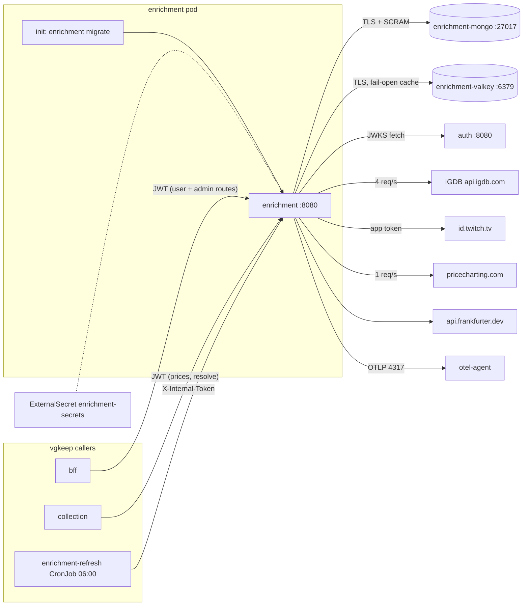
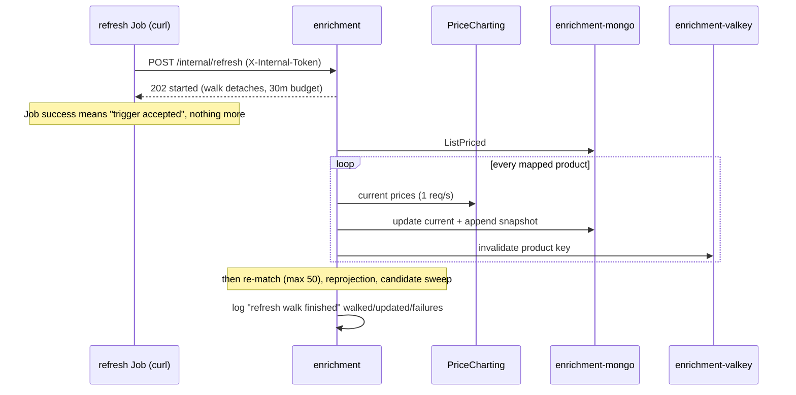

# Enrichment service

The enrichment service is the catalog and pricing quarantine for all
third-party data: IGDB game metadata, PriceCharting prices, and
frankfurter.dev exchange rates enter the system here and nowhere else.
It owns the product catalog (find-or-create identity for games,
hardware and price-anchor listings), scores auto-matches between IGDB
games and PriceCharting listings, keeps a daily price-snapshot series
per product, and runs the moderation surface for community-minted
products. Everything else in the stack (bff, collection) reads
products and prices from it by id.

Features as an operator sees them:

- Catalog search (`GET /search`, kinds game / hardware / pc_listing),
  Valkey-cached 24h, with admin-minted community products interleaved
  into game and hardware results. Provider down: answers degrade to a
  local Mongo name match, flagged `degraded: true` and never cached.
- Product resolve (`POST /products/resolve`): find-or-create keyed by
  provider identity. No-pick game resolves run the auto-matcher
  against PriceCharting listings; nothing at or above score 0.75
  (`match.Threshold`) means the product lands unmatched rather than
  guessed.
- Product reads (`GET /products/{productId}`), Valkey-cached 5m, with
  inline best-effort refetch of IGDB projections older than
  `IGDB_REFRESH_AFTER` (720h default).
- Batch prices and price history (`POST /products/prices:batch`,
  `POST /products/price-history:batch`, up to 500 ids each), read
  straight from Mongo. The collection service is the main caller.
- Recommendation scoring (`POST /recommendations:score`): user-agnostic
  scoring over the shared `igdb_raw` metadata cache, library up to
  2500 entries, candidate budget 200.
- FX rates (`GET /fx/latest`) and the platform catalog
  (`GET /platforms`).
- The nightly walk (`POST /internal/refresh`, CronJob at 06:00): price
  refresh + snapshot for every mapped product, re-match of up to 50
  unmatched games, projection rebuild for every IGDB-bearing product,
  and the promote-candidate sweep over community products. 30 minute
  budget, one walk at a time (a concurrent trigger answers 409).
- Admin moderation (JWT role `admin`): mapping fix, community product
  mint / promote / delete, unmatched and community worklists,
  promote-candidate review and dismiss, immediate refresh trigger.

## Architecture

The NetworkPolicy `enrichment-from-callers-only` admits exactly bff,
collection and the enrichment-refresh job pods on 8080; the APISIX
gateway (8090) publishes only the bff and never routes here. The
datastore policies admit only the enrichment pod plus the vg-platform
Prometheus (exporter sidecars on 9216 mongo, 9121 valkey).

The nightly walk is the one flow where the HTTP answer and the work
are decoupled, which trips people up during triage:

## Running it

Dev stack is Tilt (`task run`). The Tilt resource `enrichment` depends
on `secret-store`, `enrichment-mongo`, `enrichment-valkey` and `auth`;
`enrichment-refresh` depends on `enrichment`. Image builds from
`services/enrichment/Dockerfile` with only `libs/go` and
`services/enrichment` in context, so edits elsewhere do not roll it.

| Where | What |
|---|---|
| Service | localhost:8084 -> pod 8080 (Tilt port-forward) |
| Mongo | localhost:27018 -> 27017 |
| Valkey | no port-forward (TLS-only, in-cluster callers) |
| Gateway | not published; call 8084 directly with a JWT |
| Bruno flows | `bruno/enrichment/` (search, resolve, prices, history, recommendations, admin refresh, admin remap) |

Task targets: root `task lint`, `task build`, `task test:short`,
`task test:cover` (80 percent per-module gate via
`scripts/coverage.sh`), `task check` before committing. Module-scoped
in `services/enrichment/`: `task gen` regenerates
`internal/gen/api/server.gen.go` from `api/enrichment.yaml`, and
`task db:migrate` runs `go run ./cmd/enrichment migrate` against
`MONGO_URL`/`MONGO_DB`.

Health endpoints, outside JWT auth:

- `GET /healthz` answers 200 whenever the process is up.
- `GET /readyz` pings Mongo primary and nothing else. Mongo is the
  hard dependency; Valkey is deliberately absent because every cache
  call fails open. A Mongo outage therefore takes the pod out of
  Service endpoints after the probe's failure threshold.
- `POST /internal/refresh` is JWT-exempt but not unauthenticated: it
  checks `X-Internal-Token` against `INTERNAL_REFRESH_SECRETS` in
  constant time, with the NetworkPolicy as the outer layer.

Migrate mode: `enrichment migrate` loads the full config, runs the
embedded migrations (golang-migrate, mongodb driver, JSON arrays of
runCommand documents in `services/enrichment/migrations/`) and exits.
The deployment runs it as an init container with the same env anchor
as the app, so every rollout migrates before serving.

Startup order matters at boot only: main connects and pings Mongo,
then Valkey, and exits on either failure (crash loop with backoff
until both answer). At runtime Mongo stays hard (readyz) and Valkey
soft (per-request fail-open).

## Configuration

All env is declared in `services/enrichment/internal/config/config.go`
and wired by `deploy/charts/enrichment/templates/deployment.yaml`.
Secret material flows .env -> Tilt's `vg-fake` ClusterSecretStore ->
ExternalSecret `enrichment-secrets` (refreshInterval 1m) -> pod env.

| Env var | Value / source |
|---|---|
| `HTTP_ADDR` | code default `:8080` (chart does not set it) |
| `MONGO_URL` | chart-composed: `mongodb://enrichment-mongo:27017/enrichment?tls=true&tlsCAFile=/etc/vg/mongo-ca/ca.crt&authSource=admin` |
| `MONGO_DB` | chart `mongo.database` = `enrichment` |
| `MONGO_USERNAME` | chart `mongo.username` = `enrichment` |
| `MONGO_PASSWORD` | secret key `enrichment/mongo-password` (.env `MONGO_ENRICHMENT_PASSWORD`) |
| `VALKEY_URL` | chart `env.valkeyUrl` = `rediss://enrichment-valkey:6379/0` |
| `VALKEY_CA_FILE` | `/etc/vg/valkey-ca/ca.crt` when `valkey.enabled`; config refuses a `rediss://` URL without it |
| `JWKS_URL` | `http://auth:8080/.well-known/jwks.json` |
| `JWT_ISSUER` / `JWT_AUDIENCE` | `vgkeep-auth` / `vgkeep` |
| `INTERNAL_REFRESH_SECRETS` | CSV composed from secret keys `enrichment/internal-refresh-token` (+ `-previous` when `refresh.previousTokenEnabled`); .env `ENRICHMENT_INTERNAL_REFRESH_TOKEN` (+ `_PREVIOUS`) |
| `IGDB_MODE` | `stub` (default) or `real`; real requires `IGDB_CLIENT_ID` + `IGDB_CLIENT_SECRET` from secret keys |
| `PRICECHARTING_MODE` | `stub` or `real`; real requires `PRICECHARTING_API_KEY` |
| `FX_MODE` | chart default `real` (frankfurter.dev is credential-less); code default `stub` |
| `SEARCH_CACHE_TTL` | `24h` (search + platform catalog cache) |
| `PRODUCT_CACHE_TTL` | `5m` |
| `IGDB_REFRESH_AFTER` | `720h` (IGDB projection and platform-catalog staleness horizon) |
| `SERVICE_VERSION` | image tag, stamped on telemetry as service.version |
| `OTEL_EXPORTER_OTLP_ENDPOINT` | `http://otel-agent.vg-platform.svc.cluster.local:4317`; empty string disables export (JSON logs to stdout only) |

Absent optional pieces: stub providers serve embedded fixtures, so a
credential-less checkout runs the whole feature set deterministically.
Tilt flips `igdb.mode` / `pricecharting.mode` to real only when the
full credential set is present in .env; flipping by hand on a partial
set points the ExternalSecret at store keys that were never published
and wedges the secret sync. Config validation also refuses: one of
`MONGO_USERNAME`/`MONGO_PASSWORD` without the other, real modes
without their credentials, and empty entries in
`INTERNAL_REFRESH_SECRETS`.

## Datastores

MongoDB (`enrichment-mongo`, StatefulSet, mongo:8, 1Gi PVC) holds four
collections. `products` is one document per catalog product; identity
is enforced by two unique partial indexes scoped to `origin:
"provider"`: `products_game_identity` on (type, igdb.game_id,
platform.igdb_id, pricecharting.pc_product_id) and
`products_hardware_identity` on (type, pricecharting.pc_product_id,
region, edition, variant), plus a plain `products_name` index for the
degraded local search. Community products (`origin: "community"`) sit
outside both identity indexes on purpose: their identity is the
curated name, and the promote flow re-enters them through the index.
`igdb_raw` is the shared raw-payload cache (recommendations and the
reprojection walk read it; every provider fetch populates it
backwards). `platforms` caches the IGDB platform catalog wholesale.
`price_snapshots` is append-only, keyed (product_id, captured_at);
snapshots survive product mapping changes by design. Five migrations
to date; the down files exist and are exercised by the migrate
tooling, not by hand.

Connection facts: TLS is required (`--tlsMode requireTLS`) with a
cert-manager-issued cert; clients verify against the CA mounted at
`/etc/vg/mongo-ca/ca.crt` and authenticate SCRAM as root user
`enrichment` with `authSource=admin`. No client certificates. The
percona mongodb_exporter sidecar serves 9216, scraped via
ServiceMonitor every 30s (`service` label `enrichment-mongo`).

Valkey (`enrichment-valkey`, StatefulSet, valkey:8-alpine) is a pure
cache: TLS-only listener on 6379, no client cert auth, no persistence
(`--save ""`, `--appendonly no`, emptyDir), so a restart starts cold
and everything rebuilds from providers and Mongo. Keys:
`search:v1:<kind>:<sha256(query)>` (24h), `product:v1:<uuid>` (5m),
`platforms:v1` (24h). The redis_exporter sidecar serves 9121
(`service` label `enrichment-valkey`).

Pool metrics: the valkeykit client registers the shared pool
instruments, scoped to this service by the `service_name` resource
attribute:

| OTel name | Prometheus name | Answers |
|---|---|---|
| `vg.valkeykit.pool.hits` | `vg_valkeykit_pool_hits_total` | acquires served by a free connection |
| `vg.valkeykit.pool.misses` | `vg_valkeykit_pool_misses_total` | acquires that dialed a new connection |
| `vg.valkeykit.pool.timeouts` | `vg_valkeykit_pool_timeouts_total` | callers that gave up waiting (hard saturation) |
| `vg.valkeykit.pool.connections` | `vg_valkeykit_pool_connections` | open connections |
| `vg.valkeykit.pool.connections.idle` | `vg_valkeykit_pool_connections_idle` | idle headroom |

There are no `vg.pgkit.pool.*` series for this service: enrichment has
no Postgres. The Mongo driver exposes no app-side pool gauges here;
server-side `mongodb_ss_connections{conn_type="current"}` from the
exporter covers connection counting.

## Telemetry

The pipeline is libs/go/otel `Setup()`: OTLP traces, metrics and logs
to otel-agent -> otel-gateway -> Prometheus (remote write, exemplars
on), Loki and Jaeger, plus slog JSON on stdout with trace ids
attached. Traces already cover the full request path: otelhttp server
spans (route-labeled), otelmongo command spans, redisotel command
spans, and otelhttp client spans for IGDB, PriceCharting, frankfurter
and the Twitch token endpoint.

Emitted today (Prometheus-side names):

| Metric | Source | Labels | Answers |
|---|---|---|---|
| `http_server_request_duration_seconds_{count,sum,bucket}` | otelhttp middleware | `http_route`, `http_response_status_code` (+ `service_name="enrichment"` resource attr) | RED for every route |
| `go_goroutine_count`, `go_memory_used_bytes` | otel runtime instrumentation | `service_name` | runtime health |
| `vg_valkeykit_pool_*` (table above) | valkeykit | none | client pool health |
| `mongodb_up`, `mongodb_ss_opcounters`, `mongodb_ss_connections`, `mongodb_ss_mem_resident` | mongo exporter sidecar | `service="enrichment-mongo"` | server-side Mongo health |
| `redis_memory_used_bytes`, `redis_keyspace_hits_total`, `redis_keyspace_misses_total`, `redis_evicted_keys_total`, `redis_connected_clients` | redis exporter sidecar | `service="enrichment-valkey"` | server-side cache health |

Domain instruments, meter
`github.com/levonn-dev/vgkeep/services/enrichment`, held as
`Handlers` fields with best-effort registration (the bff
`vg.bff.cache.fail_open` pattern):

| Metric | Instrument | Unit | Labels (bounded) | Prometheus name | Question it answers |
|---|---|---|---|---|---|
| `vg.enrichment.cache.fail_open` | Int64Counter | `{event}` | `op`: search_get, search_decode, search_put, product_get, product_put, platforms_get, platforms_put, community_search, refresh_invalidate, rematch_invalidate, reprojection_invalidate, mapping_invalidate, promote_invalidate, delete_invalidate | `vg_enrichment_cache_fail_open_total` | is Valkey failing and which operation absorbs it |
| `vg.enrichment.search.requests` | Int64Counter | `{request}` | `kind`: game, hardware, pc_listing; `source`: cache, provider, degraded | `vg_enrichment_search_requests_total` | search cache effectiveness per kind, and the user-visible degraded share (provider outage) |
| `vg.enrichment.match.outcomes` | Int64Counter | `{attempt}` | `source`: resolve, rematch; `outcome`: matched, below_threshold, provider_down | `vg_enrichment_match_outcomes_total` | is the auto-matcher landing matches at its usual rate, or regressing into unmatched members |
| `vg.enrichment.refresh.items` | Int64Counter | `{item}` | `step`: prices, rematch, reprojection, sweep; `outcome`: ok, failed, skipped, flagged | `vg_enrichment_refresh_items_total` | how much of the catalog the nightly walk processed and what share failed |
| `vg.enrichment.refresh.walk.duration` | Float64Histogram | `s` | `step`: prices, rematch, reprojection, sweep | `vg_enrichment_refresh_walk_duration_seconds_{count,sum,bucket}` | did each walk step run today, and how close the walk is to its 30m budget |

Emission sites, all in `internal/server/handlers.go`:

- `cache.fail_open`: one increment inside `Handlers.failOpen`, which
  every fail-open call site already routes through; `op` is the string
  those call sites already pass.
- `search.requests`: one increment per answered `SearchCatalog`
  request at the point the source is known (cache hit, provider
  answer, or degraded local fallback). The resolve-side
  `searchPCListingsCached` helper does not count; this metric means
  "user-facing search answers".
- `match.outcomes`: in `autoMatchGame`, with the caller passing the
  source (`resolveGame` no-pick path = resolve, `runRematch` =
  rematch). provider_down maps to the existing "auto-match skipped"
  warn, below_threshold to the existing info line.
- `refresh.items`: incremented alongside the per-item tallies each
  walk loop already keeps. Per step, `outcome` means: prices ok =
  price written and snapshot appended, failed = fetch/write/snapshot
  failure; rematch ok = mapping landed, skipped = platform-less, no
  auto-match (below threshold or provider down), identity taken or
  raced (held products never enter the walk; the store filters them
  out of the worklist); reprojection ok = projection rewritten,
  skipped = diff-gate unchanged or unusable raw; sweep ok = swept
  clean, flagged = candidates stashed, failed = provider or store
  failure.
- `refresh.walk.duration`: recorded once per step next to its "walk
  finished" summary log (and on early abort, so a stopped walk still
  reports its elapsed time). Explicit bucket boundaries 1, 5, 15, 60,
  300, 900, 1800 seconds; the defaults top out at 10s and would flatten
  every walk into one bucket.

Log additions (slog, JSON, trace ids attached): one new line.

| Event | Level | Fields | Emission site |
|---|---|---|---|
| `refresh walk started` | INFO | `trigger` = admin or internal | `startRefresh`, immediately after winning the in-flight guard |

It pairs with the existing per-step "finished" summaries: a started
line without finished lines inside the 30m budget is the signature of
a hung walk. Everything else the walk needs is already logged
(finished summaries with counts, stopped-early warns, per-product
failure warns, panic containment).

## Dashboard: vg-enrichment

File `deploy/charts/platform/files/dashboards/enrichment.json`, uid
`vg-enrichment`, title `Enrichment Service`, provisioned into the
vgkeep folder like every dashboard in that directory. Open it at
http://localhost:3000/d/vg-enrichment while `task run` holds the
Grafana port-forward. It follows the structural conventions shared by
every vgkeep dashboard: schemaVersion 39, tags `["vgkeep"]`,
timezone browser, refresh 30s, explicit datasource object per target
(prometheus, loki). Panels, grouped by row:

HTTP (all Prometheus, scoped `service_name="enrichment"`):

1. "Request rate by route" - timeseries, reqps, legend `{{http_route}}`

        sum by (http_route) (rate(http_server_request_duration_seconds_count{service_name="enrichment"}[$__rate_interval]))

2. "5xx ratio" - timeseries, percentunit

        sum (rate(http_server_request_duration_seconds_count{service_name="enrichment",http_response_status_code=~"5.."}[5m])) / sum (rate(http_server_request_duration_seconds_count{service_name="enrichment"}[5m]))

3. "Latency by route (p95/p99)" - timeseries, s, `"exemplar": true` on
   both targets, legends `p95 {{http_route}}` / `p99 {{http_route}}`

        histogram_quantile(0.95, sum by (le, http_route) (rate(http_server_request_duration_seconds_bucket{service_name="enrichment"}[$__rate_interval])))
        histogram_quantile(0.99, sum by (le, http_route) (rate(http_server_request_duration_seconds_bucket{service_name="enrichment"}[$__rate_interval])))

4. "Errors by route and status" - timeseries, reqps, legend
   `{{http_route}} {{http_response_status_code}}`

        sum by (http_route, http_response_status_code) (rate(http_server_request_duration_seconds_count{service_name="enrichment",http_response_status_code=~"4..|5.."}[$__rate_interval]))

5. "Goroutines" - timeseries, short, legend `goroutines`

        go_goroutine_count{service_name="enrichment"}

6. "Heap used" - timeseries, bytes, legend `heap`

        go_memory_used_bytes{service_name="enrichment"}

Feature health:

7. "Search answers by source" - timeseries, short, legend
   `{{kind}} {{source}}`

        sum by (kind, source) (increase(vg_enrichment_search_requests_total[5m]))

8. "Auto-match outcomes" - timeseries, short, legend
   `{{source}} {{outcome}}` (rematch lands as a nightly spike; the 1h
   window keeps it visible at day scale)

        sum by (source, outcome) (increase(vg_enrichment_match_outcomes_total[1h]))

9. "Refresh walk items by step and outcome" - timeseries, short,
   legend `{{step}} {{outcome}}`

        sum by (step, outcome) (increase(vg_enrichment_refresh_items_total[1h]))

10. "Refresh walk duration by step" - timeseries, s, legend `{{step}}`
   (one walk per day: the 1h increase of the sum is the last walk's
   elapsed seconds at the walk hour, zero elsewhere)

        sum by (step) (increase(vg_enrichment_refresh_walk_duration_seconds_sum[1h]))

11. "Valkey fail-open events" - timeseries, short, legend `{{op}}`

        sum by (op) (increase(vg_enrichment_cache_fail_open_total[5m]))

Datastores and pools:

12. "Valkey client pool connections" - timeseries, short, legends
    `open` / `idle`

        vg_valkeykit_pool_connections{service_name="enrichment"}
        vg_valkeykit_pool_connections_idle{service_name="enrichment"}

13. "Valkey pool reuse ratio" - timeseries, percentunit

        rate(vg_valkeykit_pool_hits_total{service_name="enrichment"}[5m]) / (rate(vg_valkeykit_pool_hits_total{service_name="enrichment"}[5m]) + rate(vg_valkeykit_pool_misses_total{service_name="enrichment"}[5m]))

14. "Valkey pool timeouts" - timeseries, short (flat zero is the only
    healthy shape)

        increase(vg_valkeykit_pool_timeouts_total{service_name="enrichment"}[5m])

15. "Mongo up" - stat, short; state thresholds: red below 1, green at
    1 and above

        mongodb_up{service="enrichment-mongo"}

16. "Mongo operations" - timeseries, ops, legend `{{legacy_op_type}}`

        sum by (legacy_op_type) (rate(mongodb_ss_opcounters{service="enrichment-mongo"}[$__rate_interval]))

17. "Valkey server memory" - timeseries, bytes

        redis_memory_used_bytes{service="enrichment-valkey"}

18. "Valkey keyspace hit ratio" - timeseries, percentunit

        rate(redis_keyspace_hits_total{service="enrichment-valkey"}[5m]) / (rate(redis_keyspace_hits_total{service="enrichment-valkey"}[5m]) + rate(redis_keyspace_misses_total{service="enrichment-valkey"}[5m]))

Pods and logs:

19. "CPU by pod" - timeseries, short, legend `{{pod}}` (covers the
    app, mongo, valkey and refresh job pods)

        sum by (pod) (rate(container_cpu_usage_seconds_total{namespace="vgkeep", pod=~"enrichment.*", container!=""}[$__rate_interval]))

20. "Working-set memory by pod" - timeseries, bytes, legend `{{pod}}`

        sum by (pod) (container_memory_working_set_bytes{namespace="vgkeep", pod=~"enrichment.*", container!=""})

21. "Restarts (15m windows) by pod" - timeseries, short, legend
    `{{pod}}`

        sum by (pod) (increase(kube_pod_container_status_restarts_total{namespace="vgkeep", pod=~"enrichment.*"}[15m]))

22. "Recent error logs" - logs panel, Loki datasource

        {service_name="enrichment"} | severity_text="ERROR"

## Failure modes and triage

### 1. 5xx ratio climbing

Confirm on the "5xx ratio" panel or "5xx ratio by service" on
vg-overview; the shared triage in
[stack.md](stack.md#1-service-5xx-ratio-above-5-percent) applies.
Enrichment specifics: a 500 burst on `GET /products/{productId}` and
`POST /products/prices:batch` with "Mongo up" at 0 means Mongo
(failure mode 2); 502s are not 5xx-of-ours in spirit but count in the
ratio, and mean a provider outage (failure mode 3). Latency triage:
[stack.md](stack.md#2-service-p99-latency-above-500ms); use the
exemplars on "Latency by route (p95/p99)" to jump into Jaeger traces.

### 2. Mongo down

The vg-mongo-down rule (severity page) fires when mongodb_up reads
below 1, or produces no data at all, for 2 minutes; it treats missing
data the same as down, because an unreachable exporter usually means
an unreachable Mongo. The "Mongo up" stat shows the same series:

    mongodb_up

1. Run `kubectl -n vgkeep get pods enrichment-mongo-0` to see
   whether the pod is down, crash-looping or just unready.
2. Read the container logs
   (`kubectl -n vgkeep logs enrichment-mongo-0 -c mongo`) for the
   startup or crash reason.
3. Read how far enrichment's error rate has climbed on this
   dashboard's "5xx ratio" panel: while Mongo is down, enrichment
   stays graceful only for reads its caches still hold.

The enrichment-side sequence:
cache-warm product reads keep answering up to 5 minutes, search keeps
answering from the 24h cache with the community lane failing open,
everything cache-cold 500s, and within about 30s (three failed 10s
readyz probes) the pod leaves Service endpoints entirely, at which
point callers see connection failures rather than 500s. After Mongo
returns the pod re-readies on its own; no restart needed.

### 3. Search degraded

Signature: "Search answers by source" grows a `degraded` series,
users see thinner results with stale prices, and the log line below
appears at WARN. The vg-enrichment-search-degraded rule fires when
the degraded share holds above 10 percent for 15 minutes:

    sum(rate(vg_enrichment_search_requests_total{source="degraded"}[15m])) / sum(rate(vg_enrichment_search_requests_total[15m]))

The confirming log line:

    {service_name="enrichment"} |= "search provider unavailable; serving local catalog match"

This is the IGDB (kind game) or PriceCharting (hardware, pc_listing)
search path failing. Degraded answers are never cached, so recovery is
automatic on the next request once the provider answers. Check the
provider's own status page and the client spans in Jaeger before
suspecting our side; with `IGDB_MODE`/`PRICECHARTING_MODE` = stub a
degraded answer means the embedded fixtures failed to load, which does
not happen at runtime (stubs are loaded at startup).

Knock-on effects while a provider is down: resolves that need it
answer 502 `upstream_unavailable`, no-pick game resolves land
unmatched (outcome `provider_down` climbing on "Auto-match
outcomes"), and the nightly walk logs per-product fetch failures. All
of it self-heals: the re-match walk upgrades unmatched members on
later nights.

### 4. Nightly walk missing

The walk is silent-failure-prone: the CronJob can fail without anyone
noticing, and prices just quietly age (visible to users as stale
`pricecharting.as_of` stamps). Confirm: "Refresh walk items by step
and outcome" and "Refresh walk duration by step" flat for more than
24h, or

    sum(increase(vg_enrichment_refresh_walk_duration_seconds_count{step="prices"}[26h]))

reads 0. The vg-enrichment-refresh-stalled rule fires on the same
expression, and treats an absent series as firing too (a walk that
never ran is the failure case), so a brand-new stack alerts until its
first walk completes at 06:00 or by manual trigger. Then:

1. `kubectl -n vgkeep get jobs -l app.kubernetes.io/name=enrichment-refresh`
   and `kubectl -n vgkeep logs job/<latest>` for the curl output.
2. curl exit 22 reporting error 401: token drift between the CronJob
   secret and `INTERNAL_REFRESH_SECRETS` - mid-rotation state left
   half-finished. Re-check the rotation steps under Admin levers.
3. 409 `refresh_in_progress`: the in-process guard believes a walk is
   running. Walks check their context between products and the budget
   cancels it at 30m, so a 409 persisting well past 30m means the walk
   goroutine is stuck in a call that ignores its context;
   `kubectl -n vgkeep rollout restart deployment/enrichment`
   clears it (the guard dies with the process).
4. No job at all: CronJob suspended or schedule drift;
   `kubectl -n vgkeep get cronjob enrichment-refresh`.

Once fixed, trigger immediately rather than waiting for 06:00 (see
Admin levers).

### 5. Walk failing or stopping early

"Refresh walk items by step and outcome" shows a `failed` share, or
the stopped-early warn appears:

    {service_name="enrichment"} |= "refresh walk stopped early: context done"

A failed share tracks provider or Mongo trouble mid-walk; individual
products are skipped, the walk finishes what it can, and the next
night retries, so occasional failures are self-healing noise. A
stopped-early warn means the 30m budget expired: PriceCharting's 1
req/s ceiling caps a full price walk at roughly 1800 mapped products
per run, so a catalog past that size stops early every night and
starves the later steps (re-match, reprojection, sweep run on what
remains). That is a capacity signal, not an incident: raise the walk
budget or split the schedule in the service code.

### 6. Valkey failing open

"Valkey fail-open events" (`vg_enrichment_cache_fail_open_total` by
op) is the service-side signal; every op degrades to a cache miss, so
the symptom is latency and provider load, never errors. Server-side
memory/eviction triage is
[stack.md](stack.md#7-valkey-evicting-keys-or-memory-unusually-high). "Valkey
pool timeouts" nonzero means callers waited for the pool and gave
up - a saturated pool or a wedged Valkey. A Valkey restart empties the
cache (no persistence): expect a cold-start burst of provider calls
bounded by the client limiters, and product reads hitting Mongo until
the 5m cache refills. Boot-time exception: the service requires
Valkey at startup, so enrichment pods crash-loop if Valkey is absent
during a deploy.

### 7. 401s across every route

All API routes behind JWT start answering 401 at once: the validator
cannot fetch or verify against `JWKS_URL` (auth service down or its
keys rotated unexpectedly). "Errors by route and status" shows 401
across routes simultaneously, which distinguishes this from a single
misbehaving caller. Check the auth pod, then
`curl -s http://localhost:8082/.well-known/jwks.json` via the auth
port-forward. `/internal/refresh` is
unaffected (token auth), so the nightly walk keeps running through an
auth outage.

### 8. identity_taken on admin writes

Mapping fixes, clears and promotes can answer 409 `identity_taken`
with the holding product's id and name in the detail. This is the
unique identity index adjudicating, not a fault: two products cannot
carry the same provider identity, and merging is deliberately manual.
Look up the named holder, decide which product survives, and use
delete (unmatched residue) or a different mapping. No telemetry
action.

## Admin levers

All idempotent and safe to re-run; the walk triggers answer 409 while
one runs. Admin JWT: log in as an admin user via the SPA, or in dev
`task grant-fixture-admin` grants the dev fixture the role, and the
Bruno flows (`bruno/enrichment/admin-refresh.bru`, `admin-remap.bru`)
script the calls.

Run the nightly walk now, CronJob path (no JWT, in-cluster):

    kubectl -n vgkeep create job --from=cronjob/enrichment-refresh refresh-now

Same walk via the admin API (port-forward 8084):

    curl -X POST -H "Authorization: Bearer $ADMIN_JWT" http://localhost:8084/admin/refresh

Both run all four steps: prices, re-match, reprojection, candidate
sweep. The reprojection step is the catalog's self-healing backfill:
any projection-logic change redeploys through it with zero provider
calls in steady state, so "re-run the walk" is the answer to most
catalog-shape drift.

Moderated mapping fix (validates against the provider, snapshots,
marks verified; `{}` clears the mapping):

    curl -X PUT -H "Authorization: Bearer $ADMIN_JWT" -H "Content-Type: application/json" \
      -d '{"pc_product_id": 6910}' \
      http://localhost:8084/admin/products/<product-uuid>/pricecharting

Worklists and community moderation, same auth:

- `GET /admin/products/unmatched` - products with no listing mapping
  (includes admin-held ones).
- `GET /admin/products/community` - admin-minted community products.
- `POST /admin/products` - mint a community product.
- `POST /admin/products/{id}/promote` - attach provider anchors and
  flip a community product to provider origin in place (id stable, so
  every adopter upgrades through live reads).
- `GET /admin/products/promote-candidates` and
  `POST /admin/products/{id}/promote-candidates/dismiss` - review or
  permanently silence the sweep's suggestions.
- `DELETE /admin/products/{id}` - remove unmatched residue; matched
  products refuse with 409 until cleared.

Internal token rotation, zero downtime: publish the new value under
secret key `enrichment/internal-refresh-token` and the old one under
`enrichment/internal-refresh-token-previous` (dev:
`ENRICHMENT_INTERNAL_REFRESH_TOKEN` / `..._PREVIOUS` in .env), set
`refresh.previousTokenEnabled=true` (Tilt flips it automatically when
the `_PREVIOUS` var is present); the service then accepts both while
the CronJob already presents the new one. After the next green run,
drop the previous key and flip the flag back off.

## Capacity and rollout

One replica (`replicas: 1`), requests 50m CPU / 64Mi, memory limit
128Mi, no CPU limit. The heaviest allocation path is recommendation
scoring (2500-entry libraries, 200 candidates); watch "Working-set
memory by pod" before trimming the limit. Mongo: 100m / 256Mi
requests, 512Mi limit, 1Gi PVC. Valkey: 50m / 64Mi requests, 128Mi
limit.

PDBs set `minAvailable: 1` on all three workloads. With single
replicas that means voluntary drains block instead of silently
dropping the only copy - intentional; scale before draining, or
accept the eviction being refused.

Probes: liveness `/healthz`, readiness `/readyz`, chart sets no
explicit timings so kubernetes defaults apply (10s period, 3-failure
threshold); mongo and valkey ready-check via their own CLIs every 5s.

A rollout surges: deployment defaults round to maxSurge 1 /
maxUnavailable 0 at one replica, so the new pod starts, runs the
migrate init container, and must pass readyz (Mongo ping) before the
old pod terminates. Traffic never drops as long as the new pod goes
ready. Two things do not survive the swap: the Valkey-independent
in-process refresh guard, and any detached walk mid-flight - the walk
dies unlogged with the old process, so re-trigger the walk after
rolling during one (nothing corrupts; the walk is per-product
idempotent and snapshots are append-only, at worst a same-day
duplicate snapshot per product).

CronJob shape: schedule `0 6 * * *`, concurrencyPolicy Forbid (the
service's 409 guard is the inner layer), startingDeadlineSeconds 3600,
backoffLimit 2, activeDeadlineSeconds 900 for the curl pod itself
(`--max-time 60`; the walk it triggers is detached and budgeted at
30m inside the service).

Datastore restarts: Mongo restarting takes enrichment unready until
the ping passes again (failure mode 2). Valkey restarting costs
only cache warmth. Neither requires restarting enrichment itself
except the boot-time Valkey dependency noted earlier.
