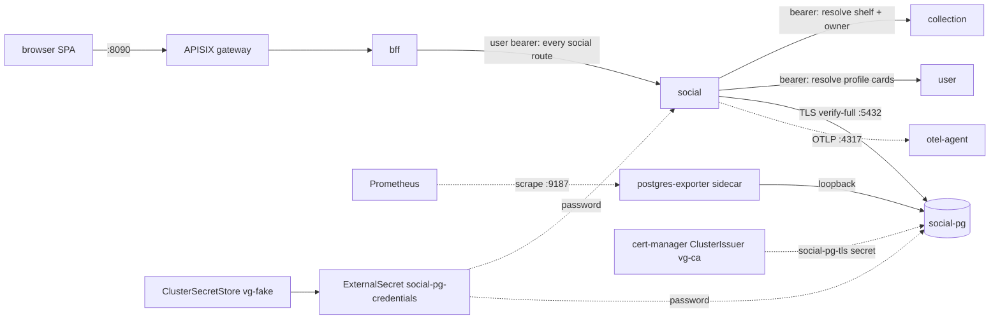
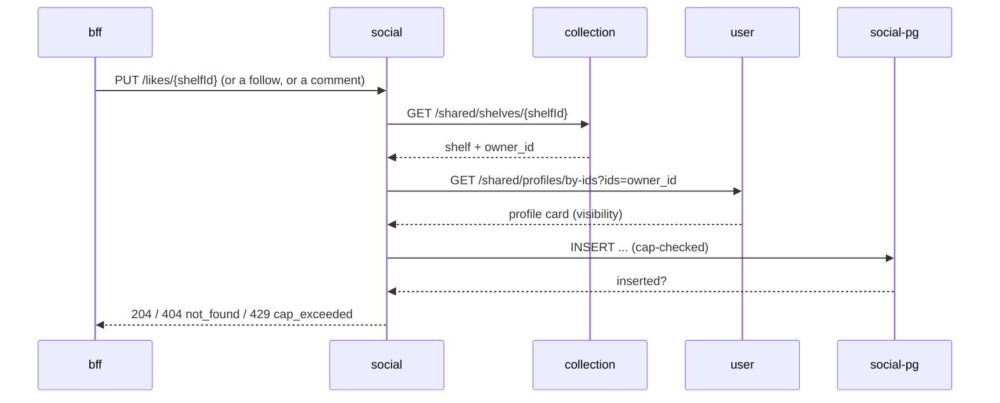

# Social service

Follows, likes, comments, and the activity feed - vgkeep's social
layer over shelves (collection's saved views) and profiles (user's
identities). It owns four tables (`follows`, `likes`, `comments`,
`activity`) and validates every write against collection or user
before it lands - it never accepts an unvalidated follow or like
target. Visibility is never stored here: every read re-evaluates it
against collection and user at query time, so a shelf or profile
going private takes effect immediately everywhere social surfaces it.

What an operator sees it doing:

- Follow/unfollow a user (`PUT`/`DELETE /follows/{userId}`), capped at
  100 follows per rolling 24h, rejecting self-follows and follows of a
  private profile.
- Like/unlike a shelf (`PUT`/`DELETE /likes/{shelfId}`), capped at 200
  per rolling 24h, resolving the shelf (and its owner's visibility)
  through collection and user first.
- Comment on a shelf (`POST /shelves/{shelfId}/comments`, 1-2000
  characters, capped at 50 per rolling 24h) and delete a comment
  (`DELETE /comments/{commentId}`, author or shelf owner only) - a
  self-delete blanks the body, an owner removal retains it for a
  later undelete.
- Serve the activity feed (`GET /feed`, tabs `following`/`you`) and
  batch summaries for shelf pages, profile pages, and Explore
  (`GET /shelves/summary`, `GET /profiles/{userId}/summary`,
  `GET /comments/by-ids`).
- Record a shelf's publish event (`POST /events/shelf-published`,
  called by the bff's orchestration, fail-open) and serve the
  all-time like-count leaderboard (`GET /explore/top-shelves`).
- Purge the caller's social graph as one leg of account deletion
  (`DELETE /user-data`, self only, idempotent) - see
  [Admin levers](#admin-levers).

## Architecture



One deployment (`social`), one StatefulSet (`social-pg`) with a
postgres-exporter sidecar. Social has no cache and no external
providers. NetworkPolicies restrict ingress: `social:8080` accepts
only bff pods (the whole social surface is browser-driven; no service
or cron calls in); `social-pg:5432` accepts only social pods;
`social-pg:9187` accepts only Prometheus from `vg-platform`.

The write-validation hot path, because it explains most incidents
involving this service:



Every mutating route runs a shape of this before it ever touches
social-pg, so collection or user answering an error 502s the write
outright rather than falling back to anything - social never accepts
an unvalidated follow or like target. Failure scenario 2 below covers
it.

## Running it

Tilt resource `social` (label `services`), image rebuilt on changes
under `libs/go/` or `services/social/`, depends on `secret-store`,
`social-pg`, `auth`, `user`, and `collection`. Expect 401s on every
route until auth serves its JWKS, and `upstream_error` 502s on writes
until collection and user are both ready.

| Surface            | Where                                                                                  |
| ------------------ | -------------------------------------------------------------------------------------- |
| Service in-cluster | `social:8080` (vgkeep namespace)                                                       |
| Direct dev port    | `localhost:8086` (Tilt port-forward; the 8090 gateway fronts only the bff)             |
| Postgres           | `localhost:5436` -> `social-pg:5432`                                                   |
| Liveness           | `GET /healthz`, static ok, no auth                                                     |
| Readiness          | `GET /readyz`, pings the pg pool, no auth; JWKS is deliberately not checked            |
| Bruno              | none yet; mint a bearer token with `auth/dev-token` and call `localhost:8086` directly |

Task targets that touch this module:

- `task social:gen` regenerates the server stubs from `api/social.yaml`
  plus the collection and user typed clients (also runs inside root
  `task gen`; CI fails on drift).
- `task social:db:migrate` runs `go run ./cmd/social migrate` against
  `DATABASE_URL` (also runs under root `task migrate`, alongside every
  other migrate-capable service).
- Root `task build`, `task lint`, `task test:short`, `task test:cover`,
  `task tidy`, `task check` iterate over this module like every other.
  Coverage gate: `scripts/coverage.sh 80`, excluding `/internal/gen/`
  and `/cmd/`.

Migrate mode: `social migrate` applies embedded SQL migrations and
exits. The deployment runs it as the `migrate` init container on every
rollout; concurrent runs serialize on golang-migrate's advisory lock
and a no-change run succeeds.

## Configuration

All config is environment variables parsed at startup
(`internal/config`); a missing required variable is a fatal error
before the listener opens.

| Variable                      | Required       | Default       | Source                                                                                               | Notes                                                                                                     |
| ----------------------------- | -------------- | ------------- | ---------------------------------------------------------------------------------------------------- | --------------------------------------------------------------------------------------------------------- |
| `HTTP_ADDR`                   | no             | `:8080`       | binary default                                                                                       |                                                                                                           |
| `DATABASE_URL`                | yes            | none          | composed in `deploy/charts/social/templates/deployment.yaml` from chart values plus `$(PG_PASSWORD)` | carries `sslmode=verify-full&sslrootcert=/etc/vg/pg-ca/ca.crt`                                            |
| `PG_PASSWORD`                 | chart-internal | none          | secret `social-pg-credentials`, key `password`                                                       | filled by the ExternalSecret; only ever referenced inside `DATABASE_URL`                                  |
| `JWKS_URL`                    | yes            | none          | chart value `env.jwksUrl`, default `http://auth:8080/.well-known/jwks.json`                          | keys fetched lazily and cached by kid; unknown-kid refetch at most every 30s                              |
| `JWT_ISSUER`                  | no             | `vgkeep-auth` | chart value `env.jwtIssuer`                                                                          |                                                                                                           |
| `JWT_AUDIENCE`                | no             | `vgkeep`      | chart value `env.jwtAudience`                                                                        |                                                                                                           |
| `COLLECTION_SERVICE_URL`      | yes            | none          | chart value `env.collectionServiceUrl`, default `http://collection:8080`                             | shelf resolve for likes, comments, and publish events                                                     |
| `USER_SERVICE_URL`            | yes            | none          | chart value `env.userServiceUrl`, default `http://user:8080`                                         | profile cards for follow and like visibility checks                                                       |
| `SOCIAL_CAP_COMMENTS_24H`     | no             | `50`          | chart value `env.capComments24h`                                                                     | rolling 24h cap; tombstones still count                                                                   |
| `SOCIAL_CAP_FOLLOWS_24H`      | no             | `100`         | chart value `env.capFollows24h`                                                                      | rolling 24h cap                                                                                           |
| `SOCIAL_CAP_LIKES_24H`        | no             | `200`         | chart value `env.capLikes24h`                                                                        | rolling 24h cap                                                                                           |
| `SERVICE_VERSION`             | no             | `dev`         | chart sets it to the image tag                                                                       | stamped onto telemetry as `service.version`                                                               |
| `OTEL_EXPORTER_OTLP_ENDPOINT` | no             | unset         | chart value `otel.exporterEndpoint`, default `http://otel-agent.vg-platform.svc.cluster.local:4317`  | empty disables all export: logs stay on stdout as JSON, every metric and trace in this document goes dark |

Secret chain in dev: `.env` `PG_SOCIAL_PASSWORD` (listed in
`.env.example`) -> Tiltfile publishes it into ClusterSecretStore
`vg-fake` under key `social/pg-password` -> ExternalSecret
`social-pg-credentials` (refreshInterval 1m) -> pod env. The
deployment re-rolls when the ExternalSecret shape changes (checksum
annotation); rotating only the value needs a Tilt re-apply.

There are no provider or mode flags. When collection or user is absent
or errors, every write this service handles 502s - social never
accepts an unvalidated follow or like target (failure scenario 2
covers it); reads that only touch social-pg keep working. When auth's
JWKS is unreachable, every bearer route answers 401 exactly like every
other service; `/healthz` and `/readyz` stay green regardless.

## Datastore: social-pg

One Postgres 17 instance, database `social`, user `social`. Schema at
a glance: `follows` (follower_id, followee_id composite PK, checked
`follower_id <> followee_id`), `likes` (user_id, shelf_id composite
PK, denormalized shelf_owner_id so owner-scoped reads and the account
purge never need a cross-service lookup), `comments` (uuid id, body
1-2000 chars on a live row by CHECK, the self-delete/owner-delete/
purge-anonymize lifecycle from the repo's identity rules), and
`activity` (append-except-undo: retracting a follow, like, or comment
deletes its event so feeds never show a retracted action; a partial
unique index keeps exactly one live `published_shelf` row per shelf).
One migration so far (`000001_init`), embedded in the binary and
applied by the init container or `task social:db:migrate`.

Connection facts: TLS `verify-full` against the cert-manager-issued
`social-pg-tls` cert (ClusterIssuer `vg-ca`, 90-day duration, renewed
automatically; the client mounts only the CA). The app pool is pgxpool
with no explicit ceiling, so the max is pgxpool's default (the greater
of 4 and the pod's visible CPU count); `vg_pgkit_pool_connections_max`
is the live truth. Server-side `max_connections` is the postgres image
default of 100. The exporter sidecar connects over pod-local loopback
without TLS and serves `:9187`, scraped through the `social-pg`
ServiceMonitor; its series carry `service="social-pg"` (a target
label), while everything the app exports carries the resource
attribute `service_name="social"`. Use the right one per query.

## Telemetry

### Metrics

Everything below reaches Prometheus through the OTLP pipeline
(otel-agent -> otel-gateway -> remote write); nothing here adds a
scrape endpoint. All app series: `service_name="social"`.

Shared plumbing, already emitted today:

| Metric (Prometheus name)                                             | Instrument           | Unit          | Labels                                                                                                                          | Answers                                                                       |
| -------------------------------------------------------------------- | -------------------- | ------------- | ------------------------------------------------------------------------------------------------------------------------------- | ----------------------------------------------------------------------------- |
| `http_server_request_duration_seconds_{count,sum,bucket}`            | histogram (otelhttp) | s             | `http_route` (matched mux pattern including the method, e.g. `PUT /follows/{userId}`, `GET /feed`), `http_response_status_code` | RED for every route: rate, errors, duration; exemplars link buckets to traces |
| `go_goroutine_count`, `go_memory_used_bytes` (among the runtime set) | gauge (otel runtime) | short / bytes | none                                                                                                                            | leak or runaway-allocation checks                                             |

PG pool, emitted since pgkit gained pool instrumentation (no labels;
`service_name` scopes them):

| Prometheus name                            | Instrument         | Unit         | Answers                                                |
| ------------------------------------------ | ------------------ | ------------ | ------------------------------------------------------ |
| `vg_pgkit_pool_connections`                | observable gauge   | {connection} | connections held (constructing + acquired + idle)      |
| `vg_pgkit_pool_connections_idle`           | observable gauge   | {connection} | idle headroom right now                                |
| `vg_pgkit_pool_connections_max`            | observable gauge   | {connection} | configured ceiling; saturation denominator             |
| `vg_pgkit_pool_acquires_total`             | observable counter | {acquire}    | pool demand rate; mean-wait denominator                |
| `vg_pgkit_pool_empty_acquires_total`       | observable counter | {acquire}    | acquires that had to wait on a drained pool            |
| `vg_pgkit_pool_acquire_wait_seconds_total` | observable counter | s            | total wait; divided by acquires = mean acquire latency |

Domain metrics, meter `github.com/levonn-dev/vgkeep/services/social`
(this service has no Valkey, so no `vg_valkeykit_*` series exist for
it):

| Metric                      | Prometheus name                   | Instrument | Unit        | Labels (bounded)                                    | Answers                                                                                                                         |
| --------------------------- | --------------------------------- | ---------- | ----------- | --------------------------------------------------- | ------------------------------------------------------------------------------------------------------------------------------- |
| `vg.social.follows`         | `vg_social_follows_total`         | counter    | {op}        | `op` = `create` \| `delete`                         | follow/unfollow rate                                                                                                            |
| `vg.social.likes`           | `vg_social_likes_total`           | counter    | {op}        | `op` = `create` \| `delete`                         | like/unlike rate                                                                                                                |
| `vg.social.comments`        | `vg_social_comments_total`        | counter    | {op}        | `op` = `create` \| `self_delete` \| `owner_delete`  | comment volume, and which path retracted each deletion (self vs shelf-owner removal)                                            |
| `vg.social.feed.reads`      | `vg_social_feed_reads_total`      | counter    | {read}      | `tab` = `following` \| `you`                        | which feed tab gets read                                                                                                        |
| `vg.social.caps.rejections` | `vg_social_caps_rejections_total` | counter    | {rejection} | `kind` = `follows` \| `likes` \| `comments`         | rate-cap pressure per surface; a sustained climb that is not an abuse pattern is the signal to revisit the cap values in config |
| `vg.social.publish.events`  | `vg_social_publish_events_total`  | counter    | {event}     | `outcome` = `created` \| `refreshed` \| `throttled` | shelf-publish activity; see failure scenario 3 for reading this against the bff's fail-open counter                             |
| `vg.social.purge.runs`      | `vg_social_purge_runs_total`      | counter    | {run}       | `outcome` = `ok`                                    | account-deletion leg volume - this service's side of DeleteMe                                                                   |

Emission sites: all seven counters are fields on `server.Handlers`,
created in `server.New` (registration failure is logged and does not
stop startup, matching every other service's counters). Each handler
increments its counter after the store call succeeds, or, for cap
rejections, at the `store.ErrCapExceeded` branch before the 429:
`Follow`/`Unfollow` increment `follows` with `op=create` only when the
store reports the edge was actually inserted (a re-follow of an
existing edge counts nothing extra); `LikeShelf`/`UnlikeShelf` mirror
that for `likes`; `CreateShelfComment` always increments `comments`
with `op=create` on success; `DeleteComment` increments `comments`
with whatever outcome the store's author-vs-owner branch returned;
`GetFeed` increments `feed.reads` with the requested tab after a
successful read; `RecordShelfPublished` increments `publish.events`
with the store's created/refreshed/throttled outcome; `PurgeUserData`
increments `purge.runs` with `outcome=ok` on every successful run (it
is idempotent, so a repeat purge against an already-empty graph still
counts one). No user ids, shelf ids, or comment bodies ever become
label values.

### Logs

JSON on stdout plus OTLP to Loki, label `service_name="social"`, trace
and span ids attached by the shared slog handler. Existing events:
`http request` (INFO: method, path, status, duration_ms, once per
request), `social service listening` (INFO: addr), `store error`
(ERROR: `op` = `follow` \| `unfollow` \| `profile_summary` \| `like` \|
`unlike` \| `shelf_summaries` \| `list_comments` \| `create_comment` \|
`delete_comment` \| `comments_by_ids` \| `feed` \| `record_publish` \|
`top_shelves` \| `purge`, `err`, logged with the request context
before every 500 response), `panic recovered` (ERROR: panic, path),
`fatal` (ERROR: err, then exit).

### Traces

otelhttp server spans (named `social`, route attribute from the
matched mux pattern), otelpgx client spans per query, and social's two
outbound clients (collection, user) wrap their `http.Client` in
otelhttp transports, so a like or comment trace in Jaeger (service
`social`) runs browser -> bff -> social -> collection (or user) ->
social-pg unbroken, minus whichever leg a given request skips (a
comment delete, for instance, never calls collection). Latency panels
carry exemplars into these traces.

## Dashboard: vg-social

File `deploy/charts/platform/files/dashboards/social.json`, uid
`vg-social`, title `Social Service`, provisioned into Grafana's
`vgkeep` folder. Open it at http://localhost:3000/d/vg-social
while `task run` holds the Grafana port-forward. Structural
conventions are the ones shared by every vgkeep dashboard:
schemaVersion 39, tags `["vgkeep"]`, timezone `browser`, refresh
`30s`, an explicit datasource object on every target (`prometheus` or
`loki` by uid), timeseries for rates and durations, default palette,
no dual-axis anywhere; `legendFormat` from a label on every
multi-series panel; latency targets set `"exemplar": true`.

HTTP row:

1. Request rate by route. timeseries, unit `reqps`, legend
   `{{http_route}}`.

    ```promql
    sum by (http_route) (rate(http_server_request_duration_seconds_count{service_name="social"}[$__rate_interval]))
    ```

2. 5xx ratio. timeseries, unit `percentunit`.

    ```promql
    sum(rate(http_server_request_duration_seconds_count{service_name="social",http_response_status_code=~"5.."}[5m])) / sum(rate(http_server_request_duration_seconds_count{service_name="social"}[5m]))
    ```

3. Latency by route (p95/p99). timeseries, unit `s`, exemplars on,
   legends `p95 {{http_route}}` / `p99 {{http_route}}`.

    ```promql
    histogram_quantile(0.95, sum by (le, http_route) (rate(http_server_request_duration_seconds_bucket{service_name="social"}[$__rate_interval])))
    histogram_quantile(0.99, sum by (le, http_route) (rate(http_server_request_duration_seconds_bucket{service_name="social"}[$__rate_interval])))
    ```

4. 4xx and 5xx by route and status. timeseries, unit `reqps`, legend
   `{{http_route}} {{http_response_status_code}}`.

    ```promql
    sum by (http_route, http_response_status_code) (rate(http_server_request_duration_seconds_count{service_name="social",http_response_status_code=~"4..|5.."}[$__rate_interval]))
    ```

Domain row (two rows of three, unit `ops` throughout):

5. Follows by op. legend `{{op}}`.

    ```promql
    sum(rate(vg_social_follows_total[$__rate_interval])) by (op)
    ```

6. Likes by op. legend `{{op}}`.

    ```promql
    sum(rate(vg_social_likes_total[$__rate_interval])) by (op)
    ```

7. Comment ops. legend `{{op}}`.

    ```promql
    sum(rate(vg_social_comments_total[$__rate_interval])) by (op)
    ```

8. Feed reads by tab. legend `{{tab}}`.

    ```promql
    sum(rate(vg_social_feed_reads_total[$__rate_interval])) by (tab)
    ```

9. Cap rejections by kind. legend `{{kind}}`.

    ```promql
    sum(rate(vg_social_caps_rejections_total[$__rate_interval])) by (kind)
    ```

10. Publish outcomes. legend `{{outcome}}`.

    ```promql
    sum(rate(vg_social_publish_events_total[$__rate_interval])) by (outcome)
    ```

Datastore row (the pgkit pool panels, same shape as collection's own
pool row):

11. PG pool connections. timeseries, unit `short`, legends `in pool` /
    `idle` / `max`.

    ```promql
    vg_pgkit_pool_connections{service_name="social"}
    vg_pgkit_pool_connections_idle{service_name="social"}
    vg_pgkit_pool_connections_max{service_name="social"}
    ```

12. PG pool mean acquire wait. timeseries, unit `s`.

    ```promql
    rate(vg_pgkit_pool_acquire_wait_seconds_total{service_name="social"}[5m]) / rate(vg_pgkit_pool_acquires_total{service_name="social"}[5m])
    ```

13. PG server connections vs max. timeseries, unit `short`, legends
    `connections` / `max` (exporter side).

    ```promql
    sum(pg_stat_activity_count{service="social-pg"})
    max(pg_settings_max_connections{service="social-pg"})
    ```

Runtime and pod row (query shapes match pod-details.json; the
`container="social"` selector scopes to the app container and keeps
social-pg and the init container out):

14. Goroutines. timeseries, unit `short`, legend `goroutines`.

    ```promql
    go_goroutine_count{service_name="social"}
    ```

15. Heap used. timeseries, unit `bytes`, legend `heap`.

    ```promql
    go_memory_used_bytes{service_name="social"}
    ```

16. Pod CPU. timeseries, unit `short`, legend `{{pod}}`.

    ```promql
    sum by (pod) (rate(container_cpu_usage_seconds_total{namespace="vgkeep", container="social"}[$__rate_interval]))
    ```

17. Pod memory working set. timeseries, unit `bytes`, legend `{{pod}}`
    (limit is 128Mi; read this panel against it).

    ```promql
    sum by (pod) (container_memory_working_set_bytes{namespace="vgkeep", container="social"})
    ```

18. Restarts (15m) and OOM kills. timeseries, unit `short`, legends
    `restarts {{pod}}` / `oom {{pod}}`; `pod=~"social-.*"` covers the
    app and social-pg pods.

    ```promql
    sum by (pod) (increase(kube_pod_container_status_restarts_total{namespace="vgkeep", pod=~"social-.*"}[15m]))
    sum by (pod) (kube_pod_container_status_last_terminated_reason{reason="OOMKilled", namespace="vgkeep", pod=~"social-.*"})
    ```

Logs row:

19. Recent error logs. logs panel, Loki datasource.

    ```logql
    {service_name="social"} | severity_text="ERROR"
    ```

## Failure modes and triage

### 1. Social down

Symptom: the SPA's shelf, profile, and Explore-recent pages keep
rendering but their social block disappears - like/comment counts and
follower counts absent, `social_available: false` on the composed
page (the same posture as collection's `pricing_available` for a
degraded read). The feed page, Explore-top, and every follow, like,
comment, and publish write 502 instead - unlike the decorative summary
reads, those have no substance without social. Confirm on the bff's
fail-open counter climbing while vg-social's own request-rate panels
go flat:

```promql
sum by (op) (increase(vg_bff_cache_fail_open_total{op=~"social_summary|comment_authors"}[5m]))
```

The vg-social-down rule pages after 2 minutes on:

```promql
up{namespace="vgkeep", pod=~"social-.*"}
```

which in practice tracks the social-pg exporter's scrape target (the
app itself is OTLP push-only, so it has no scraped `up` series of its
own) - it fires reliably whenever social-pg is unreachable, which
takes social's own readiness down with it (readiness pings the pool),
which is by far the most common route to "social down" as the bff
sees it. A pure app-level crash with social-pg still healthy is caught
instead by the platform-wide restart-churn and 5xx rules (failure
scenario 4 below, and
[stack.md](stack.md#1-service-5xx-ratio-above-5-percent)). Either way,
check `kubectl -n vgkeep get pods -l app.kubernetes.io/name=social`
and `-l app.kubernetes.io/name=social-pg` to see which side is down,
then that pod's logs for the actual cause.

### 2. Collection or user down

Symptom: social's writes 502 even though social-pg is healthy.
`Follow`, `LikeShelf`, and `CreateShelfComment` each resolve their
target through user or collection first (followee visibility, or
shelf existence and owner) before writing, and refuse to write on
anything but a clean resolve - social never accepts an unvalidated
follow or like target. Confirm on vg-social's "4xx and 5xx by route
and status" for `upstream_error` 502s clustering on
`PUT /follows/{userId}`, `PUT /likes/{shelfId}`, and
`POST /shelves/{shelfId}/comments` specifically; reads like `GET
/feed` and `GET /shelves/summary` stay healthy, since they only touch
social-pg. No `store error` log line accompanies these 502s - the
request never reaches the store - so its absence alongside a write-502
spike is the confirming tell, not a contradiction. Then check the
named dependency directly: that service's own pods and 5xx ratio on
vg-overview, not social's.

### 3. Lost publish events

Symptom: a shelf that was just published or re-published does not
bump to the top of followers' feeds, though the shelf itself is still
discoverable in Explore-recent (that surface pages collection's
listed shelves directly and gates each page's owner at the bff, not
the activity table). The bff calls
`POST /events/shelf-published` best-effort after collection confirms
the visibility flip, and fails open on any error - the event is
simply lost, not retried, until the next listed transition
re-attempts it. Compare `vg_social_publish_events_total` (this
service's own view: did the call even arrive, and with what outcome)
against the bff's

```promql
sum by (op) (increase(vg_bff_cache_fail_open_total{op="social_publish_event"}[15m]))
```

(its view: how many attempts never reached social, or errored getting
there). A gap between the two - the bff's fail-open counter climbing
while `vg_social_publish_events_total` stays flat - places the fault
between bff and social (network, social down, timeout); both moving
together means social itself is erroring on the record (check its
error logs for `op=record_publish`). No operator action restores a
lost event: the posture self-heals the next time the shelf's
visibility actually changes (unpublish then republish, or any other
listed transition), which is a normal user action, not an admin
lever.

### 4. Restart churn or OOM kill

"Restarts (15m) and OOM kills" on vg-social, and the platform-wide
rule already covers it:
[stack.md](stack.md#4-pod-restart-churn-or-oom-kill). The app limit is
128Mi with no CPU limit, matching every other service; check "Pod
memory working set" against the limit before raising it.

## Admin levers

None yet. Account deletion runs through the standard DeleteMe
orchestration (see Purge semantics below), not a dedicated admin
endpoint, so there is nothing here today that needs a guarded
re-runnable route the way collection's resnapshot or enrichment's
refresh trigger do. Two levers are scoped for later, once real usage
data justifies them - both would take call-time parameters per the
backfill-lever idiom the rest of the repo already follows (a guarded,
idempotent, re-runnable endpoint; never a one-shot migration for data
normalization):

- Activity retention prune: age out old `activity` rows past an
  `older_than` window (default posture: 90 days), with table
  partitioning as the escalation path if the table grows large enough
  that a bulk DELETE becomes disruptive.
- Orphan janitor: sweep like/comment/activity residue left behind when
  collection deletes a shelf out from under it. Today that residue is
  merely invisible - social's reads already filter by what collection
  and user currently report, and no synchronous cross-service cleanup
  runs - so nothing is actively wrong in the meantime, just unswept.

Purge semantics (`DELETE /user-data`, self only, idempotent, the
social leg of account deletion): hard-deletes follows in both
directions, every like by the caller and every like on the caller's
own shelves, every activity row where the caller is actor or target,
and every comment on the caller's own shelves outright. Comments the
caller authored on shelves they do not own are anonymized in place
instead of deleted - `author_id` and `body` NULLed, `deleted_at`
stamped - so the comment thread on a surviving shelf keeps its shape.
On that anonymized row, `deleted_by` is NULLed only when it names the
purged user themselves (their own earlier self-delete); a shelf
owner's earlier removal of the same comment keeps the owner's id, so
purging the comment's author never erases someone else's moderation
attribution. A separate step still NULLs any remaining `deleted_by`
reference to the purged user on other rows. The whole operation runs
in one transaction and is
self-contained (every table carries a denormalized owner id, so it
needs nothing else alive to complete) and idempotent - a retry after a
mid-failure 502 is safe and cheap, since every step is already a no-op
on rows that no longer match. Purge overrides everything, including a
removed comment's retained body; it is irreversible.

## Capacity and rollout

One replica, requests 50m CPU / 64Mi, limit 128Mi memory, no CPU
limit. social-pg: one replica, 50m / 128Mi, limit 256Mi, 1Gi PVC. Both
PDBs set `minAvailable: 1`, which with single replicas means a
voluntary drain blocks instead of silently dropping the only copy;
scale first if a node must be emptied.

Probes: liveness `GET /healthz` and readiness `GET /readyz` at kubelet
defaults (10s period, 3 failures to act); social-pg readiness is
`pg_isready` every 5s.

A rollout runs in this order: the new pod's `migrate` init container
applies migrations against the live database (advisory-lock
serialized), the app container starts, readiness gates traffic until
the pg ping succeeds, then the old pod gets SIGTERM and 10 seconds of
graceful drain before force-close. The old code serves against the new
schema for that window, so migrations stay backward-compatible for one
release. A social-pg restart mid-flight behaves like failure mode 1:
readiness drops, callers see the degrade posture described there, and
everything reconverges without intervention when Postgres returns.
