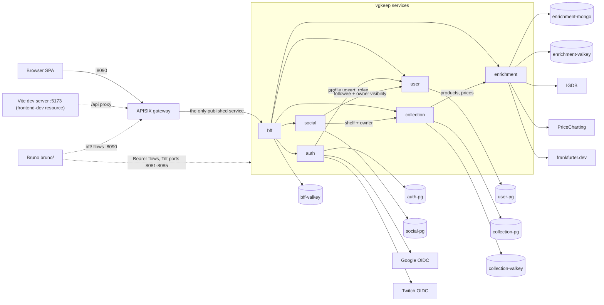
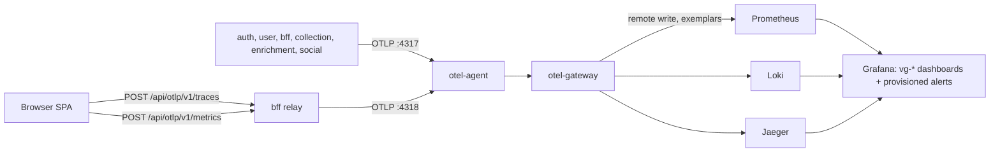

# The vgkeep stack

vgkeep is a video-game collection tracker: six Go services behind
an APISIX gateway that publishes only the bff, a React SPA served out
of the bff binary, and per-service datastores (Postgres for auth,
user, collection, and social; MongoDB plus Valkey for enrichment;
Valkey caches for the bff and collection). auth mints every token,
user owns profiles and roles, collection owns what people track,
social layers follows, likes, comments, and the activity feed on top
of collection's shelves and user's profiles, enrichment quarantines
all third-party data (IGDB, PriceCharting, frankfurter.dev), and the
bff owns the browser session end to end. The dev stack runs under Tilt
on any local Kubernetes context: the platform layer (gateway,
cert-manager, external-secrets, observability) installs once per
cluster into the `vg-platform` namespace, and the application deploys
into `vgkeep`. Each service has its own runbook (auth.md, bff.md,
collection.md, enrichment.md, social.md, user.md); this one covers the
seams between them.

## Topology



Two side doors exist in dev only: the `frontend-dev` Tilt resource
(manual trigger) runs Vite on 5173 and proxies `/api` to the gateway,
so cookie and CSRF behavior match production paths; and Bruno flows
under `bruno/` either ride the gateway (`bruno/bff/`,
`bruno/bff/admin/`) or hit services directly on their Tilt
port-forwards with Bearer tokens. Every service validates JWTs against
auth's JWKS; NetworkPolicies restrict each hop to its intended callers
(the gateway namespace to bff, bff to the five services, each service
to its own datastores). Enrichment's provider calls run in `stub` mode
by default, so the whole stack works with zero real credentials.

## Telemetry pipeline



Services push OTLP; nothing scrapes them. The exceptions are the
datastore exporter sidecars (postgres-exporter :9187, redis_exporter
:9121, mongodb_exporter :9216), which Prometheus scrapes through
ServiceMonitors; their series carry a `service` target label
(`service="auth-pg"`) while everything a service exports carries the
`service_name` resource attribute. Browser telemetry enters through
the bff's session-gated relay (1 MiB cap), so one trace stitches
browser to backend; look up service `frontend` in Jaeger.

Because the feed is push, the metric sample cadence is the SDK's export
interval, not a scrape interval: services export every 15s (the
PeriodicReader in `libs/go/otel`), and the Prometheus datasource declares
`timeInterval: 15s` so Grafana's `$__rate_interval` (4x that) spans several
samples. Keep the two in lockstep. If they drift so a rate window holds
fewer than two samples, `rate()` panels read "No Data" while the raw
counter still resolves through Prometheus's 5m staleness lookback.

## Bring-up

```bash
task bootstrap          # tool checks + .env scaffold (edit .env if you have real keys)
task bootstrap:cluster  # once per cluster: cert-manager, external-secrets, the APISIX gateway, the observability stack, CA issuers
task run                # tilt up: builds images, deploys charts, port-forwards
```

Works against any local Kubernetes context (docker-desktop, kind, k3d,
minikube); add yours to `allow_k8s_contexts` in the Tiltfile if it is
not listed. `bootstrap:cluster` is idempotent and applies the
kube-prometheus-stack CRDs by hand (`helm show crds ... | kubectl
apply --server-side`) because helm only installs a chart's `crds/` on
first install; re-run it on chart version bumps. `task run` holds the
foreground with every port-forward below; Ctrl-C stops it.

## Teardown

```bash
task down                    # stop the dev stack; namespace, datastore PVCs, issued TLS secrets survive
task nuke                    # app layer: tilt down + delete the vgkeep namespace (drops PVCs + TLS secrets)
task bootstrap:cluster:down  # remove the platform: helm uninstalls + the vg-platform namespace
```

What each tier preserves:

| Command                       | Removes                                                   | Survives                                                                                                                                      |
| ----------------------------- | --------------------------------------------------------- | --------------------------------------------------------------------------------------------------------------------------------------------- |
| `task down`                   | running Tilt resources                                    | vgkeep namespace, datastore PVCs, issued TLS secrets, the platform                                                                            |
| `task nuke`                   | vgkeep namespace, its PVCs and TLS secrets                | the platform (vg-platform), CRDs                                                                                                              |
| `task bootstrap:cluster:down` | both platform helm releases and the vg-platform namespace | cert-manager and APISIX ingress CRDs (re-adopted by the next bootstrap), the hand-applied kps CRDs, the vgkeep namespace and everything in it |

Reinstalling the platform mints a fresh dev CA, and cert-manager does
not reissue certificates that still match their specs, so TLS secrets
from before a platform-only teardown keep chaining to the dead CA
until their renewal window. For platform down/up cycles run
`task nuke && task bootstrap:cluster:down`, then
`task bootstrap:cluster && task run`.

## Ports

All dev-tier Tilt port-forwards; in-cluster, every service listens on
8080 and the gateway is the only published entrypoint.

| Port  | What                                                                                                |
| ----- | --------------------------------------------------------------------------------------------------- |
| 8090  | APISIX gateway: the app's entrypoint (browser and Bruno `bff/`)                                     |
| 8083  | bff, direct (bypasses the gateway; for debugging)                                                   |
| 8082  | auth, direct (Bruno `auth/` Bearer flows)                                                           |
| 8081  | user, direct (Bruno `user/` Bearer flows)                                                           |
| 8084  | enrichment, direct (Bruno `enrichment/` Bearer flows)                                               |
| 8085  | collection, direct (Bruno `collection/` Bearer flows)                                               |
| 8086  | social, direct (no Bruno flows yet; mint a bearer token with `auth/dev-token` and call it directly) |
| 5173  | Vite dev server (manual `frontend-dev` resource; proxies `/api` to 8090)                            |
| 3000  | Grafana (anonymous admin in dev)                                                                    |
| 9090  | Prometheus                                                                                          |
| 16686 | Jaeger                                                                                              |
| 5433  | user-pg (`psql -h localhost -p 5433 -U user user`)                                                  |
| 5434  | auth-pg (`psql -h localhost -p 5434 -U auth auth`)                                                  |
| 5435  | collection-pg (`psql -h localhost -p 5435 -U collection collection`)                                |
| 5436  | social-pg (`psql -h localhost -p 5436 -U social social`)                                            |
| 27018 | enrichment-mongo                                                                                    |

The three Valkey instances have no port-forward: TLS-only listeners,
in-cluster callers only (triage goes through `kubectl exec` and
`valkey-cli --scan`; see the owning service runbook).

## Dashboards

Twelve dashboards provision from
`deploy/charts/platform/files/dashboards/*.json` into Grafana's
`vgkeep` folder (every file in that directory globs into the
`vg-dashboards` ConfigMap). Open any of them at
`http://localhost:3000/d/<uid>` while `task run` holds the forward.
The per-service dashboards plus vg-overview absorbed the former
cross-service RED dashboard: service-level rate, 5xx ratio, and p99
sit on vg-overview, and per-route breakdowns sit on each service
dashboard.

| Dashboard          | uid               | Answers                                                                                                                                                                                                  | Goes deeper                                                                                                                                                                              |
| ------------------ | ----------------- | -------------------------------------------------------------------------------------------------------------------------------------------------------------------------------------------------------- | ---------------------------------------------------------------------------------------------------------------------------------------------------------------------------------------- |
| Overview           | `vg-overview`     | is the application healthy right now: the one pane across edge, services, and datastores; start here                                                                                                     | this document, then the service runbook the failing panel names                                                                                                                          |
| APISIX Edge        | `vg-apisix-edge`  | what the edge sees: gateway traffic, status codes, 429 rate limiting                                                                                                                                     | [bff.md](bff.md#8-rate-limiting-at-the-gateway)                                                                                                                                          |
| Datastores         | `vg-datastores`   | server-side health of every Postgres, MongoDB, and Valkey instance                                                                                                                                       | [Postgres saturation](#6-postgres-connections-above-80-percent-of-max), [Valkey pressure](#7-valkey-evicting-keys-or-memory-unusually-high), [enrichment.md](enrichment.md#2-mongo-down) |
| Pod Details        | `vg-pod-details`  | per-pod CPU, memory, restarts                                                                                                                                                                            | [Pod restart churn](#4-pod-restart-churn-or-oom-kill)                                                                                                                                    |
| Node Details       | `vg-node-details` | node pressure and capacity                                                                                                                                                                               | [Node pressure](#5-node-under-memory-disk-or-pid-pressure)                                                                                                                               |
| Auth Service       | `vg-auth`         | logins, token refreshes, signing keys, provider hops, auth-pg                                                                                                                                            | [auth.md](auth.md)                                                                                                                                                                       |
| Bff Service        | `vg-bff`          | sessions, composition caches, denylist fail-open, bff-valkey                                                                                                                                             | [bff.md](bff.md)                                                                                                                                                                         |
| Collection Service | `vg-collection`   | pricing composition, submissions queue, collection-pg and its cache                                                                                                                                      | [collection.md](collection.md)                                                                                                                                                           |
| Enrichment Service | `vg-enrichment`   | search sources, auto-matching, the catalog refresh, mongo and valkey                                                                                                                                     | [enrichment.md](enrichment.md)                                                                                                                                                           |
| Social Service     | `vg-social`       | follow/like/comment rates, feed reads, cap rejections, publish outcomes, social-pg                                                                                                                       | [social.md](social.md)                                                                                                                                                                   |
| User Service       | `vg-user`         | account upserts, currency seeds, deletions, user-pg                                                                                                                                                      | [user.md](user.md)                                                                                                                                                                       |
| Frontend Telemetry | `vg-frontend`     | locale boots by source, browser languages hitting fallback, catalog fetch failures, mid-session locale switches, prose pages served in English, uncaught errors, network failures, and web-vitals health | [frontend.md](frontend.md)                                                                                                                                                               |

The six service dashboards share one layout contract: HTTP RED per
route first, then domain metrics, then datastores from that service's
seat, then pods and error logs. Panels for a service's domain metrics
(`vg_<service>_*`) stay empty until a pod built with those instruments
is running; a freshly landed instrument needs its deployment rolled
before the series exists. Frontend Telemetry does not follow that
contract: the browser emits no HTTP RED histogram, owns no datastore,
and runs no pod of its own, so its dashboard holds nine browser-side
instruments instead - locale, prose fallback, errors, network
failures, and web vitals - documented in [frontend.md](frontend.md).

## Frontend telemetry

The SPA's telemetry - six counters and three web-vitals histograms,
relayed through the bff the same way traces are - has its own runbook:
[frontend.md](frontend.md).

## Alerting

Twenty-one rules provision from
`deploy/charts/platform/files/alerting/vg-rules.yaml` into the same
`vgkeep` folder, evaluated every 1m. `severity: page` (seven
rules) marks user-visible breakage worth interrupting someone for;
`severity: warn` (fourteen) queues investigation on the next pass. The
dev tier configures no contact point on purpose, so nothing sends:
read state in Grafana under Alerting > Alert rules, and what is firing
under Alerting > Active alerts. Every rule's `runbook_url` lands on
the runbook (or the exact failure-mode section) that triages it;
[README.md](README.md) holds the full alert-to-runbook table.

Three rules treat missing data as firing because absence is their
signal: vg-mongo-down (an unreachable exporter usually means an
unreachable Mongo), vg-enrichment-refresh-stalled (no completed
catalog refresh in 26h; a brand-new stack fires this until its first
refresh finishes at 06:00 or by manual trigger), and vg-social-down
(the social app has no ServiceMonitor of its own, so the absence of
its pg exporter target is the signal). Every other rule sets
`noDataState: OK`, so a not-yet-emitting instrument stays silent
rather than false-firing.

## Telemetry pipeline operations

The pipeline has one early-warning rule, vg-collector-drops (severity
warn), firing when the pipeline fails to export at least one batch of
spans, metrics or logs, sustained for 5 minutes:

    sum(rate({__name__=~"otelcol_exporter_(send|enqueue)_failed_.*"}[5m]))

Anything nonzero means otel-agent or otel-gateway is failing to
deliver spans, metrics, or logs downstream, and telemetry is lying by
omission while it lasts. vg-overview's "Collector exporter failures"
panel plots the same sum; the per-exporter breakdown needs Explore
against Prometheus:

1. Run `sum by (exporter) (rate({__name__=~"otelcol_exporter_(send|enqueue)_failed_.*"}[5m]))`
   to see which exporter (otlp, prometheusremotewrite) is failing.
2. Check whether the matching backend pod (kps-prometheus, loki,
   jaeger) is down or unreachable; that is the most common cause.
3. If every exporter is affected at once, check the otel-gateway pod
   for a memory_limiter processor refusing data under memory pressure.
4. Check the Pod details dashboard (vg-pod-details) for the
   otel-gateway and otel-agent pods in vg-platform: a collector starved
   of CPU or memory drops data before any backend is even involved.

When a signal goes dark (empty panels, missing logs, absent traces)
while the service itself answers requests, walk this order:

1. Export disabled: `OTEL_EXPORTER_OTLP_ENDPOINT` empty on the pod
   turns off all export by configuration; JSON logs still reach stdout
   but nothing reaches the pipeline. Check the pod env.
2. Pod predates the instrument: a metric added in a newer build has no
   series until the deployment rolls. Compare the `service_version`
   label on what the service does emit against the image you expect,
   and roll the deployment.
3. Collector trouble: the drops rule above, and the otel-agent and
   otel-gateway pods in vg-platform.
4. Backend trouble: Prometheus, Loki, or Jaeger pods in vg-platform.

Browser traces and metrics have one extra hop: they enter through the
bff's `POST /api/otlp/v1/traces` and `POST /api/otlp/v1/metrics` relay
routes, so missing frontend telemetry with healthy backend telemetry
points at the relay
([bff.md](bff.md#7-browser-telemetry-relay-failing)).

## Secrets

Dev flow: `.env` (gitignored, scaffolded from `.env.example` by
`task bootstrap`) -> the Tiltfile renders its values into the fake
ClusterSecretStore `vg-fake` -> per-service ExternalSecrets
(refreshInterval 1m) materialize Kubernetes Secrets -> pod env. The
stack runs with zero real secrets: provider credentials are optional
(stub modes serve embedded fixtures) and Tilt enables a real provider
only when its full credential pair is present in `.env`.

Two operational consequences: deployments re-roll themselves when a
secret's shape changes (the pod template hashes the ExternalSecret
manifest), but a value-only rotation needs a deliberate
`kubectl rollout restart` after ESO refreshes the Secret; and the
`vg-fake` store exists only because Tilt templates it, so any real
environment must provision its own backing store. The production
path (AWS Secrets Manager through EKS Pod Identity, same
ExternalSecret resources) is in
[../production-paths.md](../production-paths.md).

## Stack-level failure scenarios

Symptoms that cross service boundaries, and the order to read the
runbooks in:

| Symptom                                                                                     | Start                                                                                                                                                                                    | Then                                                                                                                                                                                                                       |
| ------------------------------------------------------------------------------------------- | ---------------------------------------------------------------------------------------------------------------------------------------------------------------------------------------- | -------------------------------------------------------------------------------------------------------------------------------------------------------------------------------------------------------------------------- |
| Nobody can log in                                                                           | [bff.md](bff.md#4-login-failures-at-the-edge) "Login and link outcomes"                                                                                                                  | [auth.md](auth.md#1-logins-failing-at-the-provider-hop) for the provider hop, [user.md](user.md#1-logins-fail-at-the-upsert-leg) for the upsert leg, [auth.md](auth.md#5-429s-on-login-at-the-edge) for edge rate limiting |
| Every service answers 401                                                                   | [auth.md](auth.md#6-platform-wide-401s-jwks-trouble)                                                                                                                                     | consumer views: [collection.md](collection.md#4-401-storm), [enrichment.md](enrichment.md#7-401s-across-every-route), [user.md](user.md#2-every-route-answers-401)                                                         |
| Users logged out mid-session                                                                | [bff.md](bff.md#3-refresh-failure-storm-mass-logout)                                                                                                                                     | [auth.md](auth.md#3-refresh-reuse-detections) if reuse detections climb too                                                                                                                                                |
| Revoked tokens still usable                                                                 | [bff.md](bff.md#1-valkey-unreachable)                                                                                                                                                    | exposure is bounded: a revoked token outlives revocation by its remaining TTL, 5 minutes max                                                                                                                               |
| Prices null, stale, or thin search results                                                  | [collection.md](collection.md#1-enrichment-unreachable)                                                                                                                                  | [enrichment.md](enrichment.md#3-search-degraded), [enrichment.md](enrichment.md#4-catalog-refresh-missing)                                                                                                                 |
| Like/follower counts missing from shelf or profile pages, or feed and social writes failing | [social.md](social.md#1-social-down)                                                                                                                                                     | [social.md](social.md#2-collection-or-user-down) if only writes 502                                                                                                                                                        |
| One service erroring or slow                                                                | [5xx ratio](#1-service-5xx-ratio-above-5-percent), [p99 latency](#2-service-p99-latency-above-500ms) below                                                                               | that service's runbook failure modes                                                                                                                                                                                       |
| A datastore down or saturated                                                               | [enrichment.md](enrichment.md#2-mongo-down), [Postgres saturation](#6-postgres-connections-above-80-percent-of-max), [Valkey pressure](#7-valkey-evicting-keys-or-memory-unusually-high) | the owning service runbook for readiness behavior and blast radius                                                                                                                                                         |
| Dashboards blank, service healthy                                                           | [Telemetry pipeline operations](#telemetry-pipeline-operations) above                                                                                                                    | the four-step walk there, ending at the backend pods                                                                                                                                                                       |

The dependency chain behind most of these: browser -> gateway -> bff
-> auth -> user for anything session-shaped, bff -> collection ->
enrichment for anything money-shaped, and bff -> social -> collection
or user for anything social-shaped. Failures propagate left as 502s
with the failing dependency named in the problem detail, so the bff's
"Errors by route and status" panel plus its route-to-dependency map
([bff.md](bff.md#2-a-downstream-service-is-down)) resolves "which
service do I look at" in one step.

The numbered sections below triage the cross-service and
infrastructure alert rules; each quotes its rule's query verbatim, so
the number you read here is the number that fired.

### 1. Service 5xx ratio above 5 percent

The vg-service-5xx rule (severity page) fires when more than 5 percent
of a service's responses were 5xx for 5 minutes:

    sum by (service_name) (rate(http_server_request_duration_seconds_count{http_response_status_code=~"5.."}[5m])) / sum by (service_name) (rate(http_server_request_duration_seconds_count[5m]))

1. "5xx ratio by service" on vg-overview shows the same ratio per
   service; open the firing service's own dashboard (vg-auth, vg-bff,
   vg-collection, vg-enrichment, vg-social, vg-user) and find which
   route carries the errors on "Errors by route and status".
2. Jump from a latency-panel exemplar dot to the Jaeger trace, or open
   the error logs panel and follow a trace link from a log line.
3. Check the pod details dashboard (vg-pod-details) for restarts or
   OOM kills on the same window.
4. If the errors are 502 upstream_error from the bff, the fault is in
   the named downstream service, not the bff; the route-to-dependency
   map in [bff.md](bff.md#2-a-downstream-service-is-down) names it.

Then continue in that service's runbook failure modes.

### 2. Service p99 latency above 500ms

The vg-service-p99 rule (severity warn) fires when a service's p99
request latency stays above the 500ms objective for 10 minutes:

    histogram_quantile(0.99, sum by (le, service_name) (rate(http_server_request_duration_seconds_bucket[5m])))

1. "p99 latency by service" on vg-overview shows the same quantile per
   service; the firing service's own dashboard splits it per route on
   its latency-by-route panel.
2. Follow a p99 exemplar dot to its Jaeger trace and look for a slow
   database span; otelpgx, otelmongo and redisotel spans name the
   operation they ran.
3. Check the Datastores dashboard (vg-datastores) for the same window
   in case a Postgres, Mongo or Valkey instance is saturated rather
   than the service itself.

### 3. Error log spike

The vg-loki-errors rule (severity warn) fires when a service logs more
than 20 ERROR lines in a 5 minute window, sustained for 5 minutes:

    sum by (service_name) (count_over_time({service_name=~".+"} | severity_text="ERROR" [5m]))

1. Open Explore against Loki with the rule's LogQL (drop the
   count_over_time wrapper to read the raw lines) and read the error
   messages for the firing service.
2. Follow the trace link on a log line (every OTLP log line carries
   trace_id) into Jaeger to see the full request that produced it.
3. Correlate the spike with "Errors by route and status" and the error
   logs panel on the firing service's own dashboard for the same
   window.

### 4. Pod restart churn or OOM kill

The vg-pod-churn rule (severity warn) fires when a pod restarted more
than 3 times in 15 minutes, or was OOM-killed, sustained for 5
minutes. The query combines the two series the Pod details dashboard
plots separately (restart count and OOM-kill count):

    sum by (namespace, pod) (increase(kube_pod_container_status_restarts_total{namespace=~"vgkeep|vg-platform"}[15m])) > 3 or sum by (namespace, pod) (kube_pod_container_status_last_terminated_reason{reason="OOMKilled", namespace=~"vgkeep|vg-platform"}) > 0

1. Run `kubectl -n <namespace> describe pod <pod>` and read the last
   termination reason and event list.
2. If the reason is OOMKilled, the container's memory limit in its
   chart's resources block is too low for real usage, or the process
   is leaking; check the working-set memory panel on the Pod details
   dashboard (vg-pod-details) for a climbing trend before the kill (it
   covers every pod; the "Heap used" panels on the service dashboards
   plot only that service's Go heap).
3. If the reason is a crash rather than OOM, open the Pod details
   dashboard (vg-pod-details) for the same namespace and pod to
   correlate CPU and memory with the restarts, then read the container
   logs for the panic or fatal error.

### 5. Node under memory, disk or PID pressure

The vg-node-pressure rule (severity page) fires when a node reports a
memory, disk or PID pressure condition, or has under 10 percent memory
available, for 5 minutes. The query combines the two series the Node
details dashboard plots separately (the pressure condition panel and
the available-memory ratio panel):

    kube_node_status_condition{condition=~"MemoryPressure|DiskPressure|PIDPressure", status="true"} > 0 or (node_memory_MemAvailable_bytes / node_memory_MemTotal_bytes) < 0.10

1. Open the Node details dashboard (vg-node-details) and confirm which
   condition is set and how low available memory has gone.
2. On Docker Desktop or another local VM-backed cluster, raise the
   VM's memory allocation: host sizing, not an application bug.
3. Identify the top memory or disk consumer on the Pod details
   dashboard (vg-pod-details) in case one pod is disproportionately
   responsible.

### 6. Postgres connections above 80 percent of max

The vg-pg-saturation rule (severity warn) fires when a Postgres
instance's active connections stay above 80 percent of
max_connections for 5 minutes. The query divides the two values the
Datastores dashboard shows as separate panels:

    sum by (service) (pg_stat_activity_count) / max by (service) (pg_settings_max_connections)

1. Open the Datastores dashboard (vg-datastores); panel 1 shows which
   service's Postgres instance is affected.
2. Look for a connection leak: compare the suspect service's
   configured pool maximum against its share of pg_stat_activity_count
   on the same dashboard; a service holding close to its whole pool at
   idle traffic is leaking. Consider lowering that service's pool
   size.
3. max_connections is left at the postgres image's default; raise it
   via the chart's postgres args only with a documented reason, not as
   a first response.

### 7. Valkey evicting keys or memory unusually high

The vg-valkey-pressure rule (severity warn) fires when a Valkey
instance evicts keys, or holds over 200MiB of memory, for 5 minutes.
The query combines the two series the Datastores dashboard plots
separately (eviction rate and memory used):

    rate(redis_evicted_keys_total[5m]) > 0 or redis_memory_used_bytes > 209715200

1. Check the `service` label on the firing series to identify which
   Valkey instance (bff, collection or enrichment) is affected.
2. Evictions mean the cache is thrashing: Valkey's storage is an
   emptyDir with no maxmemory configured, so growth is unbounded until
   the pod's memory limit forces evictions or an OOM kill.
3. Consider shorter TTLs on the hot keys for that service; if memory
   keeps growing without any evictions, suspect a key leak (keys
   written without a TTL) instead.

## Smoke surfaces

- `task e2e` runs the Playwright browser smoke against the running
  stack: login, collection journey (incl. bulk edit), display currency,
  account, admin, social journey, and catalog submissions - 15 tests
  across 7 specs. It
  runs `task grant-fixture-admin` first, and needs
  `npx playwright install chromium` once.
- `task grant-fixture-admin` logs the dev `admin` fixture in (so its
  user row exists) and inserts the admin role into user-pg.
  Idempotent, fixture-scoped, dev stacks only.
- Bruno flows in `bruno/` exercise every API surface:
  `bruno/bff/` and `bruno/bff/admin/` are full user and admin
  journeys through the gateway on 8090; `bruno/auth/`, `bruno/user/`,
  `bruno/enrichment/`, and `bruno/collection/` hit services directly
  on their Tilt ports with Bearer tokens (run `auth/dev-token` first
  where a flow needs `access_token` filled).

A one-minute health pass after bring-up: open vg-overview, click
around the SPA at localhost:8090, then look up service `frontend` in
Jaeger for one stitched trace.

## Verified

Deploy dashboard or alerting changes with `helm upgrade --install
vg-platform deploy/charts/platform -n vg-platform --wait --timeout
15m`, then rerun any check below against the live stack; the
port-forwards are listed under Ports.

Dashboards hot-reload from the ConfigMap within a minute. Alert rules
do not: Grafana reads alerting provisioning only at startup or on an
explicit reload, and the reload endpoint requires the basic admin
login (the anonymous Admin role lacks `provisioning:reload`). After
the ConfigMap lands, reload and count, expecting twenty-one rules:

    curl -u admin:admin -X POST http://localhost:3000/api/admin/provisioning/alerting/reload
    curl -s -u admin:admin http://localhost:3000/api/v1/provisioning/alert-rules | jq length

Dashboards provisioned, expecting twelve `.json` entries in the
ConfigMap and twelve `vg-` uids in the `vgkeep` folder (Grafana
reloads provisioned files within a minute of the ConfigMap landing):

    kubectl -n vg-platform get cm vg-dashboards -o json | jq -r '.data | keys[]'
    curl -s "http://localhost:3000/api/search?tag=vgkeep&limit=50" | jq -r '.[] | select(.type=="dash-db") | .uid'

Service deployments rolled, expecting `successfully rolled out` six
times:

    for d in auth bff collection enrichment social user; do kubectl -n vgkeep rollout status deployment/$d; done

Pool gauges emit without traffic, expecting pg series for auth,
collection, social, user and valkey series for bff, collection,
enrichment:

    curl -s http://localhost:9090/api/v1/query --data-urlencode 'query=sum by (service_name) (vg_pgkit_pool_connections)'
    curl -s http://localhost:9090/api/v1/query --data-urlencode 'query=sum by (service_name) (vg_valkeykit_pool_connections)'

One domain counter through the dev fixture login, expecting a nonzero
sum on the scrape after the curl (allow 30s):

    curl -sf "http://localhost:8090/api/auth/login?provider=dev&user=alice"
    curl -s http://localhost:9090/api/v1/query --data-urlencode 'query=sum(vg_auth_login_outcomes_total)'
