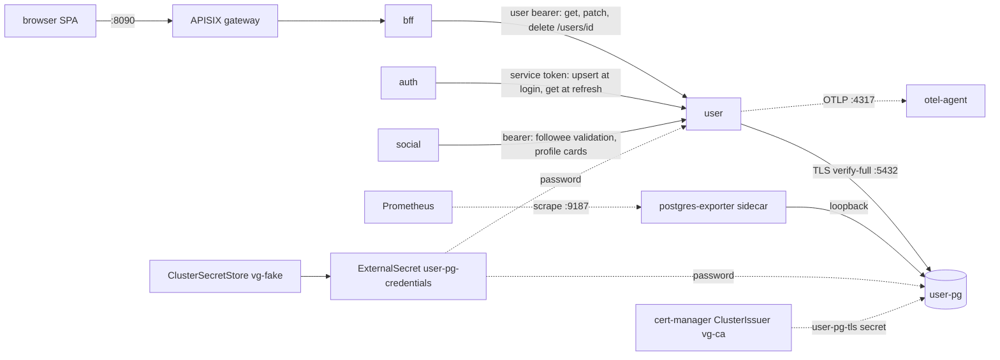
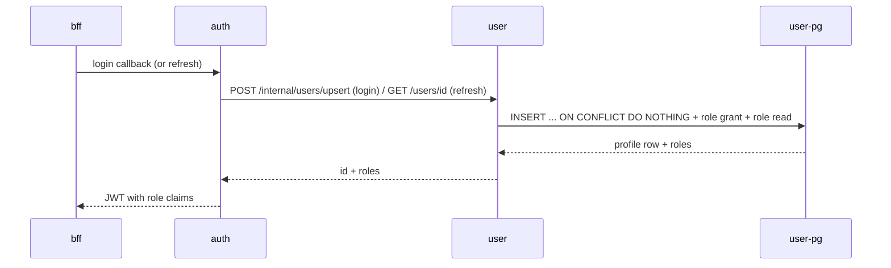

# User service

Profile and RBAC source of truth. It owns two tables (`users`,
`user_roles`) and four routes. The auth service calls it on every login
to find-or-create the profile and on every token refresh to re-read
roles, so its availability gates logins for the whole stack even though
no browser ever talks to it directly. Roles travel as JWT claims minted
by auth from this service's answers; downstream RBAC is stateless.

What an operator sees it doing:

- Create a profile at first login (`POST /internal/users/upsert`,
  service role only). The same call runs on every subsequent login and
  returns the existing profile untouched.
- Seed `preferred_currency` for new accounts from the login request's
  Accept-Language hint (`de-DE` becomes EUR); unmapped or absent hints
  default to USD. The SPA converts market values into this currency.
- Serve profile reads (`GET /users/{id}`: self, service, or admin) and
  self-service edits (`PATCH`: handle, avatar URL, preferred currency,
  profile visibility, landing-page preference).
- Store roles (`user`, `admin`) and hand them to auth at mint and
  refresh time. Admin grants are a psql lever, not an API (see
  [Admin levers](#admin-levers)); they land in the JWT at the next
  login or refresh.
- Delete the profile row as one leg of account deletion
  (`DELETE /users/{id}`, self only, idempotent). The bff orchestrates
  the other legs (auth identity wipe, collection purge).

## Architecture

No external providers, no cron workloads, no cache. One deployment
(`user`), one StatefulSet (`user-pg`) with a postgres-exporter sidecar.
NetworkPolicies restrict ingress: `user:8080` accepts only auth, bff,
and social pods; `user-pg:5432` accepts only user pods; `user-pg:9187` accepts
only Prometheus from `vg-platform`.

The login hot path, because it explains most incidents involving this
service:

Note the login leg writes even for existing accounts (the conflicting
insert plus an idempotent role grant), so a read-only Postgres fails
every login while profile reads stay green. Failure mode 1 below
covers it.

## Running it

Tilt resource `user` (label `services`), image rebuilt on changes under
`libs/go/` or `services/user/`, depends on `secret-store` and
`user-pg`. Auth depends on user, so user comes up first; expect 401s
from bearer routes until auth serves its JWKS.

| Surface | Where |
|---|---|
| Service in-cluster | `user:8080` (vg-collect namespace) |
| Direct dev port | `localhost:8081` (Tilt port-forward; the 8090 gateway fronts only the bff) |
| Postgres | `localhost:5433` -> `user-pg:5432` |
| Liveness | `GET /healthz`, static ok, no auth |
| Readiness | `GET /readyz`, pings the pg pool, no auth; JWKS is deliberately not checked |
| Bruno | `bruno/user/` (`get-self`, `update-self`); run `auth/dev-token` first to fill `access_token` and `user_id`; `user_url` is `http://localhost:8081` in the local environment |

Task targets that touch this module:

- `task user:gen` regenerates `internal/gen/api/server.gen.go` from
  `api/user.yaml` (also runs inside root `task gen`; CI fails on drift).
- `task user:db:migrate` runs `go run ./cmd/user migrate` against
  `DATABASE_URL`.
- Root `task build`, `task lint`, `task test:short`, `task test:cover`,
  `task tidy`, `task check` iterate over this module like every other.
  Coverage gate: `scripts/coverage.sh 80`, excluding `/internal/gen/`
  and `/cmd/`.
- `task grant-fixture-admin` grants the dev admin fixture its role by
  inserting into this service's database (see Admin levers).

Migrate mode: `user migrate` applies embedded SQL migrations and exits.
The deployment runs it as the `migrate` init container on every
rollout; concurrent runs serialize on golang-migrate's advisory lock
and a no-change run succeeds.

## Configuration

All config is environment variables parsed at startup
(`internal/config`); a missing required variable is a fatal error
before the listener opens.

| Variable | Required | Default | Source | Notes |
|---|---|---|---|---|
| `HTTP_ADDR` | no | `:8080` | binary default | |
| `DATABASE_URL` | yes | none | composed in `deploy/charts/user/templates/deployment.yaml` from chart values plus `$(PG_PASSWORD)` | carries `sslmode=verify-full&sslrootcert=/etc/vg/pg-ca/ca.crt` |
| `PG_PASSWORD` | chart-internal | none | secret `user-pg-credentials`, key `password` | filled by the ExternalSecret; only ever referenced inside `DATABASE_URL` |
| `JWKS_URL` | yes | none | chart value `env.jwksUrl`, default `http://auth:8080/.well-known/jwks.json` | keys fetched lazily and cached by kid; unknown-kid refetch at most every 30s |
| `JWT_ISSUER` | no | `vg-collect-auth` | chart value `env.jwtIssuer` | |
| `JWT_AUDIENCE` | no | `vg-collect` | chart value `env.jwtAudience` | |
| `SERVICE_VERSION` | no | `dev` | chart sets it to the image tag | stamped onto telemetry as `service.version` |
| `OTEL_EXPORTER_OTLP_ENDPOINT` | no | unset | chart value `otel.exporterEndpoint`, default `http://otel-agent.vg-platform.svc.cluster.local:4317` | empty disables all export: logs stay on stdout as JSON, every metric and trace in this document goes dark |

Secret chain in dev: `.env` `PG_USER_PASSWORD` (listed in
`.env.example`) -> Tiltfile publishes it into ClusterSecretStore
`vg-fake` under key `user/pg-password` -> ExternalSecret
`user-pg-credentials` (refreshInterval 1m) -> pod env. The deployment
re-rolls when the ExternalSecret shape changes (checksum annotation);
rotating only the value needs a Tilt re-apply.

There are no provider or mode flags. When auth is absent or its JWKS is
unreachable, every bearer route answers 401 (`missing_token` or
`invalid_token` problem codes) while `/healthz` and `/readyz` stay
green; the service never crashes over JWKS.

## Datastore: user-pg

One Postgres 17 instance, database `user`, user `user`. Schema at a
glance: `users` (uuid id, citext unique email, handle with a generated
`handle_key` fold column backing a unique index, handle_changed_at,
avatar_url, profile_visibility checked to `private | unlisted |
listed`, preferred_currency with a `^[A-Z]{3}$` check, landing_page
checked to `collection | feed | explore`, timestamps) and `user_roles`
(user_id FK cascade-delete, role checked to `user | admin`, composite
PK). Four migrations so far (`000001_init`, `000002_preferred_currency`,
`000003_handle`, `000004_landing_page`), embedded in the binary and
applied by the init container or `task user:db:migrate`.

Connection facts: TLS `verify-full` against the cert-manager-issued
`user-pg-tls` cert (ClusterIssuer `vg-ca`, 90-day duration, renewed
automatically; the client mounts only the CA). The app pool is pgxpool
with no explicit ceiling, so the max is pgxpool's default (the greater
of 4 and the pod's visible CPU count); `vg_pgkit_pool_connections_max`
is the live truth. Server-side `max_connections` is the postgres image
default of 100. The exporter sidecar connects over pod-local loopback
without TLS and serves `:9187`, scraped through the `user-pg`
ServiceMonitor; its series carry `service="user-pg"` (a target label),
while everything the app exports carries the resource attribute
`service_name="user"`. Use the right one per query.

## Telemetry

### Metrics

Everything below reaches Prometheus through the OTLP pipeline
(otel-agent -> otel-gateway -> remote write); nothing here adds a
scrape endpoint. All app series: `service_name="user"`.

Shared plumbing, already emitted today:

| Metric (Prometheus name) | Instrument | Unit | Labels | Answers |
|---|---|---|---|---|
| `http_server_request_duration_seconds_{count,sum,bucket}` | histogram (otelhttp) | s | `http_route` (matched mux pattern including the method, e.g. `POST /internal/users/upsert`, `GET /users/{userId}`), `http_response_status_code` | RED for every route: rate, errors, duration; exemplars link buckets to traces |
| `go_goroutine_count`, `go_memory_used_bytes` (among the runtime set) | gauge (otel runtime) | short / bytes | none | leak or runaway-allocation checks |

PG pool, emitted since pgkit gained pool instrumentation (no labels;
`service_name` scopes them):

| Prometheus name | Instrument | Unit | Answers |
|---|---|---|---|
| `vg_pgkit_pool_connections` | observable gauge | {connection} | connections held (constructing + acquired + idle) |
| `vg_pgkit_pool_connections_idle` | observable gauge | {connection} | idle headroom right now |
| `vg_pgkit_pool_connections_max` | observable gauge | {connection} | configured ceiling; saturation denominator |
| `vg_pgkit_pool_acquires_total` | observable counter | {acquire} | pool demand rate; mean-wait denominator |
| `vg_pgkit_pool_empty_acquires_total` | observable counter | {acquire} | acquires that had to wait on a drained pool |
| `vg_pgkit_pool_acquire_wait_seconds_total` | observable counter | s | total wait; divided by acquires = mean acquire latency |

Domain metrics, meter `github.com/levonn-dev/vg-collect/services/user`
(this service has no Valkey, so no `vg_valkeykit_*` series exist for
it):

| Metric | Prometheus name | Instrument | Unit | Labels (bounded) | Answers |
|---|---|---|---|---|---|
| `vg.user.account.upserts` | `vg_user_account_upserts_total` | counter | {upsert} | `outcome` = `created` \| `existing` | signup rate vs returning-login rate; the counter mirrors login volume from the profile side, so zero here while auth still handles logins means the auth-to-user leg is broken |
| `vg.user.currency.seeds` | `vg_user_currency_seeds_total` | counter | {seed} | `source` = `locale` \| `fallback` | is the Accept-Language to preferred_currency plumbing alive; a fallback share of 100 percent means auth stopped forwarding locale hints or the mapping regressed |
| `vg.user.account.deletes` | `vg_user_account_deletes_total` | counter | {delete} | `outcome` = `deleted` \| `noop` | account-deletion leg health; a noop is a retry converging on an already-deleted row |

Emission sites, precisely: all three counters are fields on
`server.Handlers`, created in `server.New` (registration failure is
logged and does not stop startup, matching the bff's counter).
`UpsertUser` increments `account.upserts` after the store call, with
`outcome=created` exactly when the store reports the insert took (the
store's created/existing branch is surfaced to the handler);
`currency.seeds` increments only on the created branch, `source=locale`
when the hint parsed and mapped to a currency (a US hint mapping to USD
counts as `locale`), `fallback` for absent, unparseable, or unmapped
hints. `DeleteUser` increments `account.deletes` with `outcome` from
the delete's rows-affected count. No user ids, emails, or other
unbounded values ever become label values.

### Logs

JSON on stdout plus OTLP to Loki, label `service_name="user"`, trace
and span ids attached by the shared slog handler. Existing events:
`http request` (INFO: method, path, status, duration_ms, once per
request), `user service listening` (INFO: addr), `panic recovered`
(ERROR: panic, path), `fatal` (ERROR: err, then exit).

Additions, closing the gap that a 500 today leaves no server-side
cause anywhere:

| Event | Level | Fields | Emission site |
|---|---|---|---|
| `store error` | ERROR | `op` = `upsert` \| `get` \| `update` \| `delete`, `err` | each handler path that answers a 500, logged with the request context before the problem response |
| `account created` | INFO | `user_id`, `preferred_currency`, `currency_source` | `UpsertUser`, created branch only |
| `account deleted` | INFO | `user_id`, `outcome` | `DeleteUser` |

Emails stay out of log fields.

### Traces

otelhttp server spans (named `user`, route attribute from the matched
mux pattern), otelpgx client spans per query, and both callers wrap
their clients in otelhttp transports, so a login trace in Jaeger
(service `user`) runs browser -> bff -> auth -> user -> pg unbroken.
Latency panels carry exemplars into these traces.

## Dashboard: vg-user

File `deploy/charts/platform/files/dashboards/user.json`, uid
`vg-user`, title `User Service`, provisioned into Grafana's
`vg-collect` folder. Open it at http://localhost:3000/d/vg-user while
`task run` holds the Grafana port-forward. Structural conventions
are the ones shared by every vg-collect dashboard: schemaVersion 39,
tags `["vg-collect"]`, timezone
`browser`, refresh `30s`, an explicit datasource object on every target
(`prometheus` or `loki` by uid), timeseries for rates and durations,
stat only for headline values, default palette, no dual-axis anywhere;
`legendFormat` from a label on every multi-series panel; latency
targets set `"exemplar": true`.

HTTP row:

1. Request rate by route. timeseries, unit `reqps`, legend
   `{{http_route}}`.

        sum by (http_route) (rate(http_server_request_duration_seconds_count{service_name="user"}[$__rate_interval]))

2. 5xx ratio. timeseries, unit `percentunit`.

        sum(rate(http_server_request_duration_seconds_count{service_name="user",http_response_status_code=~"5.."}[5m])) / sum(rate(http_server_request_duration_seconds_count{service_name="user"}[5m]))

3. Latency by route (p95/p99). timeseries, unit `s`, exemplars on,
   legends `p95 {{http_route}}` / `p99 {{http_route}}`.

        histogram_quantile(0.95, sum by (le, http_route) (rate(http_server_request_duration_seconds_bucket{service_name="user"}[$__rate_interval])))
        histogram_quantile(0.99, sum by (le, http_route) (rate(http_server_request_duration_seconds_bucket{service_name="user"}[$__rate_interval])))

4. 4xx and 5xx by route and status. timeseries, unit `reqps`, legend
   `{{http_route}} {{http_response_status_code}}`. This is where 401
   floods (JWKS trouble) and 403 spikes (authz regressions) show up
   without their own metric.

        sum by (http_route, http_response_status_code) (rate(http_server_request_duration_seconds_count{service_name="user",http_response_status_code=~"4..|5.."}[$__rate_interval]))

Feature row:

5. Account upserts by outcome (5m). timeseries, unit `short`, legend
   `{{outcome}}`.

        sum by (outcome) (increase(vg_user_account_upserts_total[5m]))

6. New-account currency seed source (5m). timeseries, unit `short`,
   legend `{{source}}`.

        sum by (source) (increase(vg_user_currency_seeds_total[5m]))

7. Account deletions by outcome (5m). timeseries, unit `short`, legend
   `{{outcome}}`.

        sum by (outcome) (increase(vg_user_account_deletes_total[5m]))

Datastore row:

8. PG client pool: connections vs max. timeseries, unit `short`,
   legends `in pool` / `idle` / `max`.

        vg_pgkit_pool_connections{service_name="user"}
        vg_pgkit_pool_connections_idle{service_name="user"}
        vg_pgkit_pool_connections_max{service_name="user"}

9. PG client pool: mean acquire wait. timeseries, unit `s`.

        rate(vg_pgkit_pool_acquire_wait_seconds_total{service_name="user"}[5m]) / rate(vg_pgkit_pool_acquires_total{service_name="user"}[5m])

10. PG client pool: empty acquires (5m). timeseries, unit `short`.

        increase(vg_pgkit_pool_empty_acquires_total{service_name="user"}[5m])

11. user-pg server connections vs max_connections. timeseries, unit
    `short`, legends `connections` / `max` (exporter side; same names
    the Datastores dashboard proves).

        sum(pg_stat_activity_count{service="user-pg"})
        max(pg_settings_max_connections{service="user-pg"})

Runtime and pod row (query shapes match pod-details.json; the
`container="user"` selector scopes to the app container and keeps
user-pg and the init container out):

12. Goroutines. timeseries, unit `short`, legend `goroutines`.

        go_goroutine_count{service_name="user"}

13. Heap used. timeseries, unit `bytes`, legend `heap`.

        go_memory_used_bytes{service_name="user"}

14. Pod CPU. timeseries, unit `short`, legend `{{pod}}`.

        sum by (pod) (rate(container_cpu_usage_seconds_total{namespace="vg-collect", container="user"}[$__rate_interval]))

15. Pod memory working set. timeseries, unit `bytes`, legend
    `{{pod}}` (limit is 128Mi; read this panel against it).

        sum by (pod) (container_memory_working_set_bytes{namespace="vg-collect", container="user"})

16. Restarts (15m) and OOM kills. timeseries, unit `short`, legends
    `restarts {{pod}}` / `oom {{pod}}`; `pod=~"user-.*"` covers the
    app and user-pg pods.

        sum by (pod) (increase(kube_pod_container_status_restarts_total{namespace="vg-collect", pod=~"user-.*"}[15m]))
        sum by (pod) (kube_pod_container_status_last_terminated_reason{reason="OOMKilled", namespace="vg-collect", pod=~"user-.*"})

Logs row:

17. Recent error logs. logs panel, Loki datasource.

        {service_name="user"} | severity_text="ERROR"

## Failure modes and triage

### 1. Logins fail at the upsert leg

Symptom: users cannot log in anywhere; auth logs upsert errors. The
login path writes even for existing accounts, so a read-only or
disk-full Postgres kills all logins while `GET /users/{id}` (refresh)
stays green and the whole-service 5xx ratio can stay under the
service-wide alert threshold. Confirm on "4xx and 5xx by route and
status" with

    sum(rate(http_server_request_duration_seconds_count{service_name="user", http_route="POST /internal/users/upsert", http_response_status_code=~"5.."}[5m]))

and in "Recent error logs" by `store error` lines with `op=upsert`.
The vg-user-upsert-5xx rule pages when 5xx exceed 20 percent of
upsert requests:

    sum(rate(http_server_request_duration_seconds_count{service_name="user", http_route="POST /internal/users/upsert", http_response_status_code=~"5.."}[5m])) / sum(rate(http_server_request_duration_seconds_count{service_name="user", http_route="POST /internal/users/upsert"}[5m]))

Then check user-pg: `kubectl -n vg-collect exec statefulset/user-pg
-- psql -U user -d user -c "SHOW transaction_read_only;"` and disk on
its PVC.
Broader 5xx triage:
[stack.md](stack.md#1-service-5xx-ratio-above-5-percent).

### 2. Every route answers 401

"4xx and 5xx by route and status" shows 401 across all routes with
normal rates. Causes in order of likelihood: auth is down (JWKS
unreachable; the validator
starts empty and refetches on unknown kid at most every 30s), or a
signing-key rotation outpaced the refetch window. Check the auth pod,
then `curl -s http://localhost:8082/.well-known/jwks.json` (auth's dev
port-forward). Not a user-service defect; readiness stays green by
design so the pod will not restart its way out.

### 3. PG pool contention

p95 climbs on all routes together on "Latency by route (p95/p99)"
while user-pg looks idle. "PG client pool: mean acquire wait" and "PG
client pool: empty acquires (5m)" confirm it: the wait rising and

    rate(vg_pgkit_pool_empty_acquires_total{service_name="user"}[5m]) / rate(vg_pgkit_pool_acquires_total{service_name="user"}[5m])

above roughly 0.25 sustained means callers queue behind a drained
pool. "PG client pool: connections vs max" shows the ceiling being
hit. Either traffic outgrew the default pool max (raise it with an
explicit `pool_max_conns` in the chart's `DATABASE_URL`, watching the
server-side budget on "user-pg server connections vs
max_connections") or a query got slow (check otelpgx spans in
Jaeger). Server-side saturation:
[stack.md](stack.md#6-postgres-connections-above-80-percent-of-max);
latency objective:
[stack.md](stack.md#2-service-p99-latency-above-500ms).

### 4. user-pg down or restarting

`/readyz` fails (it pings the pool), the pod leaves endpoints, auth
logins and bff `/api/me` return 5xx until pg is back. On vg-user,
"4xx and 5xx by route and status" shows `GET /readyz` answering 503
(the kubelet probes are instrumented like every route) while
bearer-route traffic on "Request rate by route" falls to zero once the
pod leaves endpoints. Confirm with
`kubectl -n vg-collect get pods` (user-pg not ready, user pod Running
but not Ready) and `curl -s localhost:8081/readyz` returning a
`not_ready` problem. No manual action on recovery: the pool
re-establishes on demand and readiness flips back. A deleted user-pg
PVC is account and role data loss; in dev the fixture admin grant must
then be re-run.

### 5. An admin grant did not take effect

Not an outage. Roles land in JWTs only at the next login or refresh,
so a fresh grant is invisible to an existing access token. Verify the
row exists (see Admin levers inspection query), then have the user
refresh or re-login. `GET /users/{id}` (Bruno `get-self`) shows the
live roles straight from the database.

### 6. Every new account seeds USD

"New-account currency seed source (5m)" shows `source=fallback` at
100 percent while signups continue. Either auth stopped forwarding
Accept-Language (its `bestLanguageTag` parse yields empty) or the
region map no longer covers what users
send. `account created` log lines carry `currency_source` per account.
Existing accounts are untouched either way; the seed applies only at
creation.

### 7. Restart churn or OOM kills

"Restarts (15m) and OOM kills", and the platform-wide rule already
covers it: [stack.md](stack.md#4-pod-restart-churn-or-oom-kill). The
app limit is 128Mi with no CPU limit; check "Pod memory working set"
against the limit before raising it.

### 8. Dashboard blank, service healthy

Requests succeed via Bruno but every vg-user panel is empty. Either
`OTEL_EXPORTER_OTLP_ENDPOINT` is empty (export disabled by
configuration; check the pod env) or the collector pipeline is
dropping data:
[stack.md](stack.md#telemetry-pipeline-operations) walks the pipeline
end to end, the Loki leg included, so lagging or vanished logs follow
the same trail.

## Admin levers

This service exposes no admin HTTP endpoints; roles are data on
purpose, so every lever is psql-level and idempotent.

Grant admin (the documented lever; roles reach the JWT at next login
or refresh):

    kubectl -n vg-collect exec statefulset/user-pg -- \
      psql -U user -d user -c \
      "INSERT INTO user_roles (user_id, role) \
       SELECT id, 'admin' FROM users WHERE email = 'someone@example.com' \
       ON CONFLICT DO NOTHING;"

For the dev fixture specifically, `task grant-fixture-admin` runs a dev
login (so the row exists) followed by exactly this insert for
`admin@example.com`; `task e2e` depends on it.

Revoke admin (same propagation rule):

    kubectl -n vg-collect exec statefulset/user-pg -- \
      psql -U user -d user -c \
      "DELETE FROM user_roles WHERE role = 'admin' \
       AND user_id = (SELECT id FROM users WHERE email = 'someone@example.com');"

Inspect a user's roles:

    kubectl -n vg-collect exec statefulset/user-pg -- \
      psql -U user -d user -c \
      "SELECT u.email, r.role FROM users u \
       LEFT JOIN user_roles r ON r.user_id = u.id \
       WHERE u.email = 'someone@example.com';"

Re-run migrations (safe anytime; no-change is success):

    task user:db:migrate

## Capacity and rollout

One replica, requests 50m CPU / 64Mi, limit 128Mi memory, no CPU
limit. user-pg: one replica, 50m / 128Mi, limit 256Mi, 1Gi PVC. Both
PDBs set `minAvailable: 1`, which with single replicas means a
voluntary drain blocks instead of silently dropping the only copy;
scale first if a node must be emptied.

Probes: liveness `GET /healthz` and readiness `GET /readyz` at kubelet
defaults (10s period, 3 failures to act); user-pg readiness is
`pg_isready` every 5s.

A rollout runs in this order: the new pod's `migrate` init container
applies migrations against the live database (advisory-lock
serialized), the app container starts, readiness gates traffic until
the pg ping succeeds, then the old pod gets SIGTERM and 10 seconds of
graceful drain before force-close. The old code serves against the new
schema for that window, so migrations stay backward-compatible for one
release. A user-pg restart mid-flight behaves like failure mode 4:
readiness drops, callers see errors, everything reconverges without
intervention when Postgres returns.
