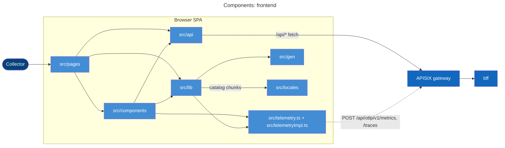
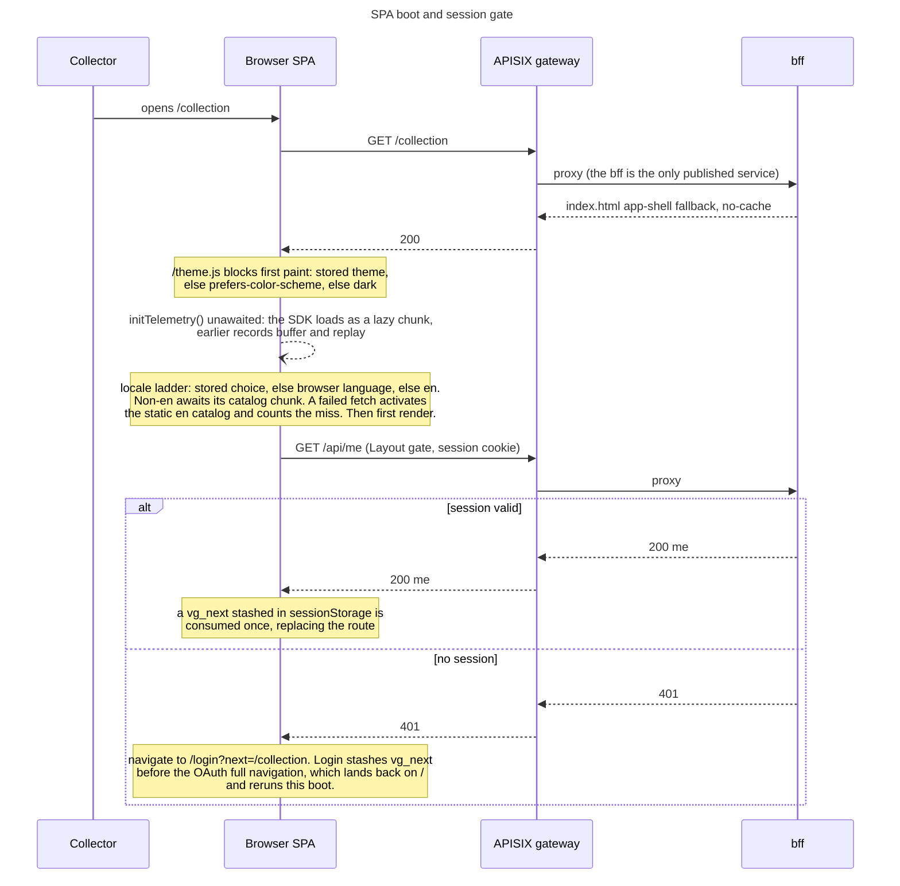

# vgkeep frontend

React 19 SPA for the vgkeep video game collection tracker.
Typed against the BFF OpenAPI contract at `api/bff.yaml`.
Served in production by the BFF at the same origin; in dev the Vite
proxy forwards `/api` to the APISIX gateway port-forward on :8090.

Site identity (the VITE_SITE_* slots, footer credit lines) is baked in
at image build; the dev server on :5173 runs without the values Tilt
derives for the cluster image, so credits and operator text are absent
there by design.

The production bundle ships inside the bff image: `services/bff/Dockerfile` builds `frontend/dist` in a
node:22-alpine stage and embeds it into the Go binary at `services/bff/internal/static`, which serves the
content-hashed assets with a one-year immutable cache, never caches `index.html`, and answers extensionless
unknown paths with the app shell so client-side routes survive a full-page load. The SPA holds no token and
enforces nothing: the session is a bff-owned `HttpOnly` cookie this code cannot read, and checks like the admin
links rendering only when `/api/me` lists role `admin` are UX, not security. Every server call is an `/api/*`
request through the gateway; the SPA never addresses a backend service directly. The bff's side of all of it
is [services/bff/README.md](../services/bff/README.md).

## API client

`src/api/client.ts` wraps `openapi-fetch` (the `api` client, typed
against `src/api/schema.ts`) with `unwrap`, which turns its
`{ data, error, response }` result into a throw-on-problem contract:
a parsed RFC 9457 problem body rejects with `ApiError` (fields
`status` and `code`; the detail text becomes its `.message`), any
other non-ok response rejects with a bare `ApiError(status)`, and a
204 resolves `undefined`. `fetch` resolves through `globalThis` on
every call instead of being captured at module init, so OTel's
`window.fetch` patch, which lands after this module loads, still
wraps every request.

Domain modules under `src/api/` (`me`, `catalog`, `collection`,
`social`, `submissions`, `admin`, `platforms`, `fx`) hold the actual
calls - things like `api.GET('/api/products/{productId}', ...)` - as
path literals checked at compile time against `schema.ts`: a path or
parameter that drifts from `api/bff.yaml` fails the build instead of
the request.

These files regenerate from the OpenAPI contracts and are committed
like any other source file: `src/api/schema.ts` from
`api/bundled/bff.yaml` (`npm run gen`, openapi-typescript with
`--enum-values`), and `src/gen/domain.ts` plus `src/gen/facets.ts`
from `api/domain.yaml` and `api/bundled/bff.yaml` respectively
(`task gen:domain`, the Go tool `tools/domaingen`). Constraint values
split by kind, not by file role: every enum's value list - the option
arrays a form or a filter reads - comes from `schema.ts`'s generated
`*Values` exports (one per named vocabulary schema or inline enum,
e.g. `itemTypeValues`); every OTHER constraint - caps, numeric bounds,
defaults, the handle pattern - comes from `facets.ts` instead,
mirrored straight out of the bundle's schemas and parameters rather
than a hand-maintained constants module. The root `task gen` runs
both generators, and a stale output fails CI's drift check the same
way a stale locale catalog does.

## Components

Pages own routes and everything below them; components are shared UI grouped by domain; all server I/O funnels
through the `src/api` modules, with react-query between them and the pages (defaults under Client state below).
Telemetry is a `record*` facade plus a lazily loaded SDK chunk (split described under Internal layout).



Two shells split the route table in `App.tsx`. `Layout` wraps the signed-in app (`/`, `/collection`, `/add`,
`/entries/:id`, `/recommendations`, `/explore`, `/u/:handle`, `/u/:handle/shelves/:slug`, `/feed`, `/admin`,
`/account`, `/help`): it gates on `GET /api/me` and bounces a 401 to `/login?next=<path>`. `PublicShell` wraps
`/login`, `/about`, `/terms`, `/privacy`, and the not-found catch-all: it never gates, so those pages paint even
with the backend down, and it upgrades to the signed-in app bar once `['me']` resolves. `/admin` is the one lazy
route (`lazy(() => import('./pages/Admin'))` behind a null Suspense fallback; a spinner would drag a new msgid
through both catalogs).

## Actor flows

The SPA owns one flow end to end, because it happens entirely in the browser: getting from the first byte to a
signed-in render.



The boot increments the locale counter the runbook's per-boot rates divide by; instrument names and panel queries
live in [docs/runbooks/frontend.md](../docs/runbooks/frontend.md). The sign-in dance inside the 401 branch is the
auth service's flow ([services/auth/README.md](../services/auth/README.md)). Elsewhere the SPA participates
without owning the flow:

- Sign-in and session issue: [services/auth/README.md](../services/auth/README.md). The SPA leg is provider
  buttons from `GET /api/auth/providers`, sign-in as a full navigation (OAuth needs the browser to follow the
  gateway's redirects), and `safeNext` on the Login page rejecting any non-internal `next` path.
- Session refresh, logout, and the account deletion purge: [services/bff/README.md](../services/bff/README.md).
  The SPA sends `POST /api/auth/logout` and `DELETE /api/me`, and shows the `?deleted` notice on the Login page
  afterward.
- Entry add and product resolve: [services/collection/README.md](../services/collection/README.md), end to end.
  On this side the add wizard walks search pick, details, confirm (`src/components/catalog/SearchPicker`, then
  `src/components/wizard/`), with a custom step when the catalog has no match.
- Pricing reads: [services/collection/README.md](../services/collection/README.md). The SPA's `useDisplayMoney`
  converts stored USD cents at the `/api/fx` snapshot rate, short-circuits USD, and flags a snapshot older than
  a week as stale.
- Catalog search and product reads: [services/enrichment/README.md](../services/enrichment/README.md).
- Social writes, Feed, and Explore: [services/social/README.md](../services/social/README.md). Shared shelf and
  profile composition, and recommendations, are the bff's ([services/bff/README.md](../services/bff/README.md)).
- Admin levers: each executes in the service that owns it; the panels under `src/components/admin/` just call
  `/api/admin/*`.
- Browser telemetry relay: the bff's ([services/bff/README.md](../services/bff/README.md)), summarized signal by
  signal in [docs/runbooks/frontend.md](../docs/runbooks/frontend.md).

## Client state

react-query holds all server state; there is no other client cache. Defaults from `App.tsx`: queries go stale
after 5 minutes, and a failed query retries at most twice, never on a 401 (`ApiError.status === 401` means "go
log in", not "retry harder"). One override: `['fx']` (`useFxRates` in `src/lib/useDisplayMoney.ts`) stretches
`staleTime` to an hour and turns off refetch-on-focus, because the upstream rate snapshot changes daily.

Query keys group into families, invalidated together:

| Family      | Keys                                                                                                                                            |
| ----------- | ----------------------------------------------------------------------------------------------------------------------------------------------- |
| identity    | `['me']`, `['providers']`, `['identities']`                                                                                                      |
| collection  | `['entries', ...]`, `['entry', id]`, `['entry-facets']`, `['dashboard', ...]`, `['tags']`, `['views']`, `['recommendations']`                    |
| catalog     | `['search', kind, q]`, `['resolve', ...]`, `['product', id]`, `['platforms']`, `['fx']`                                                          |
| social      | `['profile', handle]`, `['sharedShelf', handle, slug]`, `['sharedEntries', shelfId]`, `['shelfComments', shelfId]`, `['shelfSummary', shelfId]`, `['explore', ...]`, `['feed', tab]`, `['userSearch', q]` |
| submissions | `['submission', entryId]`                                                                                                                        |
| admin       | `['admin', ...]`                                                                                                                                 |

Two helpers keep invalidation in one place. `invalidateEntryQueries` (`src/lib/entryQueries.ts`) sweeps
`['entries']`, `['dashboard']`, and `['recommendations']` after any entry mutation, plus whatever call-site keys
the caller appends; `invalidateShelfSocial` (`src/lib/shelfQueries.ts`) refreshes `['shelfComments', shelfId]`
and `['shelfSummary', shelfId]` after a comment write.

Persistent browser state is exactly these keys: localStorage `theme` (read by `public/theme.js` before first
paint, written by the theme toggle), localStorage `locale` (`src/lib/locale.ts`), and sessionStorage `vg_next`
(the Login page stashes the intended destination before the OAuth full navigation; `Layout` consumes it once
after `['me']` resolves). Nothing else persists client-side, and in particular no token: the session cookie is
bff-owned and `HttpOnly`, invisible to this code.

## Internal layout

- `src/pages/`: one component per route in `App.tsx`, plus per-locale prose variants under
  `src/pages/<page>/<Page>.<locale>.tsx` for About, Help, Privacy, and Terms.
- `src/components/`: the shells and shared chrome at the top level (`Layout`, `PublicShell`, `AppBar`, `Footer`,
  `ErrorBoundary`, `ThemeToggle`, `LocaleSwitch`, `CrtOverlay`), domain groups below (`account/`, `admin/`,
  `catalog/`, `collection/`, `entry/`, `insights/`, `social/`, `wizard/`).
- `src/api/`: `client.ts`, the generated `schema.ts`, and the domain call modules (see API client above).
- `src/gen/`: domaingen outputs, `domain.ts` (region tables) and `facets.ts` (contract constraint mirror).
- `src/lib/`: hooks and pure helpers - locale resolution, `useMe`, `useDisplayMoney` and money formatting, the
  invalidation helpers, list and pagination params, product title and region logic, site identity.
- `src/locales/`: the PO catalogs. `en.po` bundles statically, `ja.po` is a split chunk, and `zz.po` is a
  fallback-test fixture compiled only under vitest (`lingui.config.ts` gates it on `VITEST`), never listed in
  `SUPPORTED_LOCALES` or the switcher.
- `src/telemetry.ts` and `src/telemetryImpl.ts`: the facade and the SDK half. The facade's `record*` functions
  carry only type-level OTel imports, the impl loads as its own chunk, and records fired before it lands buffer
  (cap 100) and replay on init. Instruments, dashboard, and triage are the runbook's:
  [docs/runbooks/frontend.md](../docs/runbooks/frontend.md).
- `src/test/`: vitest setup and fixtures. `e2e/`: the Playwright suite (see Dev commands below).

Committed generated files are `src/api/schema.ts`, `src/gen/domain.ts`, and `src/gen/facets.ts`; the catalogs
under `src/locales/` are extraction-managed the same way (entries extracted, translations authored). The root
`task gen` rebuilds all of them and CI fails on drift; the chain itself is described under API client.

## Configuration

The SPA has no runtime configuration: everything is baked at image build. `services/bff/Dockerfile` declares the
build args, and defaults live in `site()` in `src/lib/site.ts`, so an unset arg falls back in code (there is no
frontend chart to configure). The dev server runs with none of them set, as the intro notes.

| Build arg                  | When unset                             | Carries                                                              |
| -------------------------- | -------------------------------------- | -------------------------------------------------------------------- |
| `VITE_SITE_NAME`           | `vgkeep`                               | site name (`site().name`)                                            |
| `VITE_SITE_OPERATOR`       | empty                                  | operator line in the legal pages and footer                          |
| `VITE_SITE_CONTACT`        | empty                                  | contact line                                                         |
| `VITE_SITE_JURISDICTION`   | empty                                  | governing-jurisdiction line                                          |
| `VITE_SITE_SOURCE_URL`     | `https://github.com/levonn-dev/vgkeep` | source link                                                          |
| `VITE_SITE_DATA_SOURCES`   | no data sources credited               | CSV filter over the credit catalog in `src/lib/site.ts`; unknown keys drop |
| `VITE_SITE_AUTH_PROVIDERS` | no providers named                     | CSV filter over the auth-provider catalog, same semantics            |
| `VITE_BUILD_VERSION`       | attribute absent                       | telemetry `version` attribute; unset in dev on purpose, never derived from a git SHA |

## Dev commands

    npm run dev          start the Vite dev server on :5173
    npm run test         vitest (unit, jsdom)
    npm run test:cover   vitest + 80% coverage gate
    npm run lint         eslint
    npm run build        tsc + vite build
    npm run gen          regenerate src/api/schema.ts from api/bundled/bff.yaml
    npm run extract      rewrite the locale catalogs after copy changes (see Translations)
    npm run e2e          Playwright against the running stack (details below)

The e2e suite (`npm run e2e`, or `task e2e` from the repo root) drives Playwright at `BFF_URL` (default
`http://localhost:8090`), minting per-run `e2e-*` dev-fixture users so specs run fully parallel; `E2E_WORKERS`
(default 4) bounds the workers to the gateway's per-IP rate budget, and the browser comes from a one-time
`npx playwright install chromium`. Every script above also has a `task frontend:<name>` twin in
`frontend/Taskfile.yml`, which is what the root aggregates (`task lint`, `task test`, `task gen`, `task build`)
call; the shared stack commands are the root README's.

## Translations

UI strings are authored in English through Lingui macros, not as raw
JSX text. Three shapes cover the app:

Sentences and paragraphs use `Trans` in JSX:

```tsx
// before
<h2 className="mb-2 text-2xl font-bold">Page not found</h2>
// after
<h2 className="mb-2 text-2xl font-bold"><Trans>Page not found</Trans></h2>
```

Attribute strings (`aria-label`, `placeholder`, `title`) use `t` from
`useLingui()`:

```tsx
const { t } = useLingui()
<main aria-label={t`Page not found`} ...>
```

Module-level string tables (constants outside a component) use `msg`
descriptors, rendered with `i18n._()` where they're used. From
`src/lib/site.ts`:

```ts
import { msg } from '@lingui/core/macro'
const DATA_SOURCES = [
  { key: 'igdb', label: 'IGDB', dataType: msg`Game data`, url: 'https://www.igdb.com' },
  // ...
]
// at the render site:
const { i18n } = useLingui()
i18n._(dataSource.dataType)
```

Run `npm run extract` (or `task frontend:extract`) after changing any
translatable copy. This rewrites every registered locale's catalog:
new English text lands in `en.po` and shows up as a missing entry in
each translated catalog, which then falls back to English until
someone translates it. All of them are committed like any other source
file. The root `task gen` runs the same extraction, so a catalog left
out of date fails CI's drift check the same way a stale generated API
client would.

Prose pages (About, Terms, Privacy, Help) skip the catalog entirely.
Each is a whole page per locale under `src/pages/<page>/` (for example
`src/pages/about/About.en.tsx` and `About.ja.tsx`), picked by
`ProsePage` at render time. Translating one of these means adding a
page variant, not catalog entries.

Adding a locale takes a `.po` file under `src/locales/`, an entry in
`SUPPORTED_LOCALES` and `LOCALE_NAMES` in `src/lib/locales.ts`, and
one loader line in `CATALOG_LOADERS` in `src/lib/locale.ts` (the split
keeps the Lingui CLI config loadable under plain Node - see the
comments in both files). Prose variants are optional and can follow
per page. English and Japanese ship today; the language switcher in
the footer renders nothing while only one locale is supported, then
appears on its own. The footer is its single mount point and renders
in both shells, so signed-out visitors can switch languages on the
public pages too. See `docs/translations.md` for the
contributor-facing guide.

Product titles and cover art sit outside all of the above: they are IGDB
data, picked per region, not catalog strings, so none of this machinery
translates them. A locale only picks which FORM of that data to show -
`titleFormFor` in `src/lib/productTitle.ts` maps a locale to `translit`
(romanized) or `native` (original script); an unmapped locale defaults
to `translit`. A new locale that wants the other default adds one row to
that table. Search-result platform chips are the region picker: each
lists the entry regions its release actually shipped in
(`platformEntryRegions` in the same module, mapping releases through
`AVAILABILITY_REGIONS` from `src/gen/domain.ts`; a worldwide release
expands to `ntsc_u`, `ntsc_j`, and `pal`), the picked chip's set
leads the wizard's grouped Region select, and `LOCALIZATION_CHAINS`
gives the
details heading its region-appropriate title. Each chip's own suggested
region tries the search result's matched region first, then the UI
locale's home region when that region is in the chip's set, then the
earliest release region. Hardware and pc_listing search rows carry a
region tag of their own, derived from the listing's console-name axis
(`consoleRegionFor` in the same module: a "PAL " prefix, a "JP " prefix,
or a Famicom-family distinct name maps to pal/ntsc_j, everything else to
ntsc_u); a hardware pick seeds the wizard's region default with that
tag. Wherever a pick carries no region signal at all, the wizard's
default falls back to a hardcoded `ntsc_u` (`defaultDetails` in
`src/components/wizard/DetailsStep.tsx`) - it never consults the UI
locale. `LOCALE_HOME_REGIONS` only feeds the per-chip suggestion
described above, and only when the chip's own region set already
contains the home region.

## See also

- [docs/runbooks/frontend.md](../docs/runbooks/frontend.md): the nine browser telemetry instruments, the
  vg-frontend dashboard, and triage. Boot, switch, fallback, and error paths each record a counter; the metric
  names and queries live there, not here.
- [api/bff.yaml](../api/bff.yaml): the contract this app is typed against. [api/README.md](../api/README.md)
  covers editing and bundling it.
- [docs/translations.md](../docs/translations.md): the contributor guide for translating the UI.
- [deploy/charts/platform/files/dashboards/frontend.json](../deploy/charts/platform/files/dashboards/frontend.json):
  the vg-frontend dashboard source.
- [docs/architecture.md](../docs/architecture.md): the system and container view this app plugs into.
- [README.md](../README.md) at the repo root: full-stack bring-up (`task run` / `task down`) and the shared task
  commands.
