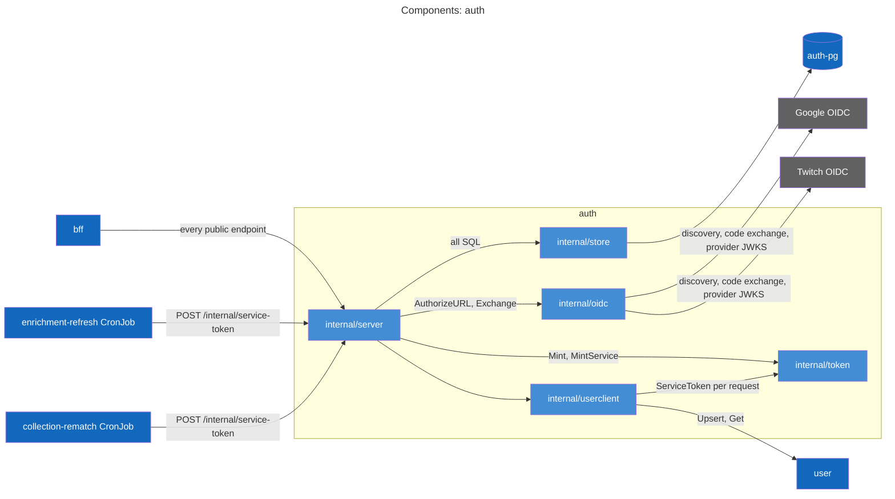
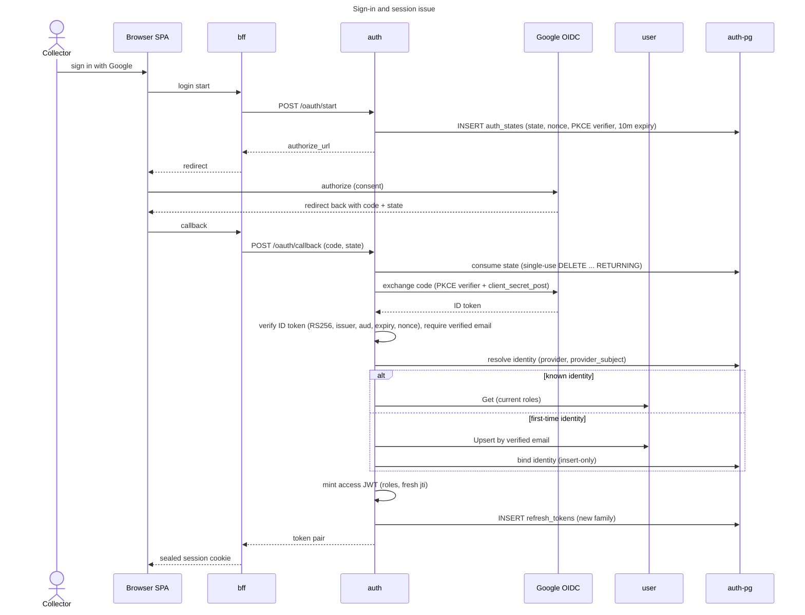
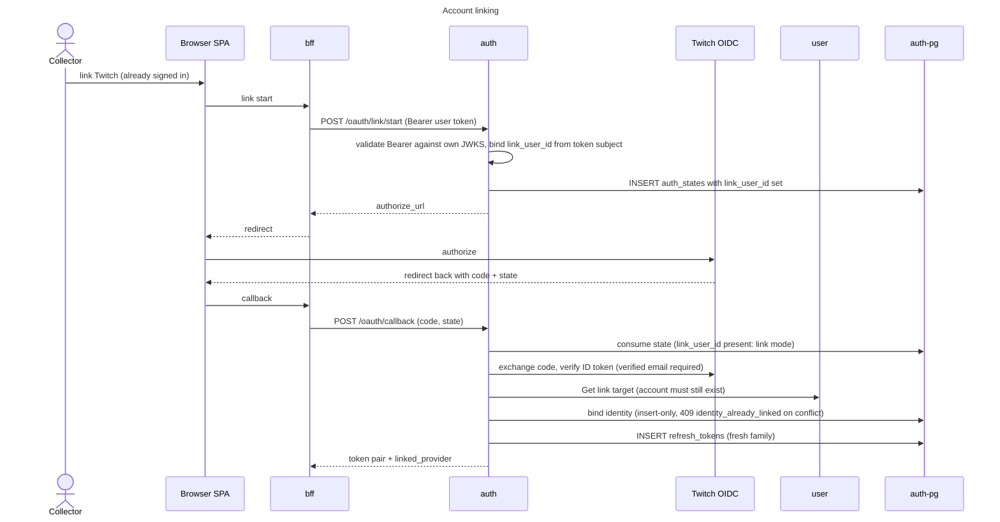
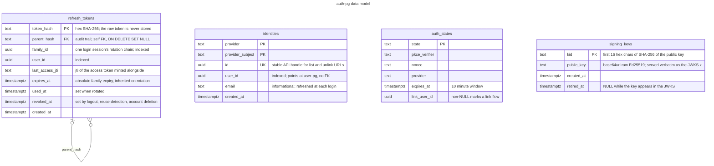

# auth service

## Purpose and boundaries

The auth service is the OIDC relying party and the only token issuer in vgkeep. It owns the
authorization-code + PKCE dance against Google and Twitch (plus a fixture-only dev provider), the binding of provider
identities to accounts, and every token the platform mints. That last part is all of it: Ed25519 access JWTs
(`iss vgkeep-auth`, `aud vgkeep`, 5 minute default TTL, a `roles` claim), opaque rotating refresh tokens (handed out
once, stored only as hex SHA-256), and 900 second `token_use=service` JWTs for machine callers. Nothing else in the
system signs a token; every service trusts this one JWKS.

What it refuses to own is just as deliberate. User profiles and roles belong to the user service: auth mints whatever
roles it reads there at login and re-reads them on every refresh, so a role grant lands at the next rotation without
auth storing it. Browser session cookies and the access-token jti denylist belong to the bff. Authorization decisions
happen downstream: the `requireService` / `requireAdminOrService` guards live in the consuming services via
`libs/go/jwtauth`; auth only puts the claims in the token.

Callers, precisely: the bff drives login, refresh, revoke, linking, identity listing, and the account-deletion leg
through its typed `authapi` client. The user, enrichment, collection, and social services fetch
`GET /.well-known/jwks.json` to validate Bearer tokens; the bff is not among them, since it parses claims unverified
out of its own AES-GCM sealed cookie and never fetches the JWKS. The enrichment-refresh and collection-rematch
CronJobs call `POST /internal/service-token` to exchange the shared internal secret for a service JWT. Outbound, auth
calls the user service (`Upsert` at login, `Get` for roles) and the real Google and Twitch issuers. The APISIX
gateway never publishes it; the NetworkPolicy `auth-from-callers-only` admits exactly those pod selectors on
8080.

## API surface

The contract is [api/auth.yaml](../../api/auth.yaml); the routes group by audience.

Login and session, no bearerAuth by design: these endpoints are where tokens come from, the service is
cluster-internal, and network reachability is the access control. Refresh and revoke authenticate with the refresh
token in the body.

- `POST /oauth/start` and `POST /oauth/callback` begin and complete a provider dance (the same callback also
  completes link flows).
- `POST /token/refresh` rotates a refresh token; `POST /token/revoke` is logout, revoking the token's whole family,
  idempotent.
- `GET /providers` reports which login buttons can succeed right now, real providers first, dev last.
- `POST /oauth/dev/token` mints a dev fixture session; 404 unless the dev provider is enabled.

Self-service, bearerAuth on every operation (they act on "my account", which only a token this same service
issued can name):

- `POST /oauth/link/start` and `POST /oauth/dev/link` attach another login to the caller's account.
- `GET /users/{userId}/identities` lists linked logins; readable by self or by a service token.
- `DELETE /identities/{identityId}` unlinks one login.
- `DELETE /users/{userId}/auth` is the account-deletion purge leg; self only, even for admins.

Shared platform: `GET /.well-known/jwks.json` serves every non-retired Ed25519 key as RFC 8037 OKP entries
(`kty OKP`, `crv Ed25519`, `x` the base64url raw public key).

Internal: `POST /internal/service-token`, gated by `X-Internal-Token` compared in constant time per candidate against
a one-or-two-entry accept set (two during a secret rotation). The body's `service` enum is
`catalog-refresh | entry-rematch`; the minted token carries `sub svc:<service>`, no roles, `token_use=service`, and a
fixed 900 second TTL independent of `ACCESS_TOKEN_TTL`.

Error codes worth knowing by name: `refresh_reused` (reuse detection; its `revoke_jtis` array is the only feed into
the bff denylist), `user_unavailable` (503 on refresh with the token NOT consumed, so the client retries with the
same token instead of tripping reuse detection), `email_unverified` / `link_email_unverified` (403, the
verified-email policy), `identity_already_linked` (409, an identity never silently moves between accounts), and
`last_identity` (409, an account keeps at least one login).

## Components

Some runtime pieces are deliberately not drawn. The self-service Bearer verifier is a `jwtauth` validator pointed at
the pod's own JWKS over loopback (the `JWKS_URL` default), so its call edge would be a self-loop adding noise.
`internal/config` and the generated `internal/gen/api` have no runtime call edges at all; they appear under Internal
layout instead.

## Actor flows

Sign-in owns the decision logic for every login shape. Google is drawn as the representative real provider; Twitch is
identical. The dev leg (`POST /oauth/dev/token`, fixtures `alice`, `bob`, `admin`, and the `e2e-*` pattern) skips the
provider dance and feeds the same completion tail.

Resolution is identity-first: a linked identity stays on its account even when its email now matches a different one,
and the email fallback serves only first-time identities. Rare branches keep that honest. When the bound user is
gone (an interrupted account deletion), the login re-anchors by email and `RebindIdentity` moves the identity to the
survivor. When the first-time insert loses a race to a concurrent link of the same identity, the login resolves again
and proceeds as whoever owns it now. A verified email is non-negotiable (403 `email_unverified` otherwise), because
accepting an unverified one would let an attacker claim someone else's future account. Login completion also forwards
the best `Accept-Language` tag so the user service can seed a locale default for accounts it creates.

Linking runs the same dance in link mode. The link target comes from the verified Bearer token, never the request
body, so a link can only ever attach to the caller's own account:

Unlinking needs no diagram: `DELETE /identities/{identityId}` runs one transaction that locks the user's identities
`FOR UPDATE`, answers 404 `identity_not_found` for an id not on the account, refuses the last login with 409
`last_identity` (the lock is what makes that guard race-proof), and deletes otherwise. `POST /oauth/dev/link` is the
one-hop dev variant of the link dance.

Flows auth participates in but does not drive:

- Session refresh, reuse revocation, and logout are driven by the bff; the flow is drawn in
  [the bff README](../bff/README.md#session-refresh-reuse-revocation-logout) and the auth-side rotation ordering in
  [the auth runbook](../../docs/runbooks/auth.md#architecture).
- Account deletion is orchestrated by the bff across collection, social, auth, and user
  ([bff README](../bff/README.md#account-deletion)); auth's purge leg is `DELETE /users/{userId}/auth`, which erases
  the identities and revokes every refresh family in one transaction, idempotently.
- The catalog refresh and the entry rematch belong to enrichment and collection (the
  [enrichment README](../enrichment/README.md) and the [collection README](../collection/README.md)); auth's leg is
  `POST /internal/service-token`, where both CronJobs exchange the shared internal secret before their first call.

## Data model

The self-edge is the only foreign key in the schema. The `user_id` columns point across the service boundary at
user-pg with no FK on purpose (the rows live in another service's database); the orphaned-identity heal path in the
sign-in flow is what reconciles the two when an account deletion is interrupted.

Design notes the diagram cannot carry:

- A state is consumable exactly once and only before expiry: `ConsumeState` is a `DELETE ... RETURNING`, and an
  unknown, expired, or replayed state all answer the same `invalid_state` (no oracle for which condition failed).
- Both mutable tables self-clean opportunistically, with no background job: every `CreateState` sweeps expired
  `auth_states`, and every `CreateSession` deletes used or revoked `refresh_tokens` more than 30 days past expiry.
  Migration `000004_parent_hash_set_null` exists for that sweep: a swept row can still be a live descendant's
  `parent_hash`, and `ON DELETE SET NULL` truncates the audit link instead of failing the delete.
- Revocation goes by `family_id` in one indexed UPDATE, never by walking the `parent_hash` chain; the chain is
  forensics only. A rotated child inherits its family's absolute `expires_at`, so a session hard-stops
  `REFRESH_TOKEN_TTL` (720h default) after login no matter how often it refreshes.
- Reuse detection rides `used_at` / `revoked_at`: presenting a consumed token revokes the whole family and reports
  the `last_access_jti` of rows young enough to still be alive (created within access TTL + 1 minute).
- Boot registers the replica's signing key idempotently (`ON CONFLICT (kid) DO NOTHING`; the kid derives from the
  key), and the JWKS serves every row whose `retired_at` is NULL.

The schema history, embedded in the binary: `000001_init`, `000002_identity_link`,
`000003_user_id_indexes` (`identities_user_id_idx`, `refresh_tokens_user_id_idx`), `000004_parent_hash_set_null`.

## Internal layout

- `cmd/auth/main.go`: wiring in dependency order: config, otel setup, `pgkit.Connect`, minter,
  `RegisterSigningKey` at boot, user client, `jwtauth` validator, the provider map (an entry only when both
  credential halves are present), then the server. `auth migrate` runs `pgkit.Migrate` over the embedded
  `migrations.FS` and exits; the deployment runs exactly that as its init container.
- `internal/server`: the generated `api.ServerInterface` implementation (`handlers.go`) plus the collaborator
  interfaces it is written against: `Store`, `Minter`, `UserService`, `Verifier` (`server.go`). `routes.go` wires
  specval request validation over the httpkit router, with binding errors rewritten to problem+json; `locale.go`
  holds the `bestLanguageTag` Accept-Language pick.
- `internal/store`: every SQL statement in the service; no other package touches the schema.
- `internal/token`: Ed25519 JWT minting (`Mint`, `MintService`, `ServiceToken`) and opaque refresh-token
  generate/hash (`refresh.go`). `KidFor` is the first 16 hex chars of the public key's SHA-256, which is what makes
  boot registration idempotent across replicas.
- `internal/oidc`: the `Provider` interface and a generic relying party `RP`: lazy discovery with an issuer-mismatch
  defense, PKCE S256, `client_secret_post` code exchange, RS256 ID-token verification with a nonce check, and an
  `rsaKeyCache` that refetches provider keys at most every 30s on an unknown kid. `NewGoogle` and `NewTwitch` differ
  only in scopes and Twitch's `claims` auth param, which is what lands email in its ID token. `DevClaims` maps the
  fixture handles (`alice`, `bob`, `admin`, `e2e-*`) and nothing else. Provider HTTP uses a 10s client timeout.
- `internal/userclient`: the typed `userapi` client; every outbound request mints a fresh service token via
  `minter.ServiceToken()`.
- `internal/config`: the env contract plus cross-field rules (see Configuration).
- Generated versus authored: `internal/gen/api/server.gen.go` comes from oapi-codegen v2.8.0 (`task auth:gen`
  against `api/auth.yaml`; the contract copy it embeds, via `GetSpec`, is what specval validates against). The
  `userapi` client it calls through is generated by the shared `libs/go/contract` module under root `task gen`, not by
  `auth:gen`. Everything else is authored.

## Configuration

Everything is environment variables, declared in `internal/config/config.go`:

| Env var                                     | Default                                       | Meaning                                                                             |
| ------------------------------------------- | --------------------------------------------- | ----------------------------------------------------------------------------------- |
| `HTTP_ADDR`                                 | `:8080`                                       | listen address                                                                      |
| `DATABASE_URL`                              | required                                      | auth-pg connection string                                                           |
| `JWT_SIGNING_KEY`                           | required                                      | base64 (std) 32-byte Ed25519 seed                                                   |
| `JWT_ISSUER`                                | `vgkeep-auth`                                 | `iss` on every minted JWT                                                           |
| `JWT_AUDIENCE`                              | `vgkeep`                                      | `aud` on every minted JWT                                                           |
| `ACCESS_TOKEN_TTL`                          | `5m`                                          | access JWT lifetime                                                                 |
| `REFRESH_TOKEN_TTL`                         | `720h`                                        | absolute session lifetime (family expiry)                                           |
| `USER_SERVICE_URL`                          | required                                      | user service base URL (`Upsert`, `Get`)                                             |
| `INTERNAL_SERVICE_SECRETS`                  | required                                      | CSV accept set for `POST /internal/service-token`; one entry, or two mid-rotation   |
| `JWKS_URL`                                  | `http://localhost:8080/.well-known/jwks.json` | where the self-service Bearer verifier reads keys: the pod's own JWKS               |
| `OAUTH_REDIRECT_URL`                        | empty                                         | public callback URL registered with real providers                                  |
| `GOOGLE_CLIENT_ID` / `GOOGLE_CLIENT_SECRET` | empty                                         | Google credential pair                                                              |
| `GOOGLE_ISSUER_URL`                         | `https://accounts.google.com`                 | Google discovery issuer                                                             |
| `TWITCH_CLIENT_ID` / `TWITCH_CLIENT_SECRET` | empty                                         | Twitch credential pair                                                              |
| `TWITCH_ISSUER_URL`                         | `https://id.twitch.tv/oauth2`                 | Twitch discovery issuer                                                             |
| `DEV_PROVIDER_ENABLED`                      | `false`                                       | fixture-only dev provider gate (chart default `true`; production values set false)  |
| `SERVICE_VERSION`                           | `dev`                                         | stamped on telemetry as `service.version`                                           |

Cross-field rules enforced at `Load`: a login provider is enabled only when BOTH halves of its credential pair are
non-empty; `OAUTH_REDIRECT_URL` becomes required the moment any real provider is enabled; `INTERNAL_SERVICE_SECRETS`
rejects empty CSV entries. No chart env overrides `JWKS_URL`, so the verifier always reads its own pod's keys.

Secrets arrive through two ExternalSecrets. `auth-secrets` carries `jwt-signing-key`, `internal-service-token`,
`internal-service-token-previous` (rendered only when `previousTokenEnabled`), and the
`google-client-id` / `google-client-secret` and `twitch-client-id` / `twitch-client-secret` pairs (each only when
`providers.<name>.enabled`). `auth-pg-credentials` carries `password`, from which the deployment assembles
`DATABASE_URL` with `sslmode=verify-full` against the mounted `auth-pg-tls` CA. `INTERNAL_SERVICE_SECRETS` composes
as `$(INTERNAL_SERVICE_TOKEN)` alone, or the A/B CSV pair when `previousTokenEnabled`. The pod re-rolls on a secret
shape change via the `checksum/externalsecret` annotation, and `OTEL_EXPORTER_OTLP_ENDPOINT` (read by the shared
telemetry setup, not `internal/config`) is set from `otel.exporterEndpoint` only when non-empty. Rotation procedures
for the signing key and the internal secret live in [the runbook's Admin
levers](../../docs/runbooks/auth.md#admin-levers).

## Development

Service tasks: `task auth:gen` regenerates the server stubs from `api/auth.yaml`, and `task auth:db:migrate` runs
`go run ./cmd/auth migrate` against `DATABASE_URL`; both also run under root `task gen` and `task migrate`.
`task grant-fixture-admin` (root Taskfile) logs the `admin` fixture in through the gateway so its user row exists,
then inserts the role on user-pg; the new role lands in the JWT at that fixture's next login or refresh. Shared
targets (`task lint`, `task test:cover`, `task run`) are in the root [README](../../README.md).

In the Tilt stack the `auth` resource (label `services`) rebuilds `vgkeep/auth` whenever `libs/go` or
`services/auth` changes and depends on `secret-store`, `auth-pg`, and `user`. Direct ports: auth on
`localhost:8082` (container 8080), auth-pg on `localhost:5434`. A real provider turns on only when both halves of
its credential pair exist in `.env`, which also sets `env.oauthRedirectUrl` (default
`http://localhost:8090/api/auth/callback`); a staged `AUTH_INTERNAL_SERVICE_TOKEN_PREVIOUS` flips
`previousTokenEnabled` so a rotation in flight accepts both secrets.

Bruno flows in `bruno/auth/` target `http://localhost:8082` directly with a folder-level Bearer of
`{{access_token}}`: `dev-token`, `refresh`, `reuse-detect` (deliberately trips reuse detection), `jwks`,
`identities`, `dev-link`, `unlink-identity`, `revoke`, `delete-user-auth`, and `service-token`.

Probes sit outside the contract: `GET /healthz` answers 200 while the process lives, and `GET /readyz` pings
Postgres via `pgkit.Health`, answering 503 `not_ready` until it succeeds.

## See also

- Contract: [api/auth.yaml](../../api/auth.yaml)
- Runbook (operations, alerts, failure modes, rotation levers): [docs/runbooks/auth.md](../../docs/runbooks/auth.md)
- Architecture (system context, containers, cross-service flows): [docs/architecture.md](../../docs/architecture.md)
- Chart: [deploy/charts/auth/](../../deploy/charts/auth/)
- Dashboard source: [deploy/observability/dashboards/auth.yaml](../../deploy/observability/dashboards/auth.yaml);
  alert rules: [deploy/observability/alerts/auth.yaml](../../deploy/observability/alerts/auth.yaml)
