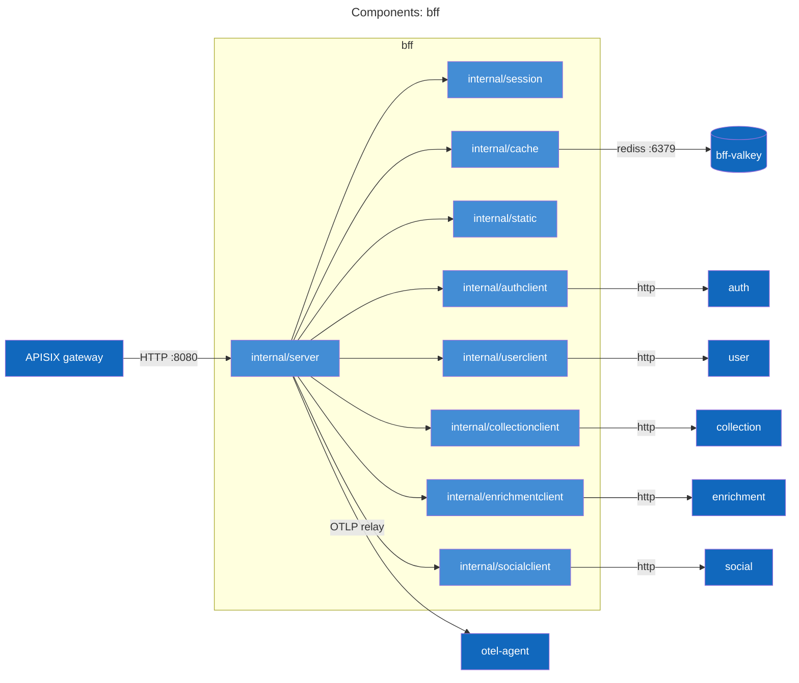
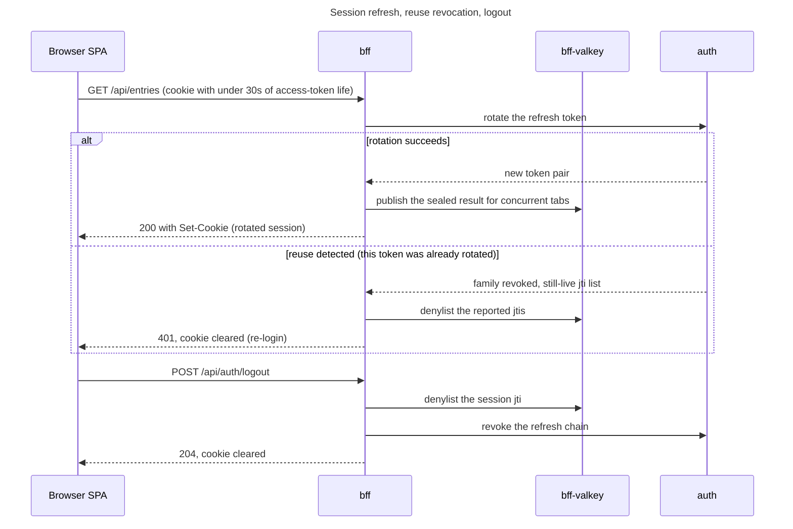
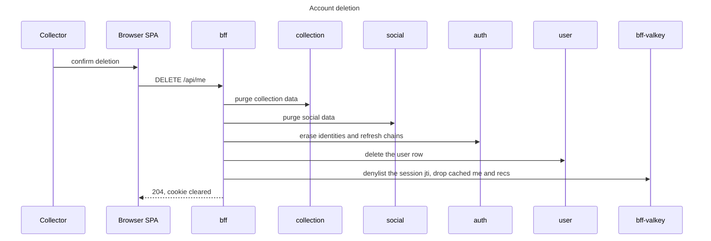
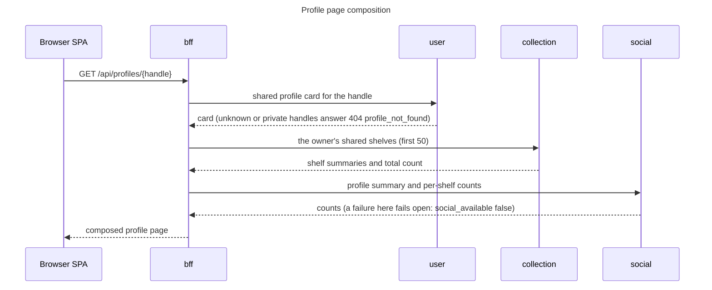
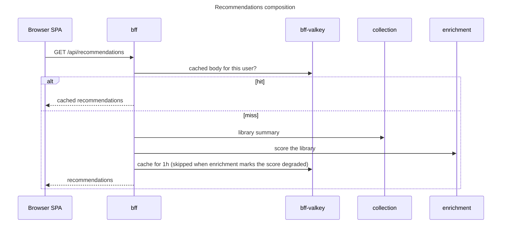
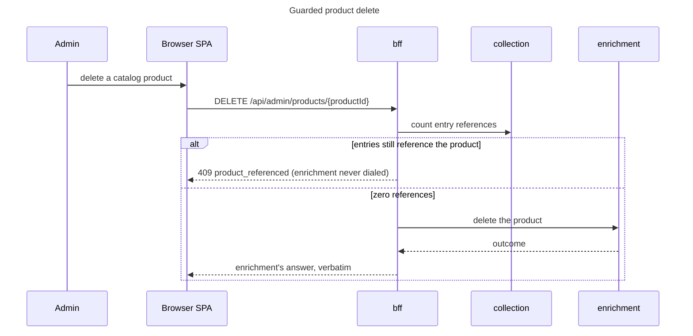

# bff service

The bff (backend for frontend) is the browser's single door into vgkeep. The APISIX gateway publishes it and
nothing else; the `bff-from-gateway-only` NetworkPolicy admits port 8080 only from apisix pods in the `vg-platform`
namespace, so its one caller is the gateway (the SPA and the Bruno journeys both arrive through port 8090).
Everything it dials stays in-cluster: auth, user, collection, enrichment, social, `bff-valkey`, and otel-agent.

## Purpose and boundaries

What it owns:

- The browser session end to end: the sealed `__Host-vg_session` cookie, transparent token refresh, the jti
  denylist, CSRF origin checks on mutating methods, and the security-header set on every response.
- SPA delivery: with `SERVE_STATIC` on (the in-cluster default) the Vite bundle ships embedded in the binary.
- Cross-service composition: `GET /api/me`, `/api/recommendations`, the shared profile and shelf pages, feed and
  Explore hydration, and the account-deletion purge ordering.

What it refuses to own:

- Role logic. Every `/api/admin/*` route relays with the user's own token; the executing service enforces admin.
- Validation past contract shape. Bodies and parameters are checked against `api/bff.yaml` before any dial (a
  violation answers 400 `invalid_param` or `invalid_body`); semantic refusals are the downstream service's
  problem body, relayed verbatim.
- Caching of pass-throughs. One staleness authority per type: the bff caches only what it composes itself,
  `/api/me` (45s) and `/api/recommendations` (1h).

There is no database, no migration step, and no init container. The only datastore is `bff-valkey`,
non-persistent by design: losing it entirely degrades revocation speed and composition latency but never breaks
the request path. The one hard dependency is the initial Valkey dial at startup; every later failure is handled
per request, which is why `/readyz` answers 200 unconditionally.

## API surface

[api/bff.yaml](../../api/bff.yaml) is the authority for every `/api` operation, errors as
`application/problem+json` with stable codes. The contract carries no tags; grouped by audience:

- Unauthenticated edge: `/api/auth/providers`, `/api/auth/login`, `/api/auth/callback`, `/api/auth/logout`, the
  exact allowlist the session middleware exempts. Login and callback are browser navigations (they redirect),
  never XHR targets. `/api/auth/link` redirects the same way but requires a session.
- Session-gated relays, by the service that answers:
  - auth: `GET /api/me/identities`, `DELETE /api/me/identities/{identityId}`.
  - collection: `/api/entries*` (including `bulk-update`, `reorder`, `region-mismatch-ack`, and the `submission`
    family), `/api/tags*`, `/api/views*`, `/api/dashboard*`.
  - enrichment: `/api/search`, `/api/products/resolve`, `/api/products/{productId}`, `/api/platforms`, `/api/fx`.
  - user: `PATCH /api/me`, `/api/search/users`, `GET /api/shared/profiles/by-ids`.
  - social: `/api/social/follows/{userId}`, `/api/social/likes/{shelfId}`, `DELETE /api/comments/{commentId}`.
- Composed reads (bff logic, not relays): `GET /api/me`, `/api/recommendations`, `/api/profiles/{handle}`,
  `/api/profiles/{handle}/shelves/{slug}`, `/api/shelves/{shelfId}` with its `/entries` and `/comments`
  sub-routes, `/api/feed`, `/api/explore`. Feed and Explore hydration reads collection and the user service as
  hard dependencies, so a 502 on those routes is not necessarily social (see Actor flows).
- `DELETE /api/me`: the orchestrated account deletion, drawn under Actor flows.
- Admin relays (`/api/admin/*`): product worklists (`unmatched`, `community`, `promote-candidates`), mint,
  promote, dismiss, the `pricecharting` mapping, the guarded delete, `refresh`, `rematch`, `resnapshot`, the
  three normalize sweeps, and `submissions` plus `verdict`. The bff requires only a session here.
- Telemetry relay: `POST /api/otlp/v1/traces` and `POST /api/otlp/v1/metrics`, session-gated, 1 MiB cap.

`GET /healthz` and `GET /readyz` sit outside the contract and answer 200 unconditionally. They are pod-only: the
gateway 404s both paths (the `internal-probes` ApisixRoute rule), so probing the deployed service means kubectl.

Problem codes minted by the bff itself: `invalid_param`, `invalid_body`, `unauthenticated`, `origin_forbidden`,
`upstream_error`, `product_referenced`, `shelf_not_found`, `profile_not_found`, `identity_not_found`,
`last_identity`, `user_unavailable`, `internal`, `not_found`. Every other code arrives verbatim from downstream.

## Components

`internal/server` holds the middleware chain and every handler; `internal/session` is pure (cookie codec, claim
parse, refresh-key hash); `internal/cache` is the whole Valkey surface; `internal/static` serves the embedded
bundle. The clients wrap the generated typed clients and either relay upstream answers verbatim or return
the typed reads composition needs. `internal/config` and the generated `internal/gen/api` are described under
Internal layout.

## Actor flows

The runbook draws the wire-level refresh coordination (lock and result keys, poll pacing); this section stays at
actor and endpoint altitude and links it:
[session refresh hot path](../../docs/runbooks/bff.md#session-refresh-hot-path).

### Session refresh, reuse revocation, logout

Refresh is transparent: the session middleware rotates the token pair inside whatever request arrives with less
than `REFRESH_WINDOW` (30s) left on the access token. Exactly one rotation may happen per session; concurrent
tabs adopt the published result instead of rotating again, because a second rotation of the same refresh token
is what reuse detection punishes.

Not drawn: when auth is unreachable and the current token still has life, the request is served on it and the
refresh is deferred; a request whose token is already expired and cannot rotate or adopt in time answers 401,
502, or 503 depending on the failing leg. Denylist entries live at most the access-token TTL plus one minute of leeway.
Logout is idempotent and best-effort: the cookie is cleared even when the denylist write or the revocation call
fails.

### Account deletion

The order is the design: data legs first, then auth, then the user row that login resolution anchors on. A leg
that fails stops the sequence with 502 `upstream_error` naming it (for example `collection purge failed; retry`),
and because auth and user still hold the account, the owner can log back in and retry.

### Shared shelf and profile page composition

The shelf page composes the same way from either address, `/api/shelves/{shelfId}` or
`/api/profiles/{handle}/shelves/{slug}`: resolve the shelf and its owner, apply the two-sided visibility rule,
attach social counts fail-open. Unknown shelf, private shelf, and private owner all converge on one 404
`shelf_not_found`, so a probe cannot learn whether a handle exists. Comment listing
(`GET /api/shelves/{shelfId}/comments`) relays social's page, then hydrates author cards with one batched
user-service read over the deduplicated author ids; a failed card batch degrades to comments without authors.

### Recommendations composition

A degraded score is never cached: caching it would pin a bad answer for the full TTL. The five entry mutations
(create, update, delete, reorder, bulk-update) and account deletion invalidate the cached body.

### Guarded product delete

The one admin lever whose decision logic lives in the bff; every other `/api/admin/*` route is a plain relay.

The reference count is the first call on purpose: a non-200 from collection (its admin check included) relays
before enrichment is dialed, so the 409 detail's entry count never leaks to a caller collection would refuse.

### Browser telemetry relay

The SPA's OTLP export rides the same origin: `POST /api/otlp/v1/traces` and `POST /api/otlp/v1/metrics` are
session-gated, capped at 1 MiB, and relayed verbatim (status and body in both directions) to the otel-agent at
`OTLP_PROXY_URL`. With that URL empty the bff answers 200 and drops the payload, so telemetry can never break
the app. The pipeline behind the agent is described in [docs/runbooks/stack.md](../../docs/runbooks/stack.md).

### Flows owned elsewhere

- Sign-in and session issue (OIDC and the dev fixture): the auth service
  ([services/auth/README.md](../auth/README.md)). The bff's leg is the `Login`/`Callback`/`LinkLogin`
  navigations, the `__Host-vg_oauth_state` cookie (10m, deliberately not longer than auth's server-side state
  TTL) binding the callback to the browser that started the flow, and the outcome redirects
  (`/login?error=...`, `/account?link_error=...`).
- Entry add and product resolve: collection end to end
  ([services/collection/README.md](../collection/README.md#entry-add-and-product-resolve)), resolve internals in
  enrichment ([services/enrichment/README.md](../enrichment/README.md#product-resolve-and-auto-match)).
- Pricing reads (entry values, dashboard, value history):
  [collection](../collection/README.md#pricing-reads).
- Catalog search and product reads: [enrichment](../enrichment/README.md#catalog-search).
- Catalog submissions and community promotion:
  [collection](../collection/README.md#catalog-submission-and-verdict) (queue and verdict),
  [enrichment](../enrichment/README.md#community-product-mint-and-promote) (mint and promote).
- Social writes (follow, like, comment) and the feed and Explore read paths: the social service
  ([services/social/README.md](../social/README.md)). The bff hydrates each page itself: shelf summaries
  and profile cards batch-read from collection and the user service, comment bodies from social, delisted or
  vanished objects dropped, short pages refilled up to 3 rounds. On `/api/feed` and `/api/explore` a failed
  hydration leg answers 502 with the failing service named in the problem detail.
  Saving a saved view whose stored visibility lands `listed` also fires social's publish event from the bff,
  fail-open: a lost event costs a feed entry, never the write.

## Data model

No Postgres, no migrations, no entity diagram. The service's state is a cookie, a keyspace, and an embedded
filesystem.

The session lives in the browser: `__Host-vg_session` carries the access and refresh token pair sealed with
AES-256-GCM under `COOKIE_KEY` (AAD `vg_session/v1`), Max-Age set to the refresh token's remaining life so cookie
and session expire together. Because the cookie is the session store, scale-out needs no affinity.

The `bff-valkey` keyspace, written only by the bff:

| Key pattern                        | Holds                                    | TTL                    | Written by                                 |
| ---------------------------------- | ---------------------------------------- | ---------------------- | ------------------------------------------ |
| `denylist:<jti>`                   | revoked access-token ids                 | token life + 1 minute  | logout, reuse revocation, account deletion |
| `refresh:lock:<sha256(refresh)>`   | rotation singleflight lock               | 10s                    | the refresh path                           |
| `refresh:result:<sha256(refresh)>` | published rotation result, sealed cookie | 60s                    | the winning rotation                       |
| `me:v4:`                      | composed `/api/me` body                  | `ME_CACHE_TTL` (45s)   | `GET /api/me`                              |
| `recs:v1:`                    | composed recommendations body            | `RECS_CACHE_TTL` (1h)  | `GET /api/recommendations`                 |

Three invariants hold across the table: every key carries a TTL, keys derived from the refresh token are hashed
so the raw token never appears as a key, and no token material rests in Valkey in the clear (the published
rotation result is the same AES-GCM ciphertext the browser holds; the me and recs bodies are cached response
JSON and carry no tokens).

`me:v4` and `recs:v1` version the projection shape: a shape change bumps the version, so a deploy never serves a
stale shape to a warm cache. `PATCH /api/me` and account deletion drop the `me:` entry; the entry mutations
and account deletion drop `recs:`.

The embedded bundle is read-only state: `//go:embed all:dist`, `assets/` served
`public, max-age=31536000, immutable` (Vite content-hashes those names), `index.html` served `no-cache` so a
deploy takes effect on the next navigation, extensionless unknown paths fall back to the app shell, and
directory paths 404.

## Internal layout

- `cmd/bff`: wiring plus compile-time proofs that each client satisfies the server's dependency interfaces.
- `internal/server`: middleware and all handlers, split by surface as
  `handlers_{session,me,catalog,collection,products,admin,submissions,social,telemetry}.go`.
- `internal/session`: the cookie codec (AES-256-GCM seal and open), both `__Host-` cookies, claim parsing, and
  the sha256 refresh-key derivation. No outbound calls.
- `internal/cache`: the whole Valkey surface: denylist, refresh lock and result, me and recs bodies.
- `internal/static`: the embedded SPA bundle and its cache-header policy.
- `internal/config`: the env contract (next section).
- `internal/authclient`, `userclient`, `collectionclient`, `enrichmentclient`, `socialclient`: authored wrappers
  over the generated typed clients in `libs/go/contract/`. Relay methods return upstream status, content type,
  and body untouched; typed reads (library summary, shared shelves, profile cards, feed events, scores) feed
  composition. `authclient` also translates auth's problem responses into the error taxonomy the session
  handlers branch on.
- `internal/gen/api`: generated server stubs, never edited by hand.

`internal/gen/api/server.gen.go` comes from `task bff:gen` (oapi-codegen, config `api/oapi.server.yaml`, source
`api/bff.yaml`); the `libs/go/contract` clients regenerate for every service inside root `task gen`. The
committed `internal/static/dist/` is a placeholder: the Dockerfile builds the frontend and overwrites it with
real Vite output before compiling the binary.

Middleware in request order: `httpkit.Recover`, otelhttp with `httpkit.RouteLabel`, `httpkit.RequestLogger`,
`SecurityHeaders`, `CheckOrigin`, `Authenticate`, then the mux. Contract validation (the shared `specval`
middleware) wraps only the `/api/` routes with a 1 MiB read cap; the SPA catch-all and the probes never pass
through it, and by the time it runs, `Authenticate` has already answered any 401.

Access-token claims are parsed without signature verification, on purpose: the cookie is AES-GCM sealed with the
bff's own key, so anything that opens is something this service sealed, and signature verification belongs to
the downstream services' jwtauth middleware. The AAD label `vg_session/v1` domain-separates the seal; changing
it invalidates every live cookie.

## Configuration

From `internal/config/config.go`; defaults are the code's own:

| Var | Default | What |
| --- | --- | --- |
| `HTTP_ADDR` | `:8080` | listen address |
| `COOKIE_KEY` | (required) | base64 (std) 32-byte AES-256 key sealing the session cookie |
| `COOKIE_SECURE` | `true` | Secure flag on both cookies; also gates the HSTS response header |
| `PUBLIC_ORIGINS` | (required) | comma-separated origins allowed to send mutating requests |
| `AUTH_SERVICE_URL`, `USER_SERVICE_URL`, `ENRICHMENT_SERVICE_URL`, `COLLECTION_SERVICE_URL`, `SOCIAL_SERVICE_URL` | (required) | the upstream base URLs |
| `VALKEY_URL` | (required) | `bff-valkey` address; a `rediss://` URL demands `VALKEY_CA_FILE` |
| `VALKEY_CA_FILE` | unset | CA bundle for `rediss://`; the chart mounts `/etc/vg/valkey-ca/ca.crt` |
| `ACCESS_TOKEN_TTL` | `5m` | must match the auth chart's `accessTokenTtl`; bounds denylist entry TTLs |
| `REFRESH_WINDOW` | `30s` | refresh starts when less than this remains on the access token |
| `ME_CACHE_TTL` | `45s` | `/api/me` composition cache |
| `RECS_CACHE_TTL` | `1h` | recommendations composition cache |
| `OTLP_PROXY_URL` | unset | OTLP/HTTP base for the browser telemetry relay; empty accepts and drops |
| `SERVE_STATIC` | `false` | serve the embedded SPA bundle; the chart sets `true` in-cluster |
| `SERVICE_VERSION` | `dev` | stamped on telemetry as `service.version` |

`OTEL_EXPORTER_OTLP_ENDPOINT` is read by the shared OTel setup rather than `internal/config` (it is the standard
SDK variable); the chart feeds it from `otel.exporterEndpoint`, and empty means JSON stdout logs only.

`COOKIE_KEY` arrives through the `bff-secrets` ExternalSecret (secret key `cookie-key`, store key
`bff/cookie-key`; the dev store `vg-fake` is filled from `BFF_COOKIE_KEY` in `.env`). Rotating it invalidates
every live session; the rotation lever lives in the runbook.

Chart values worth knowing by name: `replicas: 1`, the per-client-IP gateway budgets `rateLimit.authPerMinute:
240` and `rateLimit.apiPerMinute: 1800`, and `valkey.enabled` as the seam for swapping in a managed cache. The
rest is [deploy/charts/bff/values.yaml](../../deploy/charts/bff/values.yaml).

## Development

`task bff:gen` regenerates the server stubs; the rest of the workflow runs at the root (`task run` / `task down`,
`task check`, `task e2e`, `task grant-fixture-admin`; the [root README](../../README.md) lists the full set).

The app's entrypoint is the gateway on 8090. Port 8083 reaches the bff directly (a Tilt port-forward onto
container port 8080, bypassing the gateway and its rate limits), and the Vite dev server runs on 5173. Under
Tilt the `bff` resource starts after `secret-store`, `bff-valkey`, `auth`, and `collection`, and rebuilds on
edits to `libs/go`, `services/bff`, or `frontend`, because the image bakes the Vite output into the binary.

With `SERVE_STATIC=false` the Vite dev server owns the frontend and `/` answers 404 `not_found`.

Bruno journeys live in `bruno/bff/` (user flows) and `bruno/bff/admin/` (admin flows), both pointed at the
gateway origin (`bff_url: http://localhost:8090` in `bruno/environments/local.bru`).

## See also

- [api/bff.yaml](../../api/bff.yaml): the contract.
- [docs/runbooks/bff.md](../../docs/runbooks/bff.md): operations: dashboard, alerts, failure modes, levers.
- [deploy/observability/dashboards/bff.yaml](../../deploy/observability/dashboards/bff.yaml) and
  [deploy/observability/alerts/bff.yaml](../../deploy/observability/alerts/bff.yaml): dashboard and alert sources.
- [deploy/charts/bff/](../../deploy/charts/bff/): the chart (deployment, ApisixRoute, NetworkPolicies, bff-valkey).
- [docs/architecture.md](../../docs/architecture.md): the system view and the project-level flows.
- [docs/production-paths.md](../../docs/production-paths.md#spa-delivery): the CDN equivalent of the embedded
  SPA serving.
