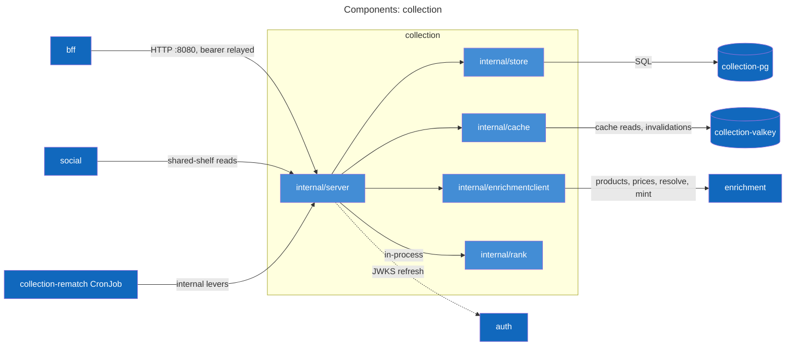
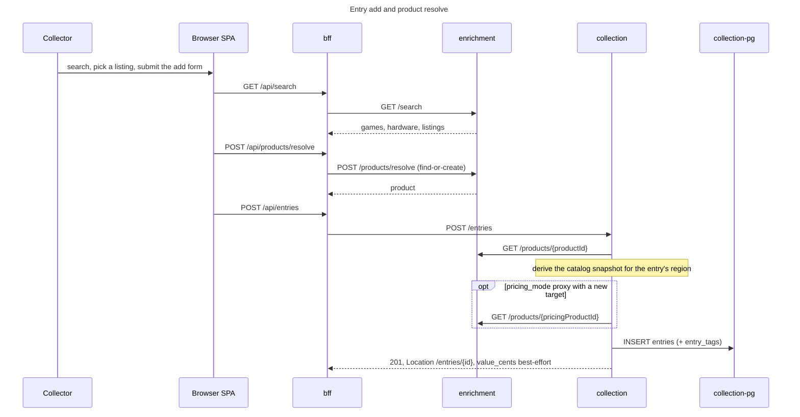
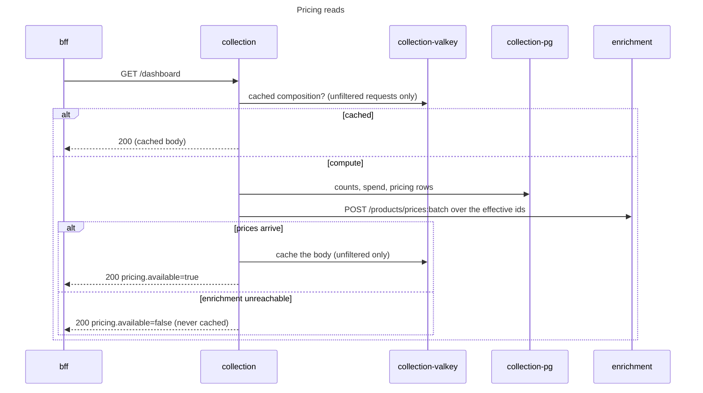
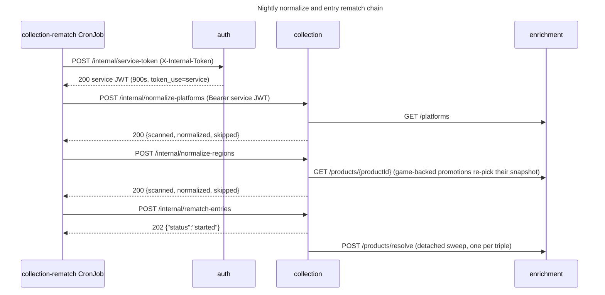
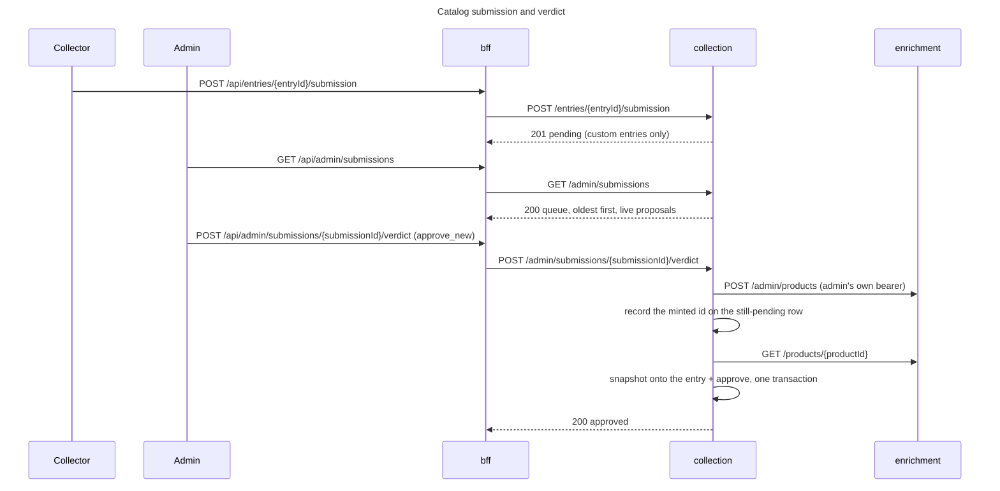
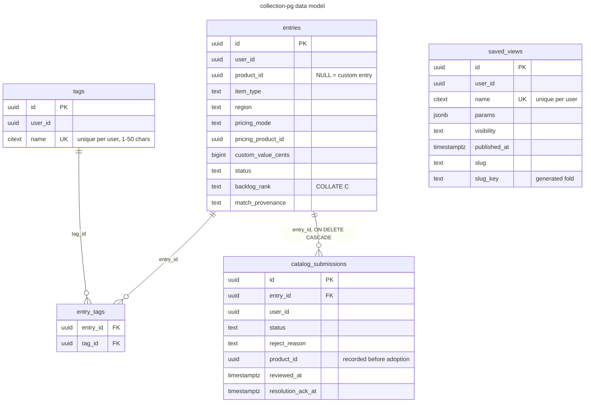

# collection service

## Purpose and boundaries

The collection service owns everything a signed-in collector tracks: entries (one row per physical copy,
product-backed or custom), per-user tags and saved views, fractional-index backlog ordering, the catalog-submission
review queue, and the shared-shelf surface other services read across users. An entry's catalog facts (item type,
display name, platform, release date, localization, credits, cover) are copied from the enrichment product once, at
creation; its value is recomputed from live enrichment prices on every read, and no price is ever stored in
collection-pg.

It refuses to own catalog data and prices (enrichment's domain), role grants (the user service writes `user_roles`;
this service only reads the role claim in the JWT), and the social graph (the social service validates its targets
against the shared-shelf reads here).

Callers are the bff, the social service, and the collection-rematch CronJob; the APISIX gateway never publishes
collection. Outbound it calls one service, enrichment, plus a background JWKS fetch against auth (`JWKS_URL`).

Every route requires a Bearer access JWT (issuer `vgkeep-auth`, audience `vgkeep`) except `GET /healthz` and
`GET /readyz`. User routes scope to the token subject. The `/admin/*` routes require role admin. The
`/internal/*` levers admit an admin user or a service token (`token_use=service`). Hops to enrichment carry the
caller's own bearer; no service credential exists on that path.

## API surface

[api/collection.yaml](../../api/collection.yaml) is the authority for schemas and status codes; the inventory below
groups the operations by audience.

User routes, scoped to the token subject:

| Route                                    | Methods                | What it does                                                    |
| ---------------------------------------- | ---------------------- | --------------------------------------------------------------- |
| `/entries`                               | GET, POST              | one page of the filter x sort x group matrix; create an entry   |
| `/entries/bulk-update`                   | POST                   | transactional tag/status/location changes across a batch        |
| `/entries/{entryId}`                     | GET, PUT, DELETE       | read with composed value; full-replace update; delete           |
| `/entries/{entryId}/reorder`             | POST                   | move a backlog entry between two neighbors (single-row write)   |
| `/entries/{entryId}/region-mismatch-ack` | POST                   | dismiss the region-mismatch banner for the current choice       |
| `/entries/{entryId}/submission`          | POST, GET, DELETE      | file, read, or cancel the entry's catalog submission            |
| `/entries/{entryId}/submission/ack`      | POST                   | dismiss an approved submission's banner                         |
| `/tags`, `/tags/{tagId}`                 | GET, POST, PUT, DELETE | tag CRUD; names citext-unique per user, at most 200 tags        |
| `/views`, `/views/{viewId}`              | GET, POST, PUT, DELETE | saved-view CRUD over an opaque frontend params document         |
| `/dashboard`                             | GET                    | SQL aggregates plus one batched enrichment price call           |
| `/dashboard/value-history`               | GET                    | 90-day value series at historical snapshot prices               |
| `/library/summary`                       | GET                    | deduplicated game list shaped for recommendation scoring        |
| `/user-data`                             | DELETE                 | the collection leg of account deletion (idempotent)             |

Shared shelf routes serve any authenticated caller and never scope to the caller's subject; the shelf owner is the
execution subject. Only non-private shelves resolve, and unknown and private are indistinguishable (404
`shelf_not_found`). `SharedEntry` is a strict whitelist that strips money and personal fields, and a stored sort of
`value` degrades to the stable base order because value composition never runs on this surface:

- `GET /shared/shelves` - listed shelves, newest publish first; `owner_ids` scopes the page (at most 5000 ids)
- `GET /shared/shelves/by-slug` - resolve (owner, slug), folding case and underscores
- `GET /shared/shelves/by-ids` - batch summaries for hydration (at most 100 ids)
- `GET /shared/shelves/{shelfId}` - shelf meta by id
- `GET /shared/shelves/{shelfId}/entries` - execute the stored params, caller controls pagination only

The admin routes (role admin): `GET /admin/products/{productId}/references` (the entry count
enrichment's guarded product delete checks first), `GET /admin/submissions` (the pending queue, oldest first, each
row joined with the live proposal from the entry), and `POST /admin/submissions/{submissionId}/verdict`
(reject / approve_existing / approve_new).

Internal routes (admin user or service token; the gateway never routes them): `POST /internal/resnapshot`,
`POST /internal/normalize-platforms`, `POST /internal/normalize-regions`, and `POST /internal/rematch-entries`. The
others answer synchronous sweep counts; rematch-entries answers 202 `{"status":"started"}` and detaches
(409 `rematch_in_progress` while a run is in flight).

Errors are `application/problem+json` with stable machine codes; characteristic ones are `tag_cap_exceeded`,
`conflicting_order`, `not_in_backlog`, `submission_pending`, `cap_exceeded`, and `enrichment_unavailable`. Request
bodies cap at 64KB. Contract validation runs after JWT auth and wraps only the generated API handler, so a 401 outranks
a 400 and a 404/405 outside the contract passes through untouched.

The list matrix, condensed: filters AND across dimensions and OR within one, except `tag_id`, which requires ALL
listed tags. Sorts are `name`, `release_date`, `purchased_at`, `created_at` (default, desc), `value`, `paid`,
`rating`, and `backlog_rank`; pinned entries sort first except under `sort=backlog_rank` (the drag-order read), and
nullable dimensions place nulls last in both directions. `group_by` (`platform`, `status`, `item_type`, `location`,
`tag`) partitions the requested page; `limit` defaults to 200 with a max of 500.

## Components

- `internal/server` maps HTTP onto the collaborators: per-user scoping via the JWT subject, the cross-field
  validation the contract schema cannot express, catalog snapshot derivation, the domain metrics, and the entry
  rematch's single-flight guard (an `atomic.Bool` behind the 409).
- `internal/store` owns every SQL statement, each method scoped to a user id. Handlers branch on its sentinels:
  `ErrNotFound`, `ErrTagNotFound`, `ErrNameTaken`, `ErrNotInBacklog`, `ErrConflictingOrder`, `ErrSubmissionPending`,
  `ErrSubmissionResolved`, `ErrTagCapExceeded`, `ErrUserTagCapExceeded`. It also folds and suffixes shelf slugs,
  enforces the 200-tag cap count-then-insert, and seeds the starter views for a zero-view user.
- `internal/cache` is the Valkey surface: the per-user dashboard keys and nothing else, errors returned verbatim
  (fail-open decisions belong to callers), misses as nil.
- `internal/enrichmentclient` wraps the generated enrichment client, relays the caller's bearer, dedupes and chunks
  batch calls at 500 ids (the prices:batch contract limit), and maps failures to `ErrUnknownProduct` or
  `ErrUnavailable`.
- `internal/rank` generates fractional-index keys over `a`..`z` that never end in `a`, so a strictly-between key
  always exists and a reorder is one single-row write; byte order matches the column's `COLLATE "C"`.

## Actor flows

The flows decided in this service are drawn here. Flows it merely participates in are listed at the end with
their owners.

### Entry add and product resolve

SPA traffic rides the gateway (:8090), collapsed here; the bff relays the caller's bearer downstream.
Resolve and auto-match internals belong to the
[enrichment service](../enrichment/README.md#product-resolve-and-auto-match).

The snapshot derivation picks the release date through the entry region's chain (`regionChains`), the localized
name/transliteration/cover through `regionkit.LocalizationChains`, credits from IGDB company roles with community
curated lists as gap-fill, and the cover through provider cover, then platform logo, then community cover. A bad
`product_id` answers 404 `unknown_product`; a bad proxy target 404 `unknown_pricing_product`; enrichment down 502
`enrichment_unavailable` (product-backed creation's one hard dependency).

Without a `product_id` the entry is custom: the client supplies `display_name` and `item_type`, optionally a
free-text `platform_name` (with or without `platform_igdb_id`), a release date, cover, and credits. `pricing_mode`
defaults to `disabled` and `auto` is invalid (there is no own product); `proxy` points value composition at a
validated catalog product, and `custom` stores the value itself (`custom_value_cents` required). A custom game with
a proxy target adopts the target's `igdb_game_id`, so a reproduction of X counts as playing X.

### Pricing reads

The effective id per pricing mode: `auto` prices the entry's own product, `proxy` the override, `custom` contributes
its stored `custom_value_cents` with no enrichment hop, and `disabled` is excluded. Sibling reads share the
composition: `GET /entries?sort=value` materializes the whole filtered set, composes prices, sorts, then
slices the page (every other sort pages in SQL and prices only the page), and `GET /dashboard/value-history` calls
`POST /products/price-history:batch` over 90 days, valuing the CURRENT collection at each day's latest snapshot;
custom rows contribute from `custom_value_set_at` forward. Cache keys, TTL mechanics, and the triage view of this
path are drawn wire-level in the [runbook](../../docs/runbooks/collection.md#architecture).

### Nightly normalize and entry rematch chain

The CronJob runs at `0 7 * * *`, an hour after enrichment's 06:00 catalog refresh, with `concurrencyPolicy: Forbid`
on top of the service's own 409 guard; its token exchange and lever curls are `&&`-joined behind
`set -e -o pipefail`, so a failed step stops the chain. The order is deliberate: platforms first, then regions (a
promotion re-picks display fields), then the rematch, so a just-promoted region's pricing class corrects the same
night. The detached rematch groups entries
by (igdb_game_id, platform_igdb_id, region), resolves once per triple, repoints each entry still on an unmatched or
region-incompatible member, and runs under a 30-minute budget; counts land in the completion log and the
`vg.collection.rematch.*` metrics, not the trigger's response. The whole nightly chain, both services' halves, is
drawn in [docs/architecture.md](../../docs/architecture.md).

### Catalog submission and verdict

Filing takes custom entries only (400 `entry_not_custom`), one pending per entry (409 `submission_pending`), and
abuse caps per user: at most 10 pending and at most 20 created in any rolling 24 hours (429; cancelled rows
persist and still count, so cancel/recreate does not reset the window). The queue holds a live reference: entry
edits flow into what the admin reviews until the verdict. `reject` requires a reason the submitter sees;
`approve_existing` adopts a validated existing product. `approve_new` is the two-phase mint drawn above: because
the minted id is recorded before adoption, a retry after a mid-way failure reuses it and never mints twice, and a
502 `enrichment_unavailable` leaves the row pending and retryable. Race arms: 409 `submission_resolved` when
another admin got there first, 404 `entry_not_found` when the entry vanished (deleting an entry cascades away its
submissions). The collector's epilogue is `GET /entries/{entryId}/submission` and
`POST /entries/{entryId}/submission/ack`. Mint and promote internals belong to the
[enrichment service](../enrichment/README.md#community-product-mint-and-promote).

### Admin levers

All are guarded admin-or-service, idempotent, and re-runnable; the bff Admin page relays each one.

| Lever               | Endpoint                            | bff relay                          | Recomputes                                                          |
| ------------------- | ----------------------------------- | ---------------------------------- | ------------------------------------------------------------------- |
| Resnapshot          | `POST /internal/resnapshot`         | `POST /api/admin/resnapshot`       | region-picked dates, localized trio, credits for game-backed entries |
| Entry rematch       | `POST /internal/rematch-entries`    | `POST /api/admin/rematch`          | repoints auto-provenance entries onto region-correct members (202)  |
| Normalize platforms | `POST /internal/normalize-platforms`| `POST /api/admin/normalize-platforms` | stamps canonical platform identity onto free-text names (exact-or-alias) |
| Normalize regions   | `POST /internal/normalize-regions`  | `POST /api/admin/normalize-regions`| promotes free-text regions; game-backed rows re-pick their snapshot |

Curl recipes, dev token minting, and the deploy-then-refresh-then-resnapshot ordering after a catalog change live in
the [runbook's Admin levers](../../docs/runbooks/collection.md#admin-levers).

### Flows owned elsewhere

- Account deletion: the [bff orchestrates the purge](../bff/README.md#account-deletion) across services; the leg
  here is `DELETE /user-data`.
- Shared shelf and profile pages: the
  [bff composes them](../bff/README.md#shared-shelf-and-profile-page-composition) from the `/shared/shelves` family.
- Social write validation: the [social service](../social/README.md#social-write-validation) resolves its targets
  via `GET /shared/shelves/{shelfId}` before landing follows, likes, and comments.
- Recommendations: the [bff pipes](../bff/README.md#recommendations-composition) `GET /library/summary` into
  enrichment's scoring input unchanged.
- Guarded product delete: the [bff orchestrates it](../bff/README.md#guarded-product-delete); the safety read here
  is `GET /admin/products/{productId}/references`.
- Catalog search and product reads: the [enrichment service](../enrichment/README.md#catalog-search) owns them.

## Data model

The diagram trims `entries` to its design-carrying columns; the migrations under
[migrations/](migrations/) are the full column list. `user_id` columns are cross-service ids into user-pg with no
FK, and `product_id` / `pricing_product_id` point at enrichment products with no FK: integrity rides the contracts,
which is why `GET /admin/products/{productId}/references` exists as the guard enrichment consults before a product
delete.

CHECK constraints carry the entry invariants: a rank exists exactly while status is `backlog`; `auto` pricing
requires `product_id` and `proxy` requires `pricing_product_id`; `custom` requires `custom_value_cents`, and the
custom-value pair (`custom_value_cents`/`custom_value_set_at`) travels together, as does the as-entered pair
(`custom_value_entered_cents`/`custom_value_entered_currency`); box and manual condition grades require `has_box` /
`has_manual`; `platform_igdb_id` never appears without `platform_name`; `igdb_game_id` exists only on games, and on
a custom entry only via a pricing proxy. `region` has been open-world since migration 13: the known values live in
code (`regionkit.KnownRegions`), and any other trimmed string is a plain display fact until the normalize sweep
promotes it. `backlog_rank` is `COLLATE "C"` so byte order matches the Go generator, with the partial index
`entries_user_backlog_rank_idx (user_id, backlog_rank) WHERE status = 'backlog'` behind the drag-order read. The
localized trio (`localized_name`, `localized_name_translit`, `localized_cover_url`) falls back to
`display_name`/`cover_url` when NULL; `developers`/`publishers` are `text[]` snapshots; `match_provenance`
(`auto`/`user`) is the fence automation respects; `region_mismatch_ack_at` pins the dismissed banner to the current
(region, product) choice.

Tags cap at 200 distinct per user, enforced count-then-insert in the store transaction rather than the schema (429
`cap_exceeded`), with a separate 50-tag ceiling per entry (400 `tag_cap_exceeded` rolls back a whole bulk-update).
`entry_tags` has PK (entry_id, tag_id), both FKs cascading, plus `entry_tags_tag_idx`. `saved_views.params` is an
opaque frontend document capped at 8192 marshaled bytes in the handler; `visibility` is
private/unlisted/listed (default private) with `published_at` stamped on transitions into listed, and
`slug_key = lower(replace(slug, '_', ''))` is a generated column under the per-user unique index, so casing and
underscore variants of a slug collide. The partial index `saved_views_listed_idx (published_at DESC) WHERE
visibility = 'listed'` serves Explore's recent-first page. A first `GET /views` with zero rows seeds the starter
views, `Full collection` and `Backlog`. `catalog_submissions` rows persist as history (a cancelled row still counts
toward the rolling cap); the partial unique index `catalog_submissions_pending_entry_idx` enforces one pending
submission per entry, and `(user_id, created_at)`, `(status, created_at)`, and `(user_id, entry_id, created_at
DESC)` serve the caps, the admin queue, and the entry page's latest-submission read.

### Cache keyspace

collection-valkey holds the per-user keys `dashboard:v1:` and `dashboard:value_history:v1:`, marshaled
response bodies under `DASHBOARD_CACHE_TTL` (default 5m), deleted together on any of the owner's entry mutations
(create, update, delete, reorder, bulk-update, purge, and an approved verdict on their submission). Only the
unfiltered dashboard is cached, and a degraded answer is never cached. The instance runs with no persistence; a
restart just recomputes.

Fifteen numbered migration pairs are embedded by `migrations.go`; `collection migrate` applies them and exits, and
the deployment runs that as an init container, so a schema change rolls out migrate-then-serve and a failed
migration holds the rollout while the old pod keeps serving (rollout detail in the
[runbook](../../docs/runbooks/collection.md#capacity-and-rollout)).

## Internal layout

- `cmd/collection` - serve by default; the `migrate` argv runs the embedded migrations via pgkit.Migrate and exits.
- `internal/server` - handlers split by domain (`handlers_entries.go`, `handlers_entries_list.go`,
  `handlers_dashboard.go`, `handlers_tags.go`, `handlers_views.go`, `handlers_shelves.go`,
  `handlers_submissions.go`, `handlers_admin.go`), snapshot derivation in `handlers_catalog.go`, the release-date
  region chains in `regions.go`, wiring in `server.go` and `routes.go`.
- `internal/store` - `store.go` plus `store_entries` / `store_dashboard` / `store_tags` / `store_views` /
  `store_submissions` / `store_admin` and `slug.go`.
- `internal/cache`, `internal/enrichmentclient`, `internal/rank`, `internal/config` - the domain adapters and the
  environment contract.
- `internal/gen/api` - generated server stubs plus the embedded contract that drives request validation.
- `migrations/` - the fifteen SQL pairs and the embedding `migrations.go`.

`internal/gen/api/server.gen.go` regenerates from `api/collection.yaml` via `task collection:gen`
(`go tool oapi-codegen -config ../../api/oapi.server.yaml`); the typed enrichment client types come from the shared
`libs/go/contract` module (`enrichapi`), generated once for every service. Everything else is authored.

The router wires Recover, then the otelhttp span, then the request logger, then the mux, with `/healthz` and
`/readyz` outside JWT auth; inside the mux, jwtauth wraps contract validation, which wraps only the generated API
handler.

Region knowledge is split on purpose: `regionChains` (which IGDB region dates back an entry region's release-date
pick) is collection-only and lives in `regions.go`, while localization chains, region synonyms, and console classes
come from `libs/go/regionkit`, generated from `api/domain.yaml`.

## Configuration

From `internal/config/config.go`, with chart-supplied values noted:

| Env var                       | Default       | Meaning                                                                     |
| ----------------------------- | ------------- | --------------------------------------------------------------------------- |
| `HTTP_ADDR`                   | `:8080`       | listen address                                                              |
| `DATABASE_URL`                | required      | Postgres DSN; the deployment composes it against collection-pg with `sslmode=verify-full` and the in-cluster CA |
| `VALKEY_URL`                  | required      | chart sets `rediss://collection-valkey:6379/0`                              |
| `VALKEY_CA_FILE`              | unset         | chart sets `/etc/vg/valkey-ca/ca.crt`; config.Load rejects a `rediss://` URL without it |
| `JWKS_URL`                    | required      | chart sets `http://auth:8080/.well-known/jwks.json`                         |
| `JWT_ISSUER`                  | `vgkeep-auth` | expected token issuer                                                       |
| `JWT_AUDIENCE`                | `vgkeep`      | expected token audience                                                     |
| `ENRICHMENT_SERVICE_URL`      | required      | chart sets `http://enrichment:8080`; the client uses a 10s timeout          |
| `DASHBOARD_CACHE_TTL`         | `5m`          | TTL for both the dashboard and value-history cache entries                  |
| `SERVICE_VERSION`             | `dev`         | chart sets the image tag; stamped on telemetry                              |
| `OTEL_EXPORTER_OTLP_ENDPOINT` | unset         | read by the shared otel setup; empty disables export (JSON stdout remains)  |

Secrets arrive by ExternalSecret: store key `collection/pg-password` fills Secret `collection-pg-credentials` key
`password` (env `PG_PASSWORD`, expanded into `DATABASE_URL`), and `auth/internal-service-token` fills Secret
`collection-secrets` key `internal-service-token`, consumed only by the CronJob's token exchange.

Valkey is a hard dependency at boot (connect failure stops the start) and soft at runtime (every cache call fails
open); enrichment being down degrades pricing reads and 502s the catalog-dependent writes. The full failure-mode
table is the [runbook's](../../docs/runbooks/collection.md#failure-modes-and-triage).

## Development

The Tilt stack forwards the service to localhost:8085 (pod 8080) and collection-pg to localhost:5435;
collection-valkey has no port-forward (in-cluster TLS only). `task collection:gen` and `task collection:db:migrate`
are the namespaced targets; root `task gen` and `task migrate` cover the same ground fleet-wide, and the shared
build/test/lint loop is in the root [README](../../README.md). Run `task grant-fixture-admin` once per dev stack
before the admin and internal routes answer for the dev admin fixture.

Bruno requests live in [bruno/collection/](../../bruno/collection/) against `collection_url` =
`http://localhost:8085`; `create-entry.bru`, `bulk-update-entries.bru`, `dashboard.bru`, and `rematch-entries.bru`
are representative. `GET /healthz` is liveness; `GET /readyz` pings Postgres only (Valkey is deliberately
unchecked, since the cache fails open per request); both sit outside JWT auth.

## See also

- [api/collection.yaml](../../api/collection.yaml) - the contract
- [docs/runbooks/collection.md](../../docs/runbooks/collection.md) - operator view: alerts, failure modes, levers,
  capacity
- [deploy/observability/dashboards/collection.yaml](../../deploy/observability/dashboards/collection.yaml) and
  [deploy/observability/alerts/collection.yaml](../../deploy/observability/alerts/collection.yaml) - dashboard and
  alert sources
- [deploy/charts/collection/](../../deploy/charts/collection/) - the chart
- [docs/architecture.md](../../docs/architecture.md) - system context, containers, and the shared actor flows
