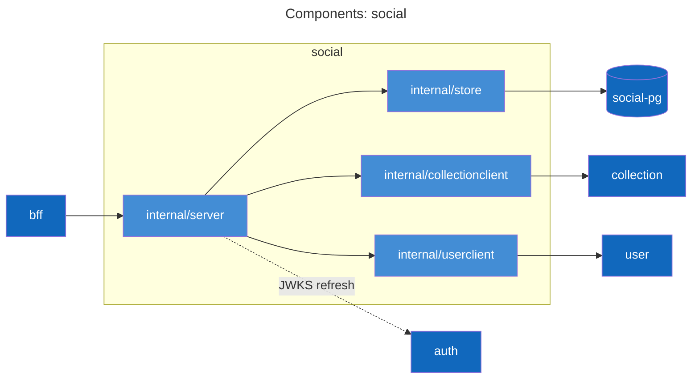
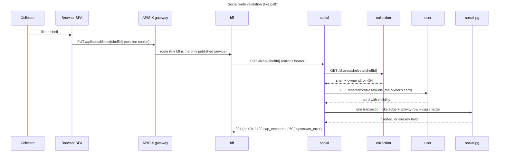
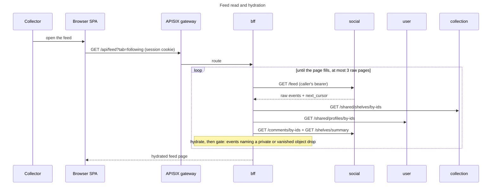
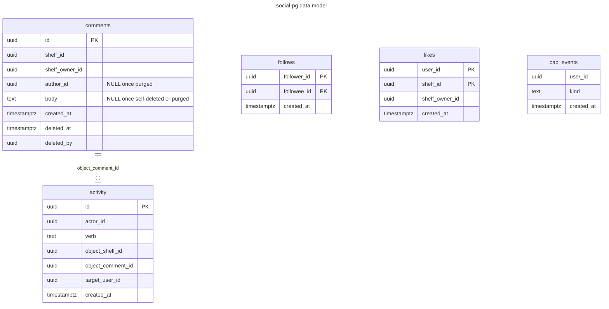

# social service

Follows, likes, comments, and the activity feed: the social layer over shelves and profiles. A shelf is a collection
saved view seen through the sharing surface, so every shelf id this service handles is a saved-view id minted by the
collection service.

## Purpose and boundaries

The service owns the graph between users (follow edges, like edges, comment threads), the activity feed built from
it, and the per-user rate caps on writing to it. All of that state lives in social-pg tables: `follows`,
`likes`, `comments`, `activity`, and `cap_events`.

It refuses to own visibility. No visibility value is stored here: every write independently re-resolves its target
through the collection service or the user service before landing, and reads answer ids and counts only, leaving
the bff to hydrate names and gate visibility at read time. A shelf that later goes private keeps its rows here; the
bff stops surfacing them.

The bff is the sole caller and relays the end user's own bearer on every route; the chart's NetworkPolicy admits
only bff pods to `social:8080`. There are no service tokens, no CronJobs calling in, no internal or admin routes, no
Valkey, and no third-party calls. Outbound, social's only upstream calls carry the caller's bearer:
the collection service (`GET /shared/shelves/{shelfId}`, through `internal/collectionclient`) and the user service
(`GET /shared/profiles/by-ids`, through `internal/userclient`).

## API surface

[api/social.yaml](../../api/social.yaml) is the authority; routes are grouped here, schemas stay there. Every route
requires an end-user bearer and authorization is per-handler; the whole surface is user-facing, so the usual
user/shared/internal/admin grouping collapses to what each route is for.

Graph writes; the follow and like pairs are idempotent (their deletes answer 204 whether or not the edge existed):

- `PUT` / `DELETE /follows/{userId}`
- `PUT` / `DELETE /likes/{shelfId}`
- `POST /shelves/{shelfId}/comments` and `DELETE /comments/{commentId}` (author or shelf owner only; deleting an
  already-tombstoned comment answers 404 `comment_not_found`)

Reads:

- `GET /profiles/{userId}/summary`: follower and following counts, plus whether the caller follows.
- `GET /shelves/summary`: batch like/comment counts and caller state, up to 100 ids; every requested id is
  answered, zeroed when no rows exist.
- `GET /shelves/{shelfId}/comments`: live comments newest first, keyset-paged, limit 1-50, default 20.
- `GET /comments/by-ids`: batch live comments (feed excerpt hydration), up to 100 ids.
- `GET /feed`: raw activity events for the caller, tabs `following` and `you`, keyset-paged.
- `GET /explore/top-shelves`: shelf ids by all-time like count, limit default 50.

bff-orchestrated, still on the end user's own bearer: `POST /events/shelf-published` after a shelf lands listed,
and `DELETE /user-data`, the social leg of account deletion.

The PUTs and POSTs validate their target upstream before touching social-pg; a failed resolve answers 502
`upstream_error` and nothing is written. The deletes touch only social-pg. The legs differ per write:

| Write | Upstream legs | Miss answer |
| --- | --- | --- |
| `PUT /follows/{userId}` | followee card via user | 404 `profile_not_found`; unknown and private answer alike |
| `PUT /likes/{shelfId}` | shelf via collection, then owner card via user | 404 `shelf_not_found`; unknown, private shelf, private owner all alike (no oracle) |
| `POST /shelves/{shelfId}/comments` | shelf via collection | 404 `shelf_not_found` |
| `POST /events/shelf-published` | shelf via collection, then caller must own it | 404 `shelf_not_found`, a non-owner caller included |

Problem codes across the surface: `self_follow`, `profile_not_found`, `shelf_not_found`, `comment_not_found`,
`invalid_body`, `invalid_param`, `forbidden`, `cap_exceeded` (429), `upstream_error` (502), `internal`.

Writes are capped per user over a rolling 24 hours: 100 follows, 200 likes, 50 comments by default. Unfollowing or
unliking never restores headroom, and comment tombstones still count; the mechanics are in the data model section.

## Components

`internal/server` implements the generated `api.ServerInterface`, wrapped in jwtauth then specval validation
(jwtauth's 401 wins; `GET /healthz` and `GET /readyz` sit outside auth). It also carries the domain counters
on meter `github.com/levonn-dev/vgkeep/services/social`; the runbook owns the full telemetry inventory.
`internal/store` is all the SQL over one pgxpool, and its sentinel errors are the HTTP mapping: `ErrNotFound` 404,
`ErrForbidden` 403, `ErrCapExceeded` 429. The clients are thin typed wrappers over the shared contract clients
(collectionapi and userapi in `libs/go/contract`), each relaying the caller's bearer.

## Actor flows

The flows below are social's end to end. The diagrams sit at actor and endpoint altitude; the wire-level
write-validation sequence an operator debugs against stays in the runbook's
[architecture section](../../docs/runbooks/social.md#architecture).

### Social write validation

The like path is drawn because it is the superset (both resolve legs); the per-write legs are the table above.

An inserted edge, its `activity` row, and its `cap_events` charge land in the same transaction; a retried PUT of an
already-held edge inserts nothing and is never charged. A resolve that fails outright stops the write before any
SQL runs, so social never records an edge it could not validate.

### Feed read and hydration

`GET /feed` returns raw events, ids only. The bff hydrates and gates them, refetching further raw pages when gating
shortens one, at most three raw pages per request.

`next_cursor` marks the last raw row, not the page boundary, precisely so the bff can resume from where gating left
off. Tab semantics: `following` is events by people the viewer follows; `you` is events targeting the viewer, with
the viewer's own actions excluded.

Explore needs no diagram. `GET /explore/top-shelves` is the all-time like-count leaderboard, ties broken by shelf
id, no paging beyond the 50-id limit. The Explore-recent surface is not social's at all: the bff pages the
collection service's listed shelves directly and only decorates them with counts from `GET /shelves/summary`.

Publish events need no diagram either. The bff fires `POST /events/shelf-published` best-effort after any
saved-view write whose result lands `visibility=listed`, and fails open: a lost event costs a feed entry, never the
write. On the social side, one live `published_shelf` activity row exists per shelf (unique partial index
`activity_publish_one_idx`), its `created_at` refreshed at most hourly so visibility flip-flopping cannot spam
feeds; the outcomes are `created`, `refreshed`, and `throttled`. Two-sided triage of a lost event is the runbook's
[failure scenario 3](../../docs/runbooks/social.md#3-lost-publish-events).

Flows social only participates in: shared shelf and profile page composition is bff-owned (social's legs are
`GET /shelves/summary`, `GET /profiles/{userId}/summary`, and `GET /shelves/{shelfId}/comments`), and so is the
account deletion orchestration (social's leg is `DELETE /user-data`); both are documented on the bff side, in
[services/bff/README.md](../bff/README.md).

## Data model

The schema is deliberately free of foreign keys: user and shelf ids are cross-service identities, validated over
HTTP at write time and never joined in Postgres. Owner ids (`likes.shelf_owner_id`, `comments.shelf_owner_id`) are
denormalized from the write-time resolve so owner-scoped reads and the account purge need no cross-service lookup.
The one reference inside the database, `activity.object_comment_id` to `comments.id` (the dashed edge above), is
kept consistent by the store's transactions, not by a constraint.

A live comment always has an author and a 1-2000 character body; a CHECK pins exactly that. It leaves the live
state one of three ways: self-delete (`deleted_by` = author, body NULLed), owner removal (`deleted_by` = owner,
body retained), or purge anonymization (`author_id` and body NULLed). An author who also owns the shelf still gets
self-delete. Tombstones never serialize; every live-read path filters `deleted_at IS NULL`.

Activity is append-except-undo. Unfollow, unlike, and comment deletion remove the matching event in the same
transaction as the retraction, so feeds never show retracted actions. `verb` is constrained to `followed_user`,
`liked_shelf`, `commented_shelf`, `published_shelf`.

`cap_events` exists because follows and likes hard-delete their edge, leaving nothing to count: one row per genuine
follow or like action, written in the edge's transaction and kept after retraction, so those caps count actions
rather than currently-held edges. Every insert first sweeps rows older than 48 hours, so the table retains itself
with no background job. Comments need no `cap_events` rows: their tombstones persist, so the comment cap counts the
`comments` table directly, tombstones included.

The indexes that carry design rather than mere speed: `comments_shelf_live_idx` (partial on `deleted_at IS NULL`, backs
live listing), `comments_author_idx` on `(author_id, created_at DESC)` (bounds the rolling-24h comment cap count),
`activity_publish_one_idx` (unique partial, one live publish row per shelf), and `cap_events_user_kind_idx` on
`(user_id, kind, created_at DESC)`. Keyset cursors over comments and the feed are `(created_at, id)` encoded
`<unixnano>.<uuid>`, the `httpkit.Cursor` type shared with the bff so the wire format cannot drift.

Purge (`DELETE /user-data`) runs as one idempotent transaction and completes with nothing else alive, thanks to the
denormalized owner ids. It hard-deletes the caller's graph, anonymizes their comments on surviving shelves, and
NULLs `deleted_by` only where it names the purged user, so a shelf owner's moderation attribution survives. The
full step list is in the runbook's [admin levers section](../../docs/runbooks/social.md#admin-levers).

## Internal layout

- `cmd/social`: one binary. A plain start serves; `social migrate` applies the embedded migrations and
  exits, which is what the deployment's init container runs on every rollout.
- `internal/server`: `server.go` (the Store, Collection, and Users interfaces, `Handlers`, `New`, the domain
  counters), `handlers.go`, `routes.go`. No middleware file of its own: jwtauth, specval, and the router shell all
  come from `libs/go`. Request bodies cap at 64 KiB (`maxBodyBytes`).
- `internal/store`: `store.go` (follows, likes, summaries, caps), `comments.go`, `activity.go` (feed, publish,
  purge).
- `internal/collectionclient` and `internal/userclient`: typed wrappers over the shared contract clients.
- `internal/config`: the env struct, loaded by `libs/go/config`.
- `internal/gen/api/server.gen.go`: generated by oapi-codegen v2.8.0 from `api/social.yaml` (`task social:gen`,
  config `api/oapi.server.yaml`: `models`, `std-http-server`, `embedded-spec`; `common.yaml` types import from
  `libs/go/contract/common`). Never edited by hand; CI fails on drift.
- `migrations/`: the numbered up/down pairs plus `migrations.go`, which embeds them as `migrations.FS`.

## Configuration

Environment variables, parsed at startup by `internal/config`; a missing required variable is fatal before the
listener opens.

| Variable                      | Required | Default       | Sets                                          |
| ----------------------------- | -------- | ------------- | --------------------------------------------- |
| `HTTP_ADDR`                   | no       | `:8080`       | listen address                                |
| `DATABASE_URL`                | yes      | none          | social-pg connection string                   |
| `JWKS_URL`                    | yes      | none          | key source for bearer validation              |
| `JWT_ISSUER`                  | no       | `vgkeep-auth` | expected `iss` claim                          |
| `JWT_AUDIENCE`                | no       | `vgkeep`      | expected `aud` claim                          |
| `COLLECTION_SERVICE_URL`      | yes      | none          | base URL for shelf resolves                   |
| `USER_SERVICE_URL`            | yes      | none          | base URL for profile-card resolves            |
| `SOCIAL_CAP_COMMENTS_24H`     | no       | `50`          | rolling-24h comment cap                       |
| `SOCIAL_CAP_FOLLOWS_24H`      | no       | `100`         | rolling-24h follow cap                        |
| `SOCIAL_CAP_LIKES_24H`        | no       | `200`         | rolling-24h like cap                          |
| `SERVICE_VERSION`             | no       | `dev`         | telemetry `service.version`                   |
| `OTEL_EXPORTER_OTLP_ENDPOINT` | no       | unset         | OTLP target; unset or empty disables export   |

`OTEL_EXPORTER_OTLP_ENDPOINT` is read by the shared telemetry setup in `libs/go/otel` rather than the config
struct; the chart defaults it to `http://otel-agent.vg-platform.svc.cluster.local:4317`.

In the cluster, `DATABASE_URL` is composed in `deploy/charts/social/templates/deployment.yaml` with
`sslmode=verify-full` and a password injected from ExternalSecret `social-pg-credentials` (key `password`,
ClusterSecretStore `vg-fake` key `social/pg-password`; the dev seed is `PG_SOCIAL_PASSWORD` in `.env`). The rest of
the chart-side plumbing, rotation included, is tabled in the runbook's
[configuration section](../../docs/runbooks/social.md#configuration).

One dial is deliberately not a dial: the hourly publish refresh throttle is the code constant
`publishRefreshThrottle` in `internal/server/server.go`, not an env var.

## Development

`task social:gen` regenerates the server stubs from the contract; `task social:db:migrate` runs
`go run ./cmd/social migrate` against `DATABASE_URL`. Both also run inside root `task gen` and `task migrate`; the
shared build, lint, and test commands are in the [root README](../../README.md).

Store tests get Postgres from `libs/go/pgtest`: the shared test server named by `PGTEST_URL` when it is set (the
root Taskfile sets it), a per-binary testcontainer otherwise; either way each test binary works in its own freshly
created, migrated database.

Under Tilt the resource is `social`, port-forwarded to `localhost:8086`, with social-pg at `localhost:5436`; it
depends on `secret-store`, `social-pg`, `auth`, `user`, and `collection`. A freshly started stack answers 401 on
every route until auth serves its JWKS, and 502 on writes until collection and user are both up. Neither is a
social bug.

There is no direct-to-social Bruno folder; `bruno/bff/social/` exercises the whole surface end to end through the
APISIX gateway. For direct calls against `localhost:8086`, mint a dev bearer with auth's dev-token request
(`bruno/auth/dev-token.bru`).

## See also

- [api/social.yaml](../../api/social.yaml): the contract.
- [docs/runbooks/social.md](../../docs/runbooks/social.md): the operator view (dashboard vg-social, alerts,
  failure triage, capacity and rollout).
- [deploy/observability/dashboards/social.yaml](../../deploy/observability/dashboards/social.yaml) and
  [deploy/observability/alerts/social.yaml](../../deploy/observability/alerts/social.yaml): dashboard and alert
  sources.
- [deploy/charts/social/](../../deploy/charts/social/): the chart, including the NetworkPolicies and the social-pg
  StatefulSet.
- [docs/architecture.md](../../docs/architecture.md): the system view (context, containers, the end-to-end flows).
