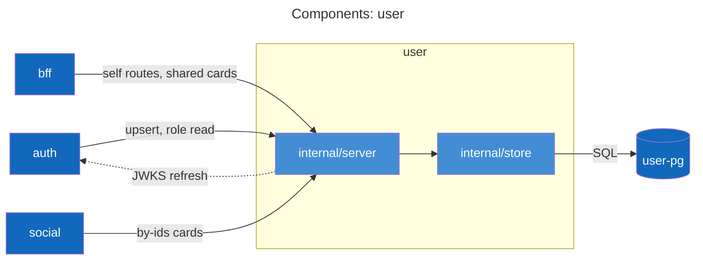
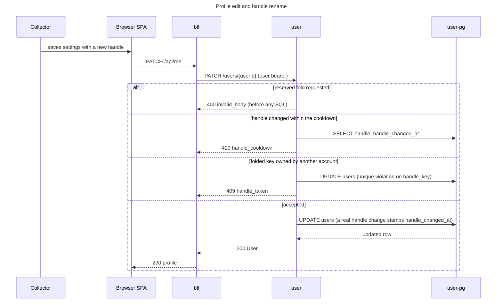
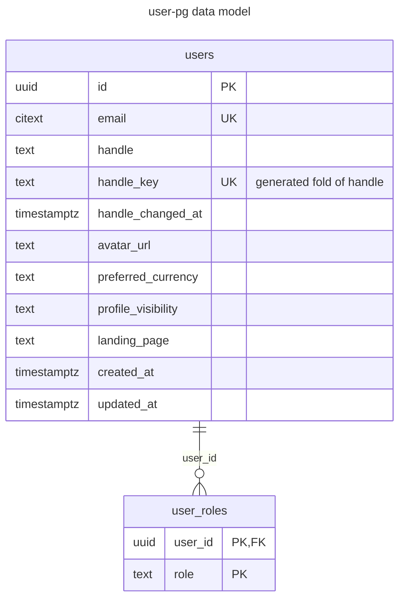

# user service

Profile and role source of truth. Auth mints every JWT's role claims from this service's answers, so it sits on the
login path of the whole stack without ever talking to a browser. The footprint is small: the `users` and
`user_roles` tables, a short contract, one Postgres; no cache, no cron, no external providers.

## Purpose and boundaries

The service owns user profiles (email, handle, avatar URL, preferred currency, profile visibility, landing page) and
role assignments (`user`, `admin`). Downstream RBAC is stateless: roles travel as JWT claims, and this service is
consulted only when auth mints them. A login on a first-seen identity runs `POST /internal/users/upsert`; a returning
login and every token refresh re-read roles with `GET /users/{userId}`.

It refuses to own the rest of identity: sessions live in the bff, identities and tokens in auth. It exposes no admin
HTTP surface; role grants are rows in `user_roles`, applied with psql (levers in the
[runbook](../../docs/runbooks/user.md#admin-levers); `task grant-fixture-admin` in dev). Cross-user reads never leak
email or roles: the `/shared/profiles` routes serve only the `ProfileCard` projection (user_id, handle, avatar_url,
profile_visibility).

Its callers, each with its own verb set:

- auth: `POST /internal/users/upsert` when a login brings a first-seen identity, `GET /users/{userId}` on returning
  logins and at every refresh, on service tokens it mints for itself (`services/auth/internal/userclient`).
- bff: get/patch/delete self behind `/api/me`, plus all three `/shared/profiles` routes for profile pages and people
  search, always on the end user's own bearer (`services/bff/internal/userclient`).
- social: `GET /shared/profiles/by-ids` only, for followee validation and card attribution
  (`services/social/internal/userclient`).

It calls user-pg and nothing else; the one out-of-band dependency is the JWKS fetch from auth
(`http://auth:8080/.well-known/jwks.json`). Because every login and refresh reads roles from this service, user being
down fails logins and refreshes stack-wide while already-issued access tokens keep validating.

## API surface

The contract is [api/user.yaml](../../api/user.yaml): every operation sits behind a bearer token.

Internal (a service token whose subject is `svc:auth`, so only auth's own credential passes):

- `POST /internal/users/upsert`: find-or-create at login. `display_name` is only the handle-derivation seed on the
  creating call and is never stored; `locale_hint` (a BCP 47 tag) seeds `preferred_currency` only at creation; an
  invalid `avatar_url` is dropped with a WARN instead of a 400, because this is the login path and no browser is
  waiting on the answer.

Self (user bearer):

- `GET /users/{userId}`: self, any service token, or role `admin`.
- `PATCH /users/{userId}`: strictly self. Fields: handle, avatar_url, preferred_currency, profile_visibility,
  landing_page; absent fields keep their value, an empty avatar_url clears it.
- `DELETE /users/{userId}`: strictly self, idempotent 204; the purge leg this service contributes to account deletion.

Shared (any bearer, no self-scoping):

- `GET /shared/profiles/{handle}`: resolves the folded handle; unknown and private answer the same 404
  `profile_not_found`, so resolution is never an existence oracle.
- `GET /shared/profiles/by-ids`: up to 100 ids, cards returned at any visibility (actions are signed; page access is
  the caller's problem).
- `GET /shared/profiles/search`: substring match over the folded handles of `listed` profiles only, up to 20 results
  in folded-key order; `q` is 1-64 chars.

Outside the contract and outside the bearer wall: `GET /healthz` (static ok) and `GET /readyz` (pings the pg pool),
added by the shared router.

Errors are problem+json with codes `invalid_body`, `invalid_param`, `forbidden`, `user_not_found`,
`profile_not_found`, `handle_taken` (409), `handle_cooldown` (429), and `internal`; the 409/429 pair exists only on
the PATCH. Shared schemas come from [api/common.yaml](../../api/common.yaml): `Handle` (2-30 chars, alphanumeric with
interior underscores), `Visibility` (`private | unlisted | listed`), `Role` (`user | admin`), `CurrencyCode`
(`^[A-Z]{3}$`), `LandingPage` (`collection | feed | explore`), and `ProfileCard`.

## Components

`internal/server` implements the generated `api.ServerInterface`; the middleware order is jwtauth then specval, so a
missing token answers 401 before request validation can answer 400, and the generated router's own param-binding
failures render as problem+json `invalid_param`. Every SQL statement lives in `internal/store`; no other package
writes queries against this schema. The JWKS edge is dotted because the validator fetches lazily and caches keys by
kid. Shared plumbing comes from `libs/go`: jwtauth (validation middleware), specval (request validation against the
embedded spec), httpkit (router, health endpoints, problem writer), and pgkit (pool, migrations, scan helpers).

## Actor flows

The one flow this service decides end to end is the profile edit: every outcome (reserved 400, taken 409, cooldown
429) is chosen here, and the bff is a pass-through hop.

Any change to the typed string consumes the cooldown, decoration-only edits (case or underscores) included;
resubmitting the identical string is a no-op that neither stamps nor gates. The window is `HANDLE_CHANGE_COOLDOWN`,
24h by default and 5s in the Tilt stack so the 429 stays testable live.

Flows this service only participates in:

- Sign-in and session issue: auth owns the flow ([services/auth/README.md](../auth/README.md)); the wire-level login
  hot path through this service is drawn in
  [the runbook's Architecture section](../../docs/runbooks/user.md#architecture).
- Account deletion: the bff orchestrates the purge order
  ([services/bff/README.md](../bff/README.md#account-deletion)); this service's leg is the idempotent
  `DELETE /users/{userId}`, last in order.
- Shared shelf and profile page composition, and people search: bff-owned composition over the shared routes
  ([services/bff/README.md](../bff/README.md#shared-shelf-and-profile-page-composition)).
- Social write validation and card attribution: social-owned
  ([services/social/README.md](../social/README.md)), built on `by-ids` alone.

## Data model

The handle is the identity, and uniqueness lives on its fold: `handle_key` is
`GENERATED ALWAYS AS (lower(replace(handle, '_', ''))) STORED` behind the unique index `users_handle_key_idx`, so
case and underscores are decoration (`A_lice` and `alice` are the same account). `store.NormalizeHandle` mirrors that
expression byte for byte and must stay that way. The partial index `users_listed_idx` on `(handle_key) WHERE
profile_visibility = 'listed'` serves the search route's filter, LIKE match, and ordering without an explicit sort.
Email uniqueness is case-insensitive via the `citext` extension.

Check constraints carry the enums: `preferred_currency ~ '^[A-Z]{3}$'`, `profile_visibility` in
`private | unlisted | listed` (default `private`), `landing_page` in `collection | feed | explore` (default `feed`),
`role` in `user | admin`. `user_roles` cascade-deletes with its user, and its composite primary key (user_id, role)
makes grants idempotent.

A first login mints the handle inside the upsert transaction: `DeriveHandle` turns the display-name seed into the
handle alphabet (symbol runs become underscores, edges are trimmed, the result is clamped to 30 chars), falling back
to the email local part and then `collector`. Collisions with existing folds or the 11 reserved folds (`admin`,
`api`, `explore`, `feed`, `login`, `me`, `search`, `settings`, `shelves`, `u`, `vg`) dedupe via a numeric suffix
probed SELECT-first, so a taken key never aborts the transaction. Every upsert re-grants the `user` role idempotently
and re-reads roles; only the creating call pays the derive/dedupe/insert path.

Migrations: `000001_init` through `000005_listed_index`, embedded in the binary via `migrations.FS`.

## Internal layout

- `cmd/user/main.go`: config load, then either the `migrate` subcommand (runs `pgkit.Migrate` over the embedded
  migrations and exits; the deployment's init container runs the same image with `args: ["migrate"]`) or the serving
  path: OTel setup, pgxpool connect, jwtauth validator, router, listen.
- `internal/config`: the environment contract as one tagged struct (`libs/go/config`); the variable list is under
  Configuration below.
- `internal/server`: `server.go` (Handlers struct, the store interface, and the domain counters
  `vg.user.account.upserts`, `vg.user.currency.seeds`, `vg.user.account.deletes`, registered in `server.New`),
  `handlers.go` (internal and self routes), `handlers_shared.go` (the ProfileCard routes), `currency.go` (the
  ISO-region to currency seed map: eurozone regions plus single-currency regions, USD for everything else),
  `routes.go` (middleware order and health wiring). Label sets, log events, and trace shape are documented in the
  [runbook's Telemetry section](../../docs/runbooks/user.md#telemetry).
- `internal/store`: `store.go` (every SQL statement: Upsert, Get, Update, Delete, GetByHandle, GetByIDs,
  SearchListed), `handle.go` (derivation, fold, the reserved set).
- `internal/gen/api/server.gen.go`: generated by `task user:gen` (oapi-codegen, config `api/oapi.server.yaml`) from
  `api/user.yaml`; never edited by hand, CI fails on drift.
- `migrations/`: the SQL pairs plus the embed declaration.

## Configuration

Environment variables, parsed at startup by `internal/config`; a missing required variable is fatal before the
listener opens.

| Variable | Default | Notes |
| --- | --- | --- |
| `HTTP_ADDR` | `:8080` | |
| `DATABASE_URL` | required | composed by the chart with `sslmode=verify-full&sslrootcert=/etc/vg/pg-ca/ca.crt` and `$(PG_PASSWORD)` from secret `user-pg-credentials` |
| `JWKS_URL` | required | chart value `env.jwksUrl`, default `http://auth:8080/.well-known/jwks.json` |
| `JWT_ISSUER` | `vgkeep-auth` | |
| `JWT_AUDIENCE` | `vgkeep` | |
| `HANDLE_CHANGE_COOLDOWN` | `24h` | chart value `env.handleChangeCooldown`; the Tiltfile overrides it to `5s` |
| `SERVICE_VERSION` | `dev` | the chart sets it to the image tag |
| `OTEL_EXPORTER_OTLP_ENDPOINT` | unset | read by the shared OTel setup (`libs/go/otel`), not `internal/config`; empty disables export |

The password arrives through the ExternalSecret `user-pg-credentials` (ClusterSecretStore `vg-fake`, remote key
`user/pg-password`, refreshInterval 1m); the dev secret chain and rotation behavior are in the
[runbook's Configuration section](../../docs/runbooks/user.md#configuration).

## Development

Tilt resource `user` (label `services`), image rebuilt on changes under `libs/go/` or `services/user/`, depending on
`secret-store` and `user-pg`. Auth depends on user in turn, so expect 401s from bearer routes until auth serves its
JWKS. Direct port `localhost:8081` maps to `user:8080`; `user-pg` listens on `localhost:5433`.

- `task user:gen` regenerates the server stubs from `api/user.yaml`.
- `task user:db:migrate` runs `go run ./cmd/user migrate` against `DATABASE_URL` (also under root `task migrate`).
- `task grant-fixture-admin` (root Taskfile) is the dev path to an admin role; grants land in the JWT only at the
  next login or refresh.
- Root `task check` covers this module along with the rest of the repo; the shared commands are in the
  [root README](../../README.md).

Bruno folder [bruno/user/](../../bruno/user/) holds `get-self` and `update-self`; run `auth/dev-token` first to fill
`access_token` and `user_id`.

## See also

- [api/user.yaml](../../api/user.yaml): the contract.
- [docs/runbooks/user.md](../../docs/runbooks/user.md): operations (dashboard, alerts, failure modes, admin levers).
- [deploy/observability/dashboards/user.yaml](../../deploy/observability/dashboards/user.yaml): source of the vg-user
  Grafana dashboard.
- [deploy/charts/user/](../../deploy/charts/user/): the chart (deployment, user-pg StatefulSet, NetworkPolicies,
  ExternalSecret).
- [docs/architecture.md](../../docs/architecture.md): the system view (context, containers, the end-to-end flows).
